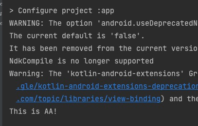
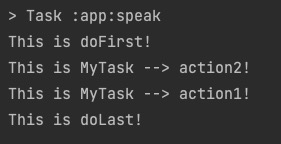

# Gradle

## task 

```java
class MyTask extends DefaultTask {

    String message = "mytask..."

    @TaskAction
    def ss1() {
        println("This is MyTask --> action1!")
    }

    @TaskAction
    def ss2() {
        println("This is MyTask --> action2!")
    }

}

task speak(type: MyTask) {
    println("This is AA!")
    doFirst {
        println("This is doFirst!")
    }
    doLast {
        println("This is doLast!")
    }
}
```

-   
-   

- task可以向对象那样操作，**task 里面也可以写代码，比如打印 AA，但是这些代码只能在配置阶段执行，而 task 的 action 都是在运行阶段执行的**
- Gradle 中 Task 都是继承自 DefaultTask，我们自定义 Task 也需要继承这个类，重点是写自己需要的方法，然后加上@TaskAction注解表示这个方法是 Task 中的 action，可以加多个，**按照倒序执行**

### task的依赖

- Task 依赖是指我们可以指定 Task 之间的执行顺序，重点理解 dependsOn 就行了
    -   A.dependsOn B -->   执行A的时候先执行B
    -   A.mustRunAfter B  -->   同时执行 A/B，先执行B再执行A，若执行关系不成立报错
    -   A.shouldRunAfter B  -->   同 mustRunAfter，但是执行关系不成立不会报错


### 系统默认的task

#### copy

- copy 复制文件

```java
task speak (type: Copy) {
    ...
}
```

```java
//数据源目录，多个目录
public AbstractCopyTask from(Object... sourcePaths)  

//目标目录，单一
public AbstractCopyTask into(Object destDir) 

//过滤文件 包含
public AbstractCopyTask include(String... includes)

//过滤文件 排除
public AbstractCopyTask exclude(String... excludes)

//重新命名，老名字 新名字
public AbstractCopyTask rename(String sourceRegEx, String replaceWith)

//删除文件 Project 接口
boolean delete(Object... paths);
```

```java
// 复制图片：多个数据源 -->
task copyImage(type: Copy) {
    from 'C:\\Users\\yiba_zyj\\Desktop\\gradle\\copy' , 
         'C:\\Users\\yiba_zyj\\Desktop\\gradle\\copy'
    into 'C:\\Users\\yiba_zyj\\Desktop'
}

// 复制文件：过滤文件，重命名 -->
task copyImage(type: Copy) {
    from 'C:\\Users\\yiba_zyj\\Desktop\\gradle\\copy'
    into 'C:\\Users\\yiba_zyj\\Desktop'
    include "*.jpg"
    exclude "image1.jpg"
    rename("image2.jpg","123.jpg")
}
```

#### Delete

- 删除文件

```java
// 删除桌面上的文件 -->
task deleteFile(type: Delete) {
    //删除系统桌面 delete 
    delete "C:\\Users\\yiba_zyj\\Desktop\\gradle\\delete"
}
```

#### 设置默认 Task 任务

- 设置这个的意思的是指，脚本中我们不调用该 task，设置的 task 也会执行

```java
defaultTasks 'clean', 'run'

task clean {
    doLast {
        println 'Default Cleaning!'
    }
}

task run {
    doLast {
        println 'Default Running!'
    }
}

task other {
    doLast {
        println "I'm not a default task!"
    }
}
```

#### Task 中使用外部依赖

- buildscript{...} 引入远程仓库和依赖 path，import 导入进来就可以用了

```java
import org.apache.commons.codec.binary.Base64

buildscript {
    // 导入仓库
    repositories {
        mavenCentral()
    }
    // 添加具体依赖
    dependencies {
        classpath group: 'commons-codec', name: 'commons-codec', version: '1.2'
    }
}

task encode {
    doLast {
        def byte[] encodedString = new Base64().encode('hello world\n'.getBytes())
        println new String(encodedString)
    }
}
```


