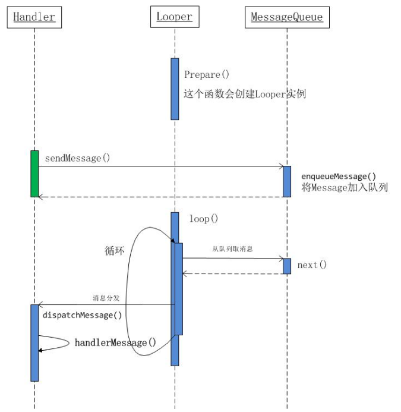

# 总结



- **其中绿色的部分与蓝色可能在一个线程，也可能不在一个线程**

- 初始化handler时，指定了对应的Looper以及消息队列MessageQueue

  ```java
  public Handler(Callback callback, boolean async) {
        //可能的内存泄露
        //所以尽可能用static 的handler,用弱引用引用外部类
        if (FIND_POTENTIAL_LEAKS) {
            final Class<? extends Handler> klass = getClass();
            if ((klass.isAnonymousClass() || klass.isMemberClass() || klass.isLocalClass()) &&
                    (klass.getModifiers() & Modifier.STATIC) == 0) {
                Log.w(TAG, "The following Handler class should be static or leaks might occur: " +
                    klass.getCanonicalName());
            }
        }

        //所以必须在一个调用了Looper.prepare()的线程中初始化handler
        //android的主线程在启动是就已经调用过了
        mLooper = Looper.myLooper();
        if (mLooper == null) {
            throw new RuntimeException(
                "Can't create handler inside thread that has not called Looper.prepare()");
        }
        mQueue = mLooper.mQueue;
        mCallback = callback;
        mAsynchronous = async;
    }
  ```

- 在主线程或工作线程中，将要传递的数据或者要执行的Runable包装成一个Message对象，然后Handler将这个Message对象加到主线程的消息队列中

  ```java
  //Handler 代码
  public boolean sendMessageAtTime(Message msg, long uptimeMillis) {
        MessageQueue queue = mQueue;
        if (queue == null) {
            RuntimeException e = new RuntimeException(
                    this + " sendMessageAtTime() called with no mQueue");
            Log.w("Looper", e.getMessage(), e);
            return false;
        }
        return enqueueMessage(queue, msg, uptimeMillis);
    }
  ```

- Message除了包含必要的信息外，还有一个target，这个target就是这个Handler对象本身

  ```java
  private boolean enqueueMessage(MessageQueue queue, Message msg, long uptimeMillis) {
       //指定了消息处理者target,也就是handler本身
        msg.target = this;
        if (mAsynchronous) {
            msg.setAsynchronous(true);
        }
        return queue.enqueueMessage(msg, uptimeMillis);
    }
  ```

- Looper不断的从消息队列中取出消息，然后调用消息的target去分发消息，也就是调用Handler去处理消息，处理完后，将Message放到Message对象池中，循环使用

  ```java
  //Looper代码
  public static void loop() {
        final Looper me = myLooper();
        if (me == null) {
            throw new RuntimeException("No Looper; Looper.prepare() wasn't called on this thread.");
        }
        final MessageQueue queue = me.mQueue;

        // Make sure the identity of this thread is that of the local process,
        // and keep track of what that identity token actually is.
        Binder.clearCallingIdentity();
        final long ident = Binder.clearCallingIdentity();

        for (;;) {
            Message msg = queue.next(); // might block
            if (msg == null) {
                // No message indicates that the message queue is quitting.
                return;
            }

            // This must be in a local variable, in case a UI event sets the logger
            final Printer logging = me.mLogging;
            if (logging != null) {
                logging.println(">>>>> Dispatching to " + msg.target + " " +
                        msg.callback + ": " + msg.what);
            }

            final long traceTag = me.mTraceTag;
            if (traceTag != 0) {
                Trace.traceBegin(traceTag, msg.target.getTraceName(msg));
            }
            try {
                //取出消息，然后调用target去处理消息，实际也就是handler去处理消息
                msg.target.dispatchMessage(msg);
            } finally {
                if (traceTag != 0) {
                    Trace.traceEnd(traceTag);
                }
            }

            if (logging != null) {
                logging.println("<<<<< Finished to " + msg.target + " " + msg.callback);
            }

            // Make sure that during the course of dispatching the
            // identity of the thread wasn't corrupted.
            final long newIdent = Binder.clearCallingIdentity();
            if (ident != newIdent) {
                Log.wtf(TAG, "Thread identity changed from 0x"
                        + Long.toHexString(ident) + " to 0x"
                        + Long.toHexString(newIdent) + " while dispatching to "
                        + msg.target.getClass().getName() + " "
                        + msg.callback + " what=" + msg.what);
            }

            msg.recycleUnchecked();
        }
    }
  ```

- handler处理分发消息

```java
public void dispatchMessage(Message msg) {
    //如果消息的callback不为null,实际上就是这个消息是包装了一个Runable
    //就去执行这个Runable
    if (msg.callback != null) {
        handleCallback(msg);
    } else {
        //如果handler的callback不为空，并且返回true，表示处理了消息，就结束了
        //否则就由自身的handleMessage函数去处理
        //handler的callback主要目的是不用重载函数，只用传入一个callback对象就行
        if (mCallback != null) {
            if (mCallback.handleMessage(msg)) {
                return;
            }
        }
        handleMessage(msg);
    }
}
```
