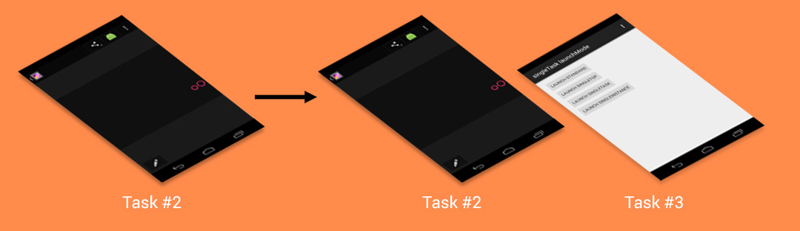
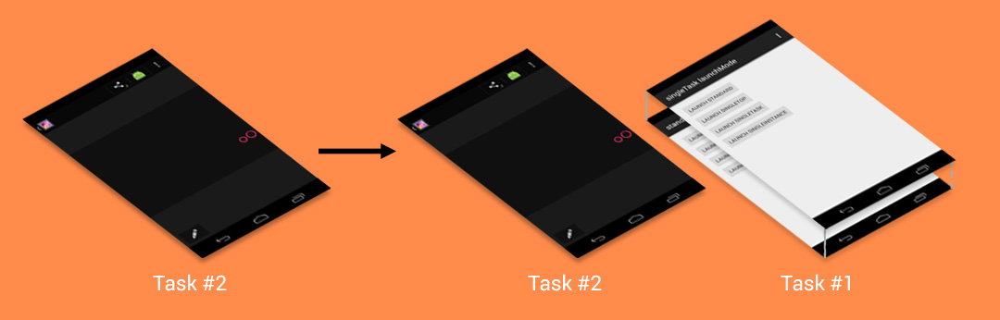
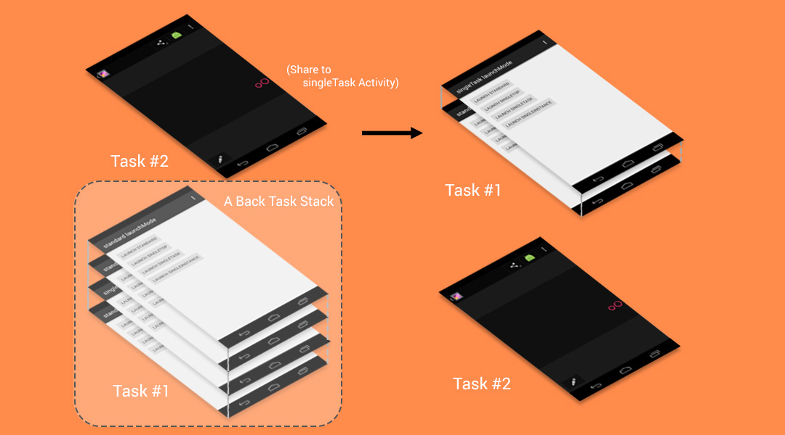

# Task 和 Back-Stack

- [相关文章](#相关文章)
- [Task](#task)
- [Back-Stack](#back-stack)
- [Task与Back-Stack的默认行为](#task与back-stack的默认行为)
- [Task和startActivityForResult](#task和startactivityforresult)
- [改变task与back stack默认行为](#改变task与back-stack默认行为)
- [Manifest中定义launch mode](#manifest中定义launch-mode)
    - [standard](#standard)
    - [single top](#single-top)
    - [single task](#single-task)
        - [本应用时](#本应用时)
        - [跨应用时](#跨应用时)
            - [要启动的singleTask所在的应用进程不存在](#要启动的singletask所在的应用进程不存在)
            - [要启动的singleTask所在的应用进程存在](#要启动的singletask所在的应用进程存在)
    - [single instance](#single-instance)
- [Intent flags](#intent-flags)
    - [FLAG_ACTIVITY_NEW_TASK](#flag_activity_new_task)
    - [FLAG_ACTIVITY_NEW_DOCUMENT](#flag_activity_new_document)
    - [FLAG_ACTIVITY_MULTIPLE_TASK](#flag_activity_multiple_task)
    - [FLAG_ACTIVITY_SINGLE_TOP](#flag_activity_single_top)
    - [FLAG_ACTIVITY_CLEAR_TOP](#flag_activity_clear_top)
    - [FLAG_ACTIVITY_CLEAR_TASK](#flag_activity_clear_task)
    - [FLAG_ACTIVITY_RESET_TASK_IF_NEEDED](#flag_activity_reset_task_if_needed)
    - [FLAG_ACTIVITY_NO_HISTORY](#flag_activity_no_history)
    - [FLAG_ACTIVITY_EXCLUDE_FROM_RECENTS](#flag_activity_exclude_from_recents)
    - [FLAG_ACTIVITY_NO_USER_ACTION](#flag_activity_no_user_action)
    - [FLAG_ACTIVITY_BROUGHT_TO_FRONT](#flag_activity_brought_to_front)
    - [FLAG_ACTIVITY_FORWARD_RESULT](#flag_activity_forward_result)
    - [FLAG_ACTIVITY_LAUNCHED_FROM_HISTORY](#flag_activity_launched_from_history)
    - [FLAG_ACTIVITY_NO_ANIMATION](#flag_activity_no_animation)
    - [FLAG_ACTIVITY_PREVIOUS_IS_TOP](#flag_activity_previous_is_top)
    - [FLAG_ACTIVITY_REORDER_TO_FRONT](#flag_activity_reorder_to_front)
    - [FLAG_ACTIVITY_RETAIN_IN_RECENTS](#flag_activity_retain_in_recents)
    - [FLAG_ACTIVITY_TASK_ON_HOME](#flag_activity_task_on_home)
    - [FLAG_DEBUG_LOG_RESOLUTION](#flag_debug_log_resolution)
    - [FLAG_EXCLUDE_STOPPED_PACKAGES和FLAG_INCLUDE_STOPPED_PACKAGES](#flag_exclude_stopped_packages和flag_include_stopped_packages)
    - [FLAG_FROM_BACKGROUND](#flag_from_background)
    - [FLAG_GRANT_PERSISTABLE_URI_PERMISSION](#flag_grant_persistable_uri_permission)
    - [FLAG_GRANT_PREFIX_URI_PERMISSION](#flag_grant_prefix_uri_permission)
    - [FLAG_GRANT_READ_URI_PERMISSION和FLAG_GRANT_WRITE_URI_PERMISSION](#flag_grant_read_uri_permission和flag_grant_write_uri_permission)
    - [FLAG_RECEIVER_FOREGROUND](#flag_receiver_foreground)
    - [FLAG_RECEIVER_NO_ABORT](#flag_receiver_no_abort)
    - [FLAG_RECEIVER_REGISTERED_ONLY](#flag_receiver_registered_only)
    - [FLAG_RECEIVER_REPLACE_PENDING](#flag_receiver_replace_pending)
- [Handling affinities](#handling-affinities)
    - [android:taskAffinity](#androidtaskaffinity)
    - [allowTaskReparenting](#allowtaskreparenting)
- [Clearing the back stack](#clearing-the-back-stack)
    - [alwaysRetainTaskState](#alwaysretaintaskstate)
    - [clearTaskOnLaunch](#cleartaskonlaunch)
    - [finishOnTaskLaunch](#finishontasklaunch)

## 相关文章

- [google LaunchModes](http://developer.android.com/guide/components/tasks-and-back-stack.html#LaunchModes)
- [activity task相关](http://blog.csdn.net/liuhe688/article/details/6761337)
- [深入讲解Android中Activity launchMode](http://droidyue.com/blog/2015/08/16/dive-into-android-activity-launchmode/)

## Task

- **任务是指在执行特定作业时与用户交互的一系列Activity**。 这些Activity按照各自的打开顺序排列在back-stack中。
- 当用户触摸应用启动器中的图标（或主屏幕上的快捷方式）时，该应用的任务将出现在前台。如果应用不存在任务（应用最近未曾使用），则会创建一个新任务，并且该应用的“主”Activity 将作为堆栈中的根Activity打开。
- **任务是一个有机整体，当用户开始新任务或通过Home键转到主屏幕时，任务可以移动到“后台”**。
- **当任务处在后台时，该任务中的所有Activity全部停止，但是任务的返回栈仍旧不变**，也就是说，当另一个任务发生时，该任务仅仅失去焦点而已。
- 任务可以再次返回到“前台”，用户就能够回到离开时的状态
- **后台可以同时运行多个任务**
- **如果用户同时运行多个后台任务，则系统可能会开始销毁后台Activity，以回收内存资源，从而导致 Activity 状态丢失**

## Back-Stack

- 任务栈是一个具有栈结构的对象，“先进后出”
- **默认情况下，所有activity所需的任务栈的名字为应用的包名，当然我们也可以通过taskAffinity为每一个activity指定一个任务栈**
- 任务栈中的Activity永远不会重新排列，仅推入和弹出堆栈，因而当我们再次start一个前面已经start过的activity，只是在stack中新增了一个该activiry的instance,而不是将前面已有的activity重新排序(针对standard启动的)

## Task与Back-Stack的默认行为

- 当Activity A启动Activity B时，Activity A将会停止，但系统会保留其状态（onSaveInstanceState）。
- 如果用户在处于 Activity B 时按“返回”按钮，则 Activity A 将恢复其状态，继续执行。
- 用户通过按Home键离开任务时，当前Activity将停止且其任务会进入后台。 系统将保留任务中每个Activity的状态。
- 如果用户稍后通过选择开始任务的启动器图标来恢复任务，则任务将出现在前台并恢复执行堆栈顶部的Activity。
- 如果用户按“返回”按钮，则当前Activity会从堆栈弹出并被销毁。堆栈中的前一个 Activity 恢复执行。销毁 Activity 时，
 系统不会保留该Activity 的状态。
- **即使来自其他任务，Activity也可以多次实例化**

## Task和startActivityForResult

- 使用startActivityForResult的必要条件是被启动的Activity和原Activity要在同一个Task中。因此，使用startActivityForResult时，会强制将新启动的Activity放在原来的Task中，不论activiy的xml属性和Intent#Flag_XXX。
- 只有一个例外FLAG_ACTIVITY_NEW_TASK：如果使用这个标签，原Activity会立刻收到onActivityResult，并执行和startActivity相同的逻辑。

## 改变task与back stack默认行为

- activity 属性

```java
taskAffinity
launchMode
allowTaskReparenting
clearTaskOnLaunch
alwaysRetainTaskState
finishOnTaskLaunch
```

- start activity时设置,intent的flag

```java
FLAG_ACTIVITY_NEW_TASK
FLAG_ACTIVITY_CLEAR_TOP
FLAG_ACTIVITY_SINGLE_TOP
```

## Manifest中定义launch mode

- 定义了一个新的activity的实例与当前task是怎样关联的
- 可以在要intent中定义，也可以manifest中定义，如果同时定义了，与intent中定义的为准
- manifest中可以定义4种：standard, singleTop,single Task ,single instance

### standard

- 默认的行为，一个任务栈可以有多个实例，每个实例也可以属于不同的任务栈
- 每当发送一个intent请求打开该activity时，都会创建一个新的activity实例.
- **在这种模式下，无论本应用打开，还是跨应用打开，新启动的Activity都运行在发送Intent的Activity的任务栈的栈顶**
- 跨引用打开，的时候会在 Recent app 页面显示两个独立项，但是此时它们两个 Activity 仍然是在一个栈中
- 对于standard启动模式的Activity,如果由非Activity的Context（Application/Service）启动，必须加上Intent.FLAG_ACTIVITY_NEW_TASK标识
- adb查看task相关的信息

```shell
➜ trunk adb shell dumpsys activity | grep "TaskRecord"
  * Recent #0: TaskRecord{2bb34f8e #12532 A=com.kascend.chushou U=0 sz=3}
  * Recent #1: TaskRecord{37367384 #12206 A=com.bbk.launcher2 U=0 sz=1}
  * Recent #2: TaskRecord{854223a #12531 A=com.tencent.mobileqq U=0 sz=2}
  * Recent #3: TaskRecord{108c221a #12530 A=com.baidu.tieba U=0 sz=3}
  * Recent #4: TaskRecord{3579976d #12524 A=com.example.businesshall U=0 sz=0}
  * Recent #5: TaskRecord{1c36dfa2 #12509 I=com.android.BBKClock/.AlertClock.AlarmAlertFullScreen U=0 sz=0}
  * Recent #6: TaskRecord{14ccc433 #12461 A=com.android.packageinstaller U=0 sz=0}
  * Recent #7: TaskRecord{316943f0 #12393 A=android.task.mms.notidelete U=0 sz=0}
  * Recent #8: TaskRecord{18253d69 #12226 A=com.baidu.input_bbk.service U=0 sz=2}
  * Recent #9: TaskRecord{8c753ee #12208 A=android.task.StkDialogActivity U=0 sz=0}
      TaskRecord{2bb34f8e #12532 A=com.kascend.chushou U=0 sz=3}
      TaskRecord{854223a #12531 A=com.tencent.mobileqq U=0 sz=2}
      TaskRecord{108c221a #12530 A=com.baidu.tieba U=0 sz=3}
      TaskRecord{1085708f #12458 A=com.autonavi.minimap U=0 sz=1}
      TaskRecord{18253d69 #12226 A=com.baidu.input_bbk.service U=0 sz=2}
      TaskRecord{2bb34f8e #12532 A=com.kascend.chushou U=0 sz=3}
      TaskRecord{854223a #12531 A=com.tencent.mobileqq U=0 sz=2}
      TaskRecord{108c221a #12530 A=com.baidu.tieba U=0 sz=3}
      TaskRecord{37367384 #12206 A=com.bbk.launcher2 U=0 sz=1}
      TaskRecord{37367384 #12206 A=com.bbk.launcher2 U=0 sz=1}

➜  trunk adb shell dumpsys activity | grep "12532"
  * Recent #0: TaskRecord{2bb34f8e #12532 A=com.kascend.chushou U=0 sz=3}
    Task id #12532
      TaskRecord{2bb34f8e #12532 A=com.kascend.chushou U=0 sz=3}
        Hist #2: ActivityRecord{317b1c93 u0 com.android.camera/.CameraActivity t12532}
        Hist #1: ActivityRecord{4ec132a u0 com.kascend.chushou/tv.chushou.athena.ui.activity.IMEntranceActivity t12532}
        Hist #0: ActivityRecord{1675388a u0 com.kascend.chushou/.ChuShouTV t12532}
      TaskRecord{2bb34f8e #12532 A=com.kascend.chushou U=0 sz=3}
        Run #7: ActivityRecord{317b1c93 u0 com.android.camera/.CameraActivity t12532}
        Run #6: ActivityRecord{4ec132a u0 com.kascend.chushou/tv.chushou.athena.ui.activity.IMEntranceActivity t12532}
        Run #5: ActivityRecord{1675388a u0 com.kascend.chushou/.ChuShouTV t12532}
    mResumedActivity: ActivityRecord{317b1c93 u0 com.android.camera/.CameraActivity t12532}
  mFocusedActivity: ActivityRecord{317b1c93 u0 com.android.camera/.CameraActivity t12532}
  mCurTaskId=12532
```

### single top

- singleTop其实和standard几乎一样，使用singleTop的Activity也可以创建很多个实例。
- 唯一不同的就是，如果调用的目标Activity已经位于调用者的Task的栈顶，则不创建新实例，而是使用当前的这个Activity实例，并调用这个实例的onNewIntent方法

### single task

#### 本应用时

- 以singleTask启动A, 系统首先会查找是否存在A想要的任务栈，也就是taskAffinity指定的任务栈，如果manifest文件中没有指定taskAffinity，则任务栈为该activity所属应用的包名.
- 如果不存在这样的任务栈，就先创建一个任务栈，然后创建A的实例后将A放到栈中
- 如果存在A所需要的任务栈,这时要查看任务栈中是否有A的实例，如果有实例存在，那么在Activity任务栈中，所有位于该Activity上面的Activity实例都将被销毁掉（销毁过程会调用Activity生命周期回调），这样使得singleTask Activity实例位于栈顶。与此同时，Intent会通过onNewIntent传递到这个SingleTask Activity实例。
- 也说明了一件事，**以singleTask启动Activity并不一定是启动了一个新的任务栈**

#### 跨应用时

##### 要启动的singleTask所在的应用进程不存在

- 如果要启动的singleTask Activity所在的应用进程不存在，那么将首先创建一个新的Task，然后创建SingleTask Activity的实例，将其放入新的Task中



##### 要启动的singleTask所在的应用进程存在

- 如果要启动的singleTask Activity所在的应用进程存在，但是singleTask Activity实例不存在，那么从别的应用启动这个Activity，新的Activity实例会被创建，并放入到所属进程所在的Task中，并位于栈顶位置。



- 如果要启动的singleTask Activity所在的应用进程存在，而且singleTask Activity实例也存在，从其他程序启动singleTask Activity，那么这个Activity所在的Task会被移到顶部，并且在这个Task中，位于singleTask Activity实例之上的所有Activity将会被正常销毁掉。



- 上面两种情况，只要要启动的singleTask所在的应用的进程存在，**如果我们按返回键，那么我们首先会回退到singleTask所在应用的Task中的其他Activity，直到该Task的Activity回退栈为空时，才会返回到调用者的Task。**

### single instance

- 这个模式和singleTask差不多，因为他们在系统中都只有一份实例。唯一不同的就是存放singleInstance Activity实例的Task只能存放一个该模式的Activity实例。如果从singleInstance Activity实例启动另一个Activity，那么这个Activity实例会放入其他的Task中。同理，如果singleInstance Activity被别的Activity启动，它也会放入不同于调用者的Task中

## Intent flags

### FLAG_ACTIVITY_NEW_TASK

- 首先会查找是否存在和被启动的Activity具有相同的taskAffinity的任务栈
- 如果有，刚直接把这个栈整体移动到前台，并保持栈中的状态不变，即栈中的activity顺序不变
- 如果没有，则新建一个栈来存放被启动的activity
- **如果被启动的Activity本身的启动模式是standard**,那么无论目标任务栈的顶部是不是被启动的Activity,**都会重新创建一个新的待启动Activity**，也就是standard的Activity的启动方式
- 如果被启动的Activity本身是singleTask，singleTop或singleInstance，那么待启动的Activity则与对应的启动模式一致，比如singleTask
 如果目标任务栈有待启动的Activity的话则清空上面的Activity并回调onNewIntent，如果是singleTop,如果目标任务栈的顶部不是待启动的Activity则创建一个，如果是的话则直接回调onNewIntent

### FLAG_ACTIVITY_NEW_DOCUMENT

- 与**FLAG_ACTIVITY_CLEAR_WHEN_TASK_RESET(deprecated)**相同
- api 21之后加入的一个标识，用来在intent启动的activity的task栈中打开一个document，和documentLaunchMode效果相等，有着不同的documents的activity的多个实例，将会出现在最近的task列表中。
- 单独使用效果和documentLaunchMode=”intoExisting”一样
- 如果和FLAG_ACTIVITY_MULTIPLE_TASK一起使用效果就等同于documentLaunchMode=”always”

### FLAG_ACTIVITY_MULTIPLE_TASK

- 这个标识用来创建一个新的task栈，并且在里面启动新的activity（**所有情况，不管系统中存在不存在该activity实例**），经常和FLAG_ACTIVITY_NEW_DOCUMENT或者FLAG_ACTIVITY_NEW_TASK一起使用。
- 这上面两种使用场景下，如果没有带上FLAG_ACTIVITY_MULTIPLE_TASK标识，他们都会使系统搜索存在的task栈，去寻找匹配intent的一个activity，如果没有找到就会去新建一个task栈；
 **但是当和FLAG_ACTIVITY_MULTIPLE_TASK一起使用的时候，这两种场景都会跳过搜索这步操作无条件的创建一个新的task**
- 和FLAG_ACTIVITY_NEW_TASK一起使用需要注意，尽量不要使用该组合除非你完成了自己的顶部应用启动器，他们的组合使用会禁用已经存在的task栈回到前台的功能

### FLAG_ACTIVITY_SINGLE_TOP

- 同single top

### FLAG_ACTIVITY_CLEAR_TOP

- 如果该activity已经在task中存在，并且设置了该flag，系统不会启动新的 Activity 实例，会将task栈里该Activity之上的所有Activity一律结束掉，然后将Intent发给这个已存在的Activity。Activity收到 Intent之后，或者在onNewIntent()里做下一步的处理，或者自行结束然后重新创建自己。
- 如果 Activity 在 AndroidMainifest.xml 里将启动模式设置成默认standard模式，并且 Intent 里也没有设置 FLAG_ACTIVITY_SINGLE_TOP，那么他将会结束并且重启；否则则会传递到onNewIntent方法，- FLAG_ACTIVITY_CLEAR_TOP 还可以和 FLAG_ACTIVITY_NEW_TASK 配合使用，用来启动一个task栈的根activity，他将会把该栈清空为根状态，比如从notification manager启动activity

### FLAG_ACTIVITY_CLEAR_TASK

- 如果在调用startActivity时传递这个标记，该task栈中的其他activity会先被清空，然后该activity在该task中启动，也就是说，这个新启动的activity变为了这个空task的根activity。所有老的activity都结束掉。该标志必须和FLAG_ACTIVITY_NEW_TASK一起使用

### FLAG_ACTIVITY_RESET_TASK_IF_NEEDED

- 这个标记在以下情况下会生效：1.启动Activity时创建新的task来放置Activity实例；2.已存在的task被放置于前台。系统会根据affinity对指定的task进行重置操作，task会压入某些Activity实例或移除某些Activity实例。我们结合上面的FLAG_ACTIVITY_CLEAR_WHEN_TASK_RESET可以加深理解

### FLAG_ACTIVITY_NO_HISTORY

- 如果设置这个标志，新的Activity就不会在历史栈中保存。用户一旦离开，这个Activity就会finish掉。也可以使用noHistory属性设置

### FLAG_ACTIVITY_EXCLUDE_FROM_RECENTS

- 设置完之后，新的activity将不会添加到当前activity列表中，当某些情况下我们不希望用户通过历史列表回到我们的Activity的时候这个标记比较有用。他等同于在XML中指定Activity的属性android:excludeFromRecents=”true”

### FLAG_ACTIVITY_NO_USER_ACTION

- 如果设置了这个标志，可以在避免用户离开当前Activity时回调到 onUserLeaveHint(). 通常，Activity可以通过这个回调表明有明确的用户行为将当前activity切出前台。
 这个回调标记了activity生命周期中的一个恰当的点，可以用来“在用户看过通知之后”将它们清除。
- 如果Activity是由非用户驱动的事件（如电话呼入或闹钟响铃）启动的，那这个标志就应该被传入Context.startActivity，以确保被打断的activity不会认为用户已经看过了通知

### FLAG_ACTIVITY_BROUGHT_TO_FRONT

- 比方说我现在有Ａ，在Ａ中启动Ｂ，在Intent中加上这个标记。此时B就是以FLAG_ACTIVITY_BROUGHT_TO_FRONT 这个启动的，在B中再启动C，D（正常启动C，D），如果这个时候在D中再启动B，这个时候最后的栈的情况是 A,C,D,B.。

### FLAG_ACTIVITY_REORDER_TO_FRONT

- 如果在Intent中设置，并传递给Context.startActivity()，这个标志将引发已经运行的Activity移动到历史stack的顶端。 例如，假设一个Task由四个Activity组成：A，B，C，D。如果D调用startActivity()来启动Activity B，那么，B会移动到历史stack的顶端，现在的次序变成A，C，D，B。如果FLAG_ACTIVITY_CLEAR_TOP标志也设置的话，那么这个标志将被覆盖。

### FLAG_GRANT_READ_URI_PERMISSION和FLAG_GRANT_WRITE_URI_PERMISSION

- 如果设置FLAG_GRANT_READ_URI_PERMISSION这个标记,Intent的接受者将会被赋予读取Intent中URI数据的权限和ClipData中的URIs的权限。当使用于Intent的ClipData时，所有的URIs和data的所有递归遍历或者其他Intent的ClipData数据都会被授权。
- FLAG_GRANT_WRITE_URI_PERMISSION同FLAG_GRANT_READ_URI_PERMISSION只是相应的赋予的是写权限.
- 一个典型的例子就是邮件程序处理带有附件的邮件。进入邮件需要使用permission来保护，因为这些是敏感的用户数据。然而，如果有一个指向图片附件的URI需要传递给图片浏览器，那个图片浏览器是不会有访问附件的权利的，因为他不可能拥有所有的邮件的访问权限。针对这个问题的解决方案就是per-URI permission：当启动一个activity或者给一个activity返回结果的时候，呼叫方可以设置Intent.FLAG_GRANT_READ_URI_PERMISSION和/或Intent.FLAG_GRANT_WRITE_URI_PERMISSION . 这会使接收该intent的activity获取到进入该Intent指定的URI的权限，而不论它是否有权限进入该intent对应的content provider

### FLAG_GRANT_PERSISTABLE_URI_PERMISSION

- api19添加
- 当和FLAG_GRANT_READ_URI_PERMISSION 和/或FLAG_GRANT_WRITE_URI_PERMISSION一起使用时，uri权限在设置重启之后依然存在,直到用户调用了revokeUriPermission(Uri, int)方法，这个标识仅为可能的存在状态提供许可，接受的应用必须要调用takePersistableUriPermission(Uri, int)方法去实际的变为存在状态

### FLAG_GRANT_PREFIX_URI_PERMISSION

- api21加入
- 当和FLAG_GRANT_READ_URI_PERMISSION 和/或FLAG_GRANT_WRITE_URI_PERMISSION一起使用时，uri的许可只用匹配前缀即可（默认为全部匹配）

### FLAG_ACTIVITY_FORWARD_RESULT

- 如果设置，并且这个Intent用于从一个存在的Activity启动一个新的Activity，那么，这个作为答复目标的Activity将会传到这个新的Activity中。这种方式下，新的Activity可以调用setResult(int)，并且这个结果值将发送给那个作为答复目标的Activity

### FLAG_ACTIVITY_LAUNCHED_FROM_HISTORY

- 一般由系统调用，比如长摁home键从历史记录中启动。

### FLAG_ACTIVITY_NO_ANIMATION

- 禁止activity之间的切换动画

### FLAG_ACTIVITY_PREVIOUS_IS_TOP

- 如果给Intent对象设置了这个标记，这个Intent对象被用于从一个存在的Activity中启动一个新的Activity，那么新的这个Activity不能用于接受发送给顶层activity的intent，这个新的activity的前一个activity被作为顶部activity。

### FLAG_ACTIVITY_RETAIN_IN_RECENTS

- api21加入
- 默认情况下通过FLAG_ACTIVITY_NEW_DOCUMENT启动的activity在关闭之后，task中的记录会相对应的删除。如果为了能够重新启动这个activity你想保留它，就可以使用者个flag，最近的记录将会保留在接口中以便用户去重新启动。接受该flag的activity可以使用autoRemoveFromRecents去复写这个request或者调用Activity.finishAndRemoveTask()方法。 

### FLAG_ACTIVITY_TASK_ON_HOME

- 把当前新启动的任务置于Home任务之上，也就是按back键从这个任务返回的时候会回到home，即使这个不是他们最后看见的activity，注意这个标记必须和FLAG_ACTIVITY_NEW_TASK一起使用

### FLAG_DEBUG_LOG_RESOLUTION

- 将log置为可用状态，如果设置了这个flag，那么在处理这个intent的时候，将会打印相关创建日志。

### FLAG_EXCLUDE_STOPPED_PACKAGES和FLAG_INCLUDE_STOPPED_PACKAGES

- 在3.1之后，系统的package manager增加了对处于“stopped state”应用的管理，这个stopped和Activity生命周期中的stop状态是完全两码事，指的是安装后从来没有启动过和被用户手动强制停止的应用，与此同时系统增加了2个Flag：FLAG_INCLUDE_STOPPED_PACKAGES和FLAG_EXCLUDE_STOPPED_PACKAGES ，来标识一个intent是否激活处于“stopped state”的应用。当2个Flag都不设置或者都进行设置的时候，采用的是FLAG_INCLUDE_STOPPED_PACKAGES的效果。

### FLAG_FROM_BACKGROUND

- 用来标识该intent的操作是一个后端的操作而不是一个直接的用户交互

### FLAG_RECEIVER_FOREGROUND

- 当发送广播时，允许其接受者拥有前台的优先级，更短的超时间隔。

### FLAG_RECEIVER_NO_ABORT

- api19添加
- 如果这是一个有序广播，不允许接受者终止这个广播，它仍然能够传递给下面的接受者。

### FLAG_RECEIVER_REGISTERED_ONLY

- 如果设置了这个flag，当发送广播的时，动态注册的接受者才会被调用，在Androidmanifest.xml 里定义的Receiver 是接收不到这样的Intent 的

### FLAG_RECEIVER_REPLACE_PENDING

- api8添加
- 如果设置了的话，ActivityManagerService就会在当前的系统中查看有没有相同的intent还未被处理，如果有的话，就由当前这个新的intent来替换旧的intent，所以就会出现在发送一系列的这样的Intent 之后，中间有些Intent 有可能在你还没有来得及处理的时候， 就被替代掉了的情况

## Handling affinities

### android:taskAffinity

- 定义了一个activity的task归属问题，默认情况下，Activity所需要的任务栈的名字为应用的包名
- android:taskAffinity，接受一个参数，一般是一个包名，用来指定Activity所属任务栈的名字
- TaskAffinity一般和SingleTask或者allowTaskReparenting一起使用
- **当SingleTask与TaskAffinity一起使用时，待启动的Activity会运行在名字和TaskAffinity相同的任务栈中**

### allowTaskReparenting

- allowTaskReparenting，**这个属性用来标记一个Activity实例在当前应用退居后台后，是否能从启动它的那个task移动到有共同affinity的task中**，“true”表示可以移动，
 “false”表示它必须呆在当前应用的task中，默认值为false。如果一个Activity的<activity>元素没有设定此属性，设定在<application>上的此属性会对此Activity起作用
- 当taskAffinity和allowTaskReparenting一起使用时，当应用A启动了应用B的某个Activity后，如果这个Activity的allowTaskReparenting为true的话，
 当应用B被启动后，此Activity会直接从应用A的任务栈移动到应用B的任务栈

## Clearing the back stack

- 当用户离开一个task非常长的时间后，android系统会清除back stack中除了了root activity其它的activity，可以通过设置修改activity的属性，该变这种默认行为：

### alwaysRetainTaskState

- 这个属性用来标记应用的task是否保持原来的状态，“true”表示总是保持，“false”表示不能够保证，默认为 “false”。
- 此属性只对task的根Activity起作用，其他的Activity都会被忽略。
- 默认情况下，如果一个应用在后台呆的太久例如30分钟，用户从主选单再次选择该应用时，系统就会对该应用的task进行清理，
 除了根Activity，其他Activity都会被清除出栈，但是如果在根Activity中设置了此属性之后，用户再次启动应用时，
 仍然可以看到上一次操作的界面。
- 这个属性对于一些应用非常有用，例如Browser应用程序，有很多状态，比如打开很多的tab，用户不想丢失这些状态，使用这个属性就极为恰当

### clearTaskOnLaunch

- 这个属性用来标记是否从task清除除根Activity之外的所有的Activity，“true”表示清除，“false”表示不清除，默认为“false”。
- 同样，这个属性也只对根Activity起作用，其他的Activity都会被忽略。
- 如果设置了这个属性为“true”，每次用户重新启动这个应用时，都只会看到根Activity，task中的其他Activity都会被清除出栈。
 如果我们的应用中引用到了其他应用的Activity，这些Activity设置了allowTaskReparenting属性为“true”，
 则它们会被重新宿主到有共同affinity的task中。

### finishOnTaskLaunch

- 与clearTaskOnLaunch类似，不同之处在于allowReparenting属性是重新宿主到有共同affinity的task中，而finishOnTaskLaunch属性是销毁实例。如果这个属性和android:allowReparenting都设定为“true”，则这个属性胜出