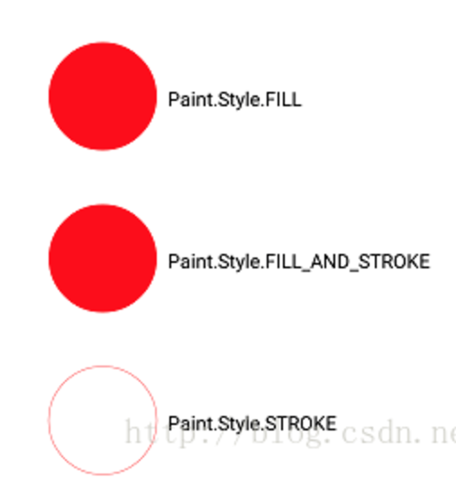
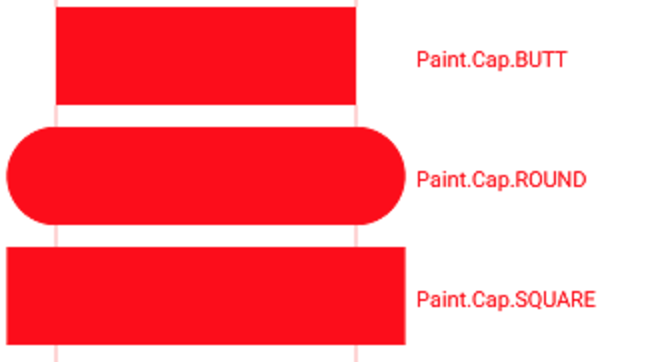

# Paint基础

## 构造函数

```java
//创建一个画笔对象
Paint()；

//在构造的时候可以传入一些定义好的属性，flags与用setFlags()一样
Paint(int flags);

//使用构造函数中Paint的属性生成一个新的Paint
Paint(Paint paint);
```

## 常用设置

### Paint.Style

- Paint.Style.FILL：填充内部
- Paint.Style.FILL_AND_STROKE  ：填充内部和描边
- Paint.Style.STROKE  ：描边



### Paint.Cap



### Paint.Join


### Paint.Align

- Paint.Align.LEFT
- Paint.Align.CENTER
- Paint.Align.RIGHT