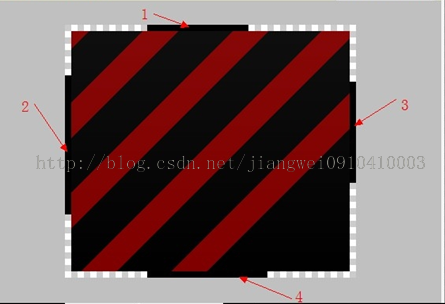

# Drawable

[google drawable](https://developer.android.com/guide/topics/resources/drawable-resource.html)

## BitmapDrawable

### 位图资源

- png jpg gif

### xml位图

```xml
<?xml version="1.0" encoding="utf-8"?>
<bitmap
    xmlns:android="http://schemas.android.com/apk/res/android"
    android:src="@[package:]drawable/drawable_resource"
    android:antialias=["true" | "false"]
    android:dither=["true" | "false"]
    android:filter=["true" | "false"]
    android:gravity=["top" | "bottom" | "left" | "right" | "center_vertical" |
                      "fill_vertical" | "center_horizontal" | "fill_horizontal" |
                      "center" | "fill" | "clip_vertical" | "clip_horizontal"]
    android:mipMap=["true" | "false"]
    android:tileMode=["disabled" | "clamp" | "repeat" | "mirror"] />
```

- **android:dither** 布尔值。当位图的像素配置与屏幕不同时,启用位图抖动可以让高质量的图片在低质量的屏幕上还能保持很好的显示效果
- **android:filter** 布尔值。启用或停用位图过滤。当位图收缩或拉伸以使其外观平滑时使用过滤可以保持较好的显示效果
- **android:tileMode** 关键字。定义平铺模式。当平铺模式启用时，位图会重复。重力在平铺模式启用时将被忽略
    - disabled  不平铺位图。这是默认值。
    - clamp     当着色器绘制范围超出其原边界时复制边缘颜色
    - repeat    水平和垂直重复着色器的图像。
    - mirror    水平和垂直重复着色器的图像，交替镜像图像以使相邻图像始终相接。

## NinePatchDrawable

### .9图详解



- 各条线的意义：
    - 1号黑色条位置向下覆盖的区域表示图片横向拉伸时，只拉伸该区域
    - 2号黑色条位置向右覆盖的区域表示图片纵向拉伸时，只拉伸该区域
    - 3号黑色条位置向左覆盖的区域表示图片纵向显示内容的区域
    - 4号黑色条位置向上覆盖的区域表示图片横向显示内容的区域 没有黑色

### 开源库从文件生成.9图

[NinePatchChunk](https://github.com/Anatolii/NinePatchChunk)

- 使用这个开源库的时候，要注意原来的bitmap的density与实际的density的关系
- 并且在最开始解析为bitmap的时候，只能设置inDensity,**不能设置targetDensity**,必须在生成NinePatchDrawable后设置targetDensity

```java
try {
    BitmapFactory.Options options = new BitmapFactory.Options();
    options.inDensity = DisplayMetrics.DENSITY_MEDIUM;
    Bitmap bitmap = BitmapFactory.decodeFile(bgLocal, options);
    NinePatchDrawable drawable1 = BitmapType.getNinePatchDrawable(mResources, bitmap, null);
    drawable1.setTargetDensity(mResources.getDisplayMetrics().densityDpi);
    drawable = drawable1;
} catch (Exception e) {
    drawable = null;
}
if (drawable == null) {
    drawable = mResources.getDrawable(bgDefault);
}
```

## ShapeDrawabel GradientDrawable PaintDrawable

### GradientDrawable

- 能过shape标签生成的其实是GradientDrawable

```xml
<?xml version="1.0" encoding="utf-8"?>
<shape
    xmlns:android="http://schemas.android.com/apk/res/android"
    android:shape=["rectangle" | "oval" | "line" | "ring"] >
    <corners
        android:radius="integer"
        android:topLeftRadius="integer"
        android:topRightRadius="integer"
        android:bottomLeftRadius="integer"
        android:bottomRightRadius="integer" />
    <gradient
        android:angle="integer"
        android:centerX="float"
        android:centerY="float"
        android:centerColor="color"
        android:endColor="color"
        android:gradientRadius="integer"
        android:startColor="color"
        android:type=["linear" | "radial" | "sweep"]
        android:useLevel=["true" | "false"] />
    <padding
        android:left="integer"
        android:top="integer"
        android:right="integer"
        android:bottom="integer" />
    <size
        android:width="integer"
        android:height="integer" />
    <solid
        android:color="color" />
    <stroke
        android:width="integer"
        android:color="color"
        android:dashWidth="integer"
        android:dashGap="integer" />
</shape>
```

#### ring

- **android:innerRadius** 尺寸。环内部（中间的孔）的半径，以尺寸值或尺寸资源表示。
- **android:innerRadiusRatio** 浮点型。环内部的半径，以环宽度的比率表示。
 例如，如果 android:innerRadiusRatio="5"，则内半径等于环宽度除以 5。此值被android:innerRadius 覆盖。默认值为 9。
- android:thickness 尺寸。环的厚度，以尺寸值或尺寸资源表示。
- **android:thicknessRatio** 浮点型。环的厚度，表示为环宽度的比率。例如，如果 android:thicknessRatio="2"，则厚度等于环宽度除以 2。此值被 android:innerRadius 覆盖。默认值为 3。
- **android:useLevel** 布尔值。如果这用作 LevelListDrawable，则此值为“true”。这通常应为“false”，否则形状不会显示。

#### gradient

- **android:angle** 整型。渐变的角度（度）。0 为从左到右，90 为从上到上。必须是 45 的倍数。默认值为 0。
- **android:centerX** 浮点型。渐变中心的相对 X 轴位置 (0 - 1.0)。
- **android:centerY** 浮点型。渐变中心的相对 Y 轴位置 (0 - 1.0)。
- **android:startColor** 颜色。起始颜色，表示为十六进制值或颜色资源。
- **android:centerColor** 颜色。起始颜色与结束颜色之间的可选颜色，以十六进制值或颜色资源表示。
- **android:endColor** 颜色。结束颜色，表示为十六进制值或颜色资源。
- **android:gradientRadius** 浮点型。渐变的半径。仅在 android:type="radial" 时适用。
- **android:type** 关键字。要应用的渐变图案的类型。有效值为：
    - **"linear"**  线性渐变。这是默认值。
    - **"radial"**  径向渐变。起始颜色为中心颜色。
    - **"sweep"**   流线型渐变。
- **android:useLevel** 布尔值。如果这用作 LevelListDrawable，则此值为“true”。

#### padding

- 表示的实际上不是shape的padding,而是包含它的View的padding

#### size

- ShapeDrawable的getIntrinsicWidth 与 getIntrinsicHeight默认会返回-1,但是设置了size属性后，会修该shape的固有宽和固有高
- 即使设置了固有宽和固有高，当shape作为View的背景的时候，它还是会被拉伸缩小为View的大小

### ShapeDrawable 和 PaintDrawable

- 都是用来绘制shape的，不能通过xml创建，只能通过代码创建，与GradientDrawable有些功能比较类似

## LayerDrawable

- LayerDrawable 是管理其他可绘制对象阵列的可绘制对象。列表中的每个可绘制对象按照列表的顺序绘制，列表中的最后一个可绘制对象绘于顶部。
- 每个可绘制对象由layer-list元素内的item元素表示。

```xml
<?xml version="1.0" encoding="utf-8"?>
<layer-list
    xmlns:android="http://schemas.android.com/apk/res/android" >
    <item
        android:drawable="@[package:]drawable/drawable_resource"
        android:id="@[+][package:]id/resource_name"
        android:left="dimension"
        android:top="dimension"
        android:right="dimension"
        android:bottom="dimension"
         />
</layer-list>
```

- **默认情况下，所有可绘制项都会缩放以适应包含视图的大小。**因此，将图像放在图层列表中的不同位置可能会增大视图的大小，并且有些图像会相应地缩放。
- 为避免缩放列表中的项目，请在item元素内使用bitmap元素指定可绘制对象，并且对某些不缩放的项目（例如 "center"）定义重力。

```xml
<!-- 定义缩放以适应其容器视图的项目-->
<item android:drawable="@drawable/image" />

<!-- 为避免缩放，以下示例使用重力居中的 <bitmap> 元素-->
<item>
  <bitmap android:src="@drawable/image"
          android:gravity="center" />
</item>
```

- 代码生成LayerDrawable

```java
Drawable[] layer = new Drawable[2];
layer[0] = new ColorDrawable(getResources().getColor(R.color.im_transparent));
layer[1] = new ColorDrawable(getResources().getColor(R.color.im_background));
LayerDrawable ly = new LayerDrawable(layer);
ly.setLayerInset(0, 0, 0, 0, 0);
ly.setLayerInset(1, 0, statusbarHeight + spaceHeight, 0, 0);
getWindow().setBackgroundDrawable(ly);
```

```java
/**
* Specifies the insets in pixels for the drawable at the specified index.
*
* @param index the index of the drawable to adjust
* @param l number of pixels to add to the left bound
* @param t number of pixels to add to the top bound
* @param r number of pixels to subtract from the right bound
* @param b number of pixels to subtract from the bottom bound
*
* @attr ref android.R.styleable#LayerDrawableItem_left
* @attr ref android.R.styleable#LayerDrawableItem_top
* @attr ref android.R.styleable#LayerDrawableItem_right
* @attr ref android.R.styleable#LayerDrawableItem_bottom
*/
public void setLayerInset(int index, int l, int t, int r, int b) {
    setLayerInsetInternal(index, l, t, r, b, UNDEFINED_INSET, UNDEFINED_INSET);
}
```

## StateListDrawable

```xml
<?xml version="1.0" encoding="utf-8"?>
<selector xmlns:android="http://schemas.android.com/apk/res/android"
    android:constantSize=["true" | "false"]
    android:dither=["true" | "false"]
    android:variablePadding=["true" | "false"] >
    <item
        android:drawable="@[package:]drawable/drawable_resource"
        android:state_pressed=["true" | "false"]
        android:state_focused=["true" | "false"]
        android:state_hovered=["true" | "false"]
        android:state_selected=["true" | "false"]
        android:state_checkable=["true" | "false"]
        android:state_checked=["true" | "false"]
        android:state_enabled=["true" | "false"]
        android:state_activated=["true" | "false"]
        android:state_window_focused=["true" | "false"] />
</selector>
```

- **android:constantSize** 布尔值。如果可绘制对象的内部大小在状态变更时保持不变，则值为“true”
 （大小是所有状态的最大值）；如果大小根据当前状态而变化，则值为“false”。默认值为 false。
- **android:dither** 布尔值。默认值为 true。
- **android:variablePadding** 布尔值。如果可绘制对象的内边距应根据选择的当前状态而变化，则值为“true”；如果内边距应保持不变（基于所有状态的最大内边距），则值为“false”。启用此功能要求您在状态变更时处理执行布局，这通常不受支持。默认值为 false。

- Android 将应用状态列表中第一个与对象当前状态匹配的项目。因此，如果列表中的第一个项目不含上述任何状态属性，则每次都会应用它，这就是默认值应始终放在最后的原因

### android:duplicateParentState

- 让子View跟随其Parent的状态，如pressed等。常见的使用场景是某些时候一个按钮很小，我们想要扩大其点击区域的时候通常会再给其包裹一层布局，将点击事件写到Parent上，这时候如果希望被包裹按钮的点击效果对应的Selector继续生效的话，这时候duplicateParentState就派上用场了。

```xml
<?xml version="1.0" encoding="utf-8"?>
<LinearLayout xmlns:android="http://schemas.android.com/apk/res/android"
    android:id="@+id/ll_subscribe_root"
    android:layout_width="@dimen/subscribe_btn_width"
    android:layout_height="@dimen/subscribe_btn_height"
    android:background="@drawable/btn_subscribe_bg"
    android:orientation="horizontal"
    android:gravity="center"
    >

    <ImageView
        android:id="@+id/iv_subscribe_icon"
        android:layout_width="wrap_content"
        android:layout_height="wrap_content"
        android:duplicateParentState="true"
        android:src="@drawable/icon_subscribe_normal" />

    <TextView
        android:id="@+id/tv_subscribe_content"
        android:layout_width="wrap_content"
        android:layout_height="wrap_content"
        android:paddingLeft="3dp"
        android:duplicateParentState="true"
        android:text="@string/str_not_yet_subscribe_btn"
        android:textSize="@dimen/subscribe_text_size" />


</LinearLayout>
```


## LevelListDrawable

```xml
<?xml version="1.0" encoding="utf-8"?>
<level-list
    xmlns:android="http://schemas.android.com/apk/res/android" >
    <item
        android:drawable="@drawable/drawable_resource"
        android:maxLevel="integer"
        android:minLevel="integer" />
</level-list>
```

- 通过Drawable的setLevel方法来选择level在maxLevel与minLevel之间的drawable进行渲染
- ImageView自带setImageLevel方法

```java
public void setImageLevel(int level) {
    mLevel = level;
    if (mDrawable != null) {
        mDrawable.setLevel(level);
        resizeFromDrawable();
    }
}
```

## TransitionDrawable

- TransitionDrawable 是可在两种可绘制对象资源之间交错淡出的可绘制对象。
- 每个可绘制对象由单一transition元素内的item元素表示。
- **不支持超过两个项目**。
- 要向前转换，请调用 startTransition()。要向后转换，则调用 reverseTransition()。

```xml
<?xml version="1.0" encoding="utf-8"?>
<transition
xmlns:android="http://schemas.android.com/apk/res/android" >
    <item
        android:drawable="@[package:]drawable/drawable_resource"
        android:id="@[+][package:]id/resource_name"
        android:top="dimension"
        android:right="dimension"
        android:bottom="dimension"
        android:left="dimension" />
</transition>
```

```xml
<?xml version="1.0" encoding="utf-8"?>
<transition xmlns:android="http://schemas.android.com/apk/res/android">
    <item android:drawable="@drawable/on" />
    <item android:drawable="@drawable/off" />
</transition>
```

```java
ImageButton button = (ImageButton) findViewById(R.id.button);
TransitionDrawable drawable = (TransitionDrawable) button.getDrawable();
drawable.startTransition(500);
```

## InsetDrawable

- 在 XML 文件中定义的以指定距离插入其他可绘制对象的可绘制对象。
- 当View希望自己的背景比自己的实际区域小的时候，可以使用InsetDrawable

```xml
<?xml version="1.0" encoding="utf-8"?>
<inset
    xmlns:android="http://schemas.android.com/apk/res/android"
    android:drawable="@drawable/drawable_resource"
    android:insetTop="dimension"
    android:insetRight="dimension"
    android:insetBottom="dimension"
    android:insetLeft="dimension" />
```

## ScaleDrawable

- 在 XML 文件中定义的更改其他可绘制对象大小（根据其当前级别）的可绘制对象

```xml
<?xml version="1.0" encoding="utf-8"?>
<scale
    xmlns:android="http://schemas.android.com/apk/res/android"
    android:drawable="@drawable/drawable_resource"
    android:scaleGravity=["top" | "bottom" | "left" | "right" | "center_vertical" |
                          "fill_vertical" | "center_horizontal" | "fill_horizontal" |
                          "center" | "fill" | "clip_vertical" | "clip_horizontal"]
    android:scaleHeight="percentage"
    android:scaleWidth="percentage" />
```

### level

```xml
<?xml version="1.0" encoding="utf-8"?>
<scale xmlns:android="http://schemas.android.com/apk/res/android"
    android:drawable="@drawable/image"
    android:scaleGravity="center_vertical|center_horizontal"
    android:scaleHeight="50%"
    android:scaleWidth="50%" />

<ImageView
    android:id="@+id/imgView"
    android:src="@drawable/scale"
    android:layout_width="wrap_content"
    android:layout_height="wrap_content"/>
```

- 如果我们直接运行，会发现并没有显示图片，查看ScaleDrawable的源码，发现draw()方法有判断getLevel() != 0才绘制。而我们在没有setLevel()时，默认getLevel()都是0。

```java
 @Override
    public void draw(Canvas canvas) {
        final Drawable d = getDrawable();
        if (d != null && d.getLevel() != 0) {
            d.draw(canvas);
        }
    }

 public final boolean setLevel(int level) {
        if (mLevel != level) {
            mLevel = level;
            return onLevelChange(level);
        }
        return false;
    }

@Override
    protected boolean onLevelChange(int level) {
        super.onLevelChange(level);
        onBoundsChange(getBounds());
        invalidateSelf();
        return true;
    }

@Override
    protected void onBoundsChange(Rect bounds) {
        final Drawable d = getDrawable();
        final Rect r = mTmpRect;
        final boolean min = mState.mUseIntrinsicSizeAsMin;
        final int level = getLevel();

        int w = bounds.width();
        if (mState.mScaleWidth > 0) {
            final int iw = min ? d.getIntrinsicWidth() : 0;
            w -= (int) ((w - iw) * (MAX_LEVEL - level) * mState.mScaleWidth / MAX_LEVEL);
        }

        int h = bounds.height();
        if (mState.mScaleHeight > 0) {
            final int ih = min ? d.getIntrinsicHeight() : 0;
            h -= (int) ((h - ih) * (MAX_LEVEL - level) * mState.mScaleHeight / MAX_LEVEL);
        }

        final int layoutDirection = getLayoutDirection();
        Gravity.apply(mState.mGravity, w, h, bounds, r, layoutDirection);

        if (w > 0 && h > 0) {
            d.setBounds(r.left, r.top, r.right, r.bottom);
        }
    }

```

- min = mState.mUseIntrinsicSizeAsMin;其实也是从xml文件中读取的：

```java
state.mUseIntrinsicSizeAsMin = a.getBoolean(
R.styleable.ScaleDrawable_useIntrinsicSizeAsMinimum, state.mUseIntrinsicSizeAsMin);
```

但是我们一般没有设置这个值，默认为false，所以iw和ih也默认为0，MAX_LEVEL为10000.那么上面的表达式就可以简化为

```java
w -= (int) (w * (10000 - level) * mState.mScaleWidth / 10000);
h -= (int) (h * (10000 - level) * mState.mScaleHeight / 10000);
```

如果我们设置level=10000，即为:

```java
w -= 0;
h -= 0;
```

也就是图片原始大小，没有缩放效果。当level=0时图片又没有显示，所以我们一般设置level为1，这样，图片就会根据xml中的android:scaleWidth和android:scaleHeight进行相应的缩放了。

- 所以我们想将drawable缩小为原来的30%,那么xml中指定的数值应当为70%,**也就是说scaleWidth和scaleHeight其实并不是最后的大小，而是缩小的大小**

```xml
<scale xmlns:android="http://schemas.android.com/apk/res/android"
    android:drawable="@drawable/image"
    android:scaleGravity="center_vertical|center_horizontal"
    android:scaleHeight="70%"
    android:scaleWidth="70%" />

<ImageView
    android:id="@+id/imgView"
    android:src="@drawable/scale"
    android:layout_width="wrap_content"
    android:layout_height="wrap_content"/>
```

```java
ImageView button = (ImageView) findViewById(R.id.imgView);
ScaleDrawable drawable = (ScaleDrawable) button.getDrawable();
// 非常重要，必须设置level才能显示，
// 并且xml中为70%，实际最后的大小为30%!!!!!!!!!!!
drawable.setLevel(1);
```

## ClipDrawable

- 在 XML 文件中定义的对其他可绘制对象进行裁剪（根据其当前级别）的可绘制对象。
- 您可以根据级别以及用于控制其在整个容器中位置的重力，来控制子可绘制对象的裁剪宽度和高度。通常用于实现进度栏之类的项目。

```xml
<?xml version="1.0" encoding="utf-8"?>
<clip
    xmlns:android="http://schemas.android.com/apk/res/android"
    android:drawable="@drawable/drawable_resource"
    android:clipOrientation=["horizontal" | "vertical"]
    android:gravity=["top" | "bottom" | "left" | "right" | "center_vertical" |
                     "fill_vertical" | "center_horizontal" | "fill_horizontal" |
                     "center" | "fill" | "clip_vertical" | "clip_horizontal"] />
```

### clipOrientation

- horizontal 水平裁剪可绘制对象。
- vertical  垂直裁剪可绘制对象。

### gravity

参数 | 描述
----|----------------------------------------------------------------
top | 将对象放在其容器顶部，不改变其大小。当 clipOrientation 是 "vertical" 时，在可绘制对象的底部裁剪。
bottom | 将对象放在其容器底部，不改变其大小。当 clipOrientation 是 "vertical" 时，在可绘制对象的顶部裁剪。
left | 将对象放在其容器左边缘，不改变其大小。这是默认值。当 clipOrientation 是 "horizontal" 时，在可绘制对象的右边裁剪。这是默认值。
right | 将对象放在其容器右边缘，不改变其大小。当 clipOrientation 是 "horizontal" 时，在可绘制对象的左边裁剪。
center_vertical | 将对象放在其容器的垂直中心，不改变其大小。裁剪行为与重力为 "center" 时相同。
fill_vertical | 按需要扩展对象的垂直大小，使其完全适应其容器。当 clipOrientation 是 "vertical" 时，不会进行裁剪，因为可绘制对象会填充垂直空间（除非可绘制对象级别为 0，此时它不可见）。
center_horizontal | 将对象放在其容器的水平中心，不改变其大小。裁剪行为与重力为 "center" 时相同。
fill_horizontal | 按需要扩展对象的水平大小，使其完全适应其容器。当 clipOrientation 是 "horizontal" 时，不会进行裁剪，因为可绘制对象会填充水平空间（除非可绘制对象级别为 0，此时它不可见）。
center | 将对象放在其容器的水平和垂直轴中心，不改变其大小。当 clipOrientation 是 "horizontal" 时，在左边和右边裁剪。当 clipOrientation 是 "vertical" 时，在顶部和底部裁剪。
fill | 按需要扩展对象的垂直大小，使其完全适应其容器。不会进行裁剪，因为可绘制对象会填充水平和垂直空间（除非可绘制对象级别为 0，此时它不可见）。
clip_vertical | 可设置为让子元素的上边缘和/或下边缘裁剪至其容器边界的附加选项。裁剪基于垂直重力：顶部重力裁剪上边缘，底部重力裁剪下边缘，任一重力不会同时裁剪两边。
clip_horizontal | 可设置为让子元素的左边和/或右边裁剪至其容器边界的附加选项。裁剪基于水平重力：左边重力裁剪右边缘，右边重力裁剪左边缘，任一重力不会同时裁剪两边。

### ClipDrawable的level

- ClipDrawable的level值也与它的绘制和裁剪区域的大小有关

```java
@Override
    public void draw(Canvas canvas) {
        final Drawable dr = getDrawable();
        if (dr.getLevel() == 0) {
            return;
        }

        final Rect r = mTmpRect;
        final Rect bounds = getBounds();
        final int level = getLevel();

        int w = bounds.width();
        final int iw = 0; //mState.mDrawable.getIntrinsicWidth();
        if ((mState.mOrientation & HORIZONTAL) != 0) {
            w -= (w - iw) * (MAX_LEVEL - level) / MAX_LEVEL;
        }

        int h = bounds.height();
        final int ih = 0; //mState.mDrawable.getIntrinsicHeight();
        if ((mState.mOrientation & VERTICAL) != 0) {
            h -= (h - ih) * (MAX_LEVEL - level) / MAX_LEVEL;
        }

        final int layoutDirection = getLayoutDirection();
        Gravity.apply(mState.mGravity, w, h, bounds, r, layoutDirection);

        if (w > 0 && h > 0) {
            canvas.save();
            canvas.clipRect(r);
            dr.draw(canvas);
            canvas.restore();
        }
    }
```

- **如果没有设置level,那么ClipDrawable是不会绘制出来的**

```java
w -= w * (10000 - level) / 10000;
h -= h * (10000 - level) / 10000;
```

- **level值越大，表示裁剪区域越小**，如果想裁剪20%，留下80%,那么level应当设置为8000;