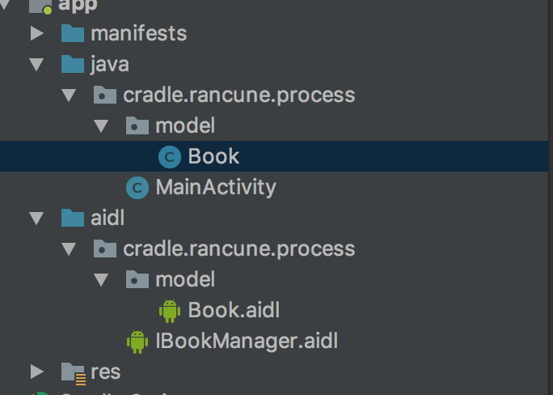
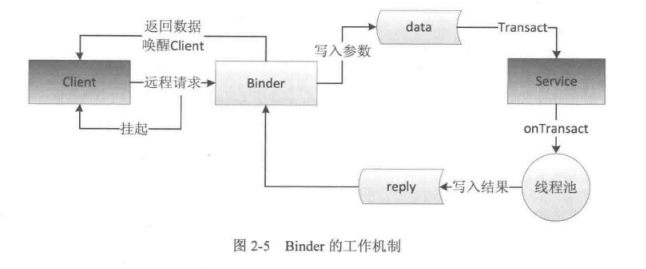

# AIDL

## 相关文档

- 《Android开发艺术探索》
- [Android：学习AIDL，这一篇文章就够了(上)](https://blog.csdn.net/luoyanglizi/article/details/51980630)

## Android Studio中的AIDL工程结构



- android{}结构下

```groovy
// 指定源集，Android Studio 3.1默认就是这样
sourceSets {
    main {
        java.srcDirs = ['src/main/java', 'src/main/aidl']
    }
}
```

## AIDL中支持的数据类型

- 基本数据类型(int,long,char,boolean,double等)
- String和CharSequence
- List,只支持ArrayList,里面每个元素都必须能够被AIDL支持
- Map,只持持HashMap,里面的每个元素都必须被AIDL支持，包括key和value
- Parcelable,所以实现了Parcelable接口的对象
- AIDL，所有的AIDL接口本身也可以在AIDL中使用

## 定向Tag

- AIDL中的定向tag表示了在跨进程通信中数据的流向，**其中 in 表示数据只能由客户端流向服务端， out 表示数据只能由服务端流向客户端，而 inout 则表示数据可在服务端与客户端之间双向流通**。其中，数据流向是针对在客户端中的那个传入方法的对象而言的。
- in为定向tag的话表现为服务端将会接收到一个那个对象的完整数据，**但是客户端的那个对象不会因为服务端对传参的修改而发生变动**；
- out的话表现为服务端将会接收到那个对象的的空对象，但是**在服务端对接收到的空对象有任何修改之后客户端将会同步变动；
- inout为定向tag的情况下，**服务端将会接收到客户端传来对象的完整信息，并且客户端将会同步服务端对该对象的任何变动**
- **Java中的基本类型和String ，CharSequence 的定向tag默认且只能是in**
- **传参时除了基本类型与String,CharSequence,其它的类型必须加上定向Tag**

## 自定义Parcelable

- **即使在对应的package中定义Parcelable Java对象，也必须在aidl中再次声明**,并且两者的package要一样

```java
// Book.java
package cradle.rancune.process.model;

import android.os.Parcel;
import android.os.Parcelable;

/**
 * Created by Rancune@126.com 2018/3/29.
 */
public class Book implements Parcelable {
    private String mId;
    private String mName;

    public Book() {

    }

    protected Book(Parcel in) {
        mId = in.readString();
        mName = in.readString();
    }

    public static final Creator<Book> CREATOR = new Creator<Book>() {
        @Override
        public Book createFromParcel(Parcel in) {
            return new Book(in);
        }

        @Override
        public Book[] newArray(int size) {
            return new Book[size];
        }
    };

    public String getId() {
        return mId;
    }

    public void setId(String id) {
        mId = id;
    }

    public String getName() {
        return mName;
    }

    public void setName(String name) {
        mName = name;
    }

    public void readFromParcel(Parcel in) {

    }

    @Override
    public int describeContents() {
        return 0;
    }

    @Override
    public void writeToParcel(Parcel dest, int flags) {
        dest.writeString(mId);
        dest.writeString(mName);
    }
}
```

```java
// Book.aidl
package cradle.rancune.process.model;

// Declare any non-default types here with import statements
parcelable Book;
```

- **如果一个Parcelable的定向Tag是inout,那么该对象除了要实现Parcelable接口，还必须实现readFromParcel(Parcel)函数**

```java
public void readFromParcel(Parcel in) {
    mId = in.readString();
    mName = in.readString();
}
```

## 显示引入

- **即使不同的aidl类在同一个包中，在使用时也必须要显示引入**

```java
// IBookManager.aidl
package cradle.rancune.process;

// 必须显示引入
import cradle.rancune.process.model.Book;

// Declare any non-default types here with import statements

interface IBookManager {
    void add(inout Book book);
    List<Book> getBookList();
}
```

## 自动生成代码

- 使用Android Studio编译自动生成代码

```java
/*
 * This file is auto-generated.  DO NOT MODIFY.
 * Original file: /Users/tanhua/Work/android/process/app/src/main/aidl/cradle/rancune/process/IBookManager.aidl
 */
package cradle.rancune.process;
// Declare any non-default types here with import statements

public interface IBookManager extends android.os.IInterface {
    /**
     * Local-side IPC implementation stub class.
     */
    public static abstract class Stub extends android.os.Binder implements cradle.rancune.process.IBookManager {
        private static final java.lang.String DESCRIPTOR = "cradle.rancune.process.IBookManager";

        /**
         * Construct the stub at attach it to the interface.
         */
        public Stub() {
            this.attachInterface(this, DESCRIPTOR);
        }

        /**
         * Cast an IBinder object into an cradle.rancune.process.IBookManager interface,
         * generating a proxy if needed.
         */
        public static cradle.rancune.process.IBookManager asInterface(android.os.IBinder obj) {
            if ((obj == null)) {
                return null;
            }
            android.os.IInterface iin = obj.queryLocalInterface(DESCRIPTOR);
            if (((iin != null) && (iin instanceof cradle.rancune.process.IBookManager))) {
                return ((cradle.rancune.process.IBookManager) iin);
            }
            return new cradle.rancune.process.IBookManager.Stub.Proxy(obj);
        }

        @Override
        public android.os.IBinder asBinder() {
            return this;
        }

        @Override
        public boolean onTransact(int code, android.os.Parcel data, android.os.Parcel reply, int flags) throws android.os.RemoteException {
            switch (code) {
                case INTERFACE_TRANSACTION: {
                    reply.writeString(DESCRIPTOR);
                    return true;
                }
                case TRANSACTION_add: {
                    data.enforceInterface(DESCRIPTOR);
                    cradle.rancune.process.model.Book _arg0;
                    // 获得函数add(Book)的参数 Book _arg0;
                    if ((0 != data.readInt())) {
                        _arg0 = cradle.rancune.process.model.Book.CREATOR.createFromParcel(data);
                    } else {
                        _arg0 = null;
                    }
                    // 所以这里我们要注意这里的Book可能是null
                    this.add(_arg0);
                    // 函数调用中没有发生Exception
                    reply.writeNoException();
                    // 因为上面我们在定义的Book的定向Tag是inout,所以这里会再次返回函数调用参数_arg0
                    if ((_arg0 != null)) {
                        reply.writeInt(1);
                        _arg0.writeToParcel(reply, android.os.Parcelable.PARCELABLE_WRITE_RETURN_VALUE);
                    } else {
                        reply.writeInt(0);
                    }
                    return true;
                }
                case TRANSACTION_getBookList: {
                    data.enforceInterface(DESCRIPTOR);
                    java.util.List<cradle.rancune.process.model.Book> _result = this.getBookList();
                    reply.writeNoException();
                    reply.writeTypedList(_result);
                    return true;
                }
            }
            return super.onTransact(code, data, reply, flags);
        }

        private static class Proxy implements cradle.rancune.process.IBookManager {
            private android.os.IBinder mRemote;

            Proxy(android.os.IBinder remote) {
                mRemote = remote;
            }

            @Override
            public android.os.IBinder asBinder() {
                return mRemote;
            }

            public java.lang.String getInterfaceDescriptor() {
                return DESCRIPTOR;
            }

            @Override
            public void add(cradle.rancune.process.model.Book book) throws android.os.RemoteException {
                android.os.Parcel _data = android.os.Parcel.obtain();
                android.os.Parcel _reply = android.os.Parcel.obtain();
                try {
                    _data.writeInterfaceToken(DESCRIPTOR);
                    if ((book != null)) {
                        _data.writeInt(1);
                        book.writeToParcel(_data, 0);
                    } else {
                        _data.writeInt(0);
                    }
                    mRemote.transact(Stub.TRANSACTION_add, _data, _reply, 0);
                    _reply.readException();
                    if ((0 != _reply.readInt())) {
                        book.readFromParcel(_reply);
                    }
                } finally {
                    _reply.recycle();
                    _data.recycle();
                }
            }

            @Override
            public java.util.List<cradle.rancune.process.model.Book> getBookList() throws android.os.RemoteException {
                android.os.Parcel _data = android.os.Parcel.obtain();
                android.os.Parcel _reply = android.os.Parcel.obtain();
                java.util.List<cradle.rancune.process.model.Book> _result;
                try {
                    _data.writeInterfaceToken(DESCRIPTOR);
                    mRemote.transact(Stub.TRANSACTION_getBookList, _data, _reply, 0);
                    _reply.readException();
                    _result = _reply.createTypedArrayList(cradle.rancune.process.model.Book.CREATOR);
                } finally {
                    _reply.recycle();
                    _data.recycle();
                }
                return _result;
            }
        }

        static final int TRANSACTION_add = (android.os.IBinder.FIRST_CALL_TRANSACTION + 0);
        static final int TRANSACTION_getBookList = (android.os.IBinder.FIRST_CALL_TRANSACTION + 1);
    }

    public void add(cradle.rancune.process.model.Book book) throws android.os.RemoteException;

    public java.util.List<cradle.rancune.process.model.Book> getBookList() throws android.os.RemoteException;
}
```

### DESCRIPTOR

- Binder的唯一标识，一般用当前Binder的类名表示

### asInterface(android.os.IBinder obj)

- 用于将服务端的Binder对象转为客户端的AIDL接口对象
- **如果客户端与服务端位于同一进程，返回服务端的Stub对象本身**
- **如果不在同一进程，返回系统封装后的Stub.proxy对象**

### asBinder()

- 返回当前的Binder对象

### onTransact(int code, android.os.Parcel data, android.os.Parcel reply, int flags)

- **运行在服务端的Binder线程池中**
- 当客户端发起跨进程的请求时，远程请求会通过底层封装后交由此方法来处理
- 通过code可以确定客户端要调用哪一个方法
- 如果方法有参数的话，可以从data中获得方法需要的参数
- 目标方法执行完成后，如果有返回结果，需要将结果写入reply中
- **如果某个函数的参数的定向Tag是inout,那么还需要将参数还回**
- **如果这个方法返回false,那么客户端的请求会失败，可以利用这个特性来做权限验证**

### Proxy.getBookList 和 Proxy.addBook

- **这两个方法运行在客户端**
- 创建方法调用的_data,返回值_reply，将方法参数写入_data
- **通过transact发起RPC请求，同时将当前线程挂起**
- 服务端的onTransact方法会被调用，直到RPC过程返回，从_reply中取出返回结果，并且当前线程继续执行
- **所以客户端发起请求到返回实际上是一个阻塞的过程**

## AIDL RPC请求流程

- 客户端在线程A发起请求的话，线程A会被挂起，**如果请求是一个耗时的，所以不能在主线程发起请求**
- **由于服务端的Binder方法运行在Binder线程池中，所以Binder方法不管是否耗时都应当采用同步的方法去实现**
- **由于Binder方法会从不同线程发起，所以服务端方法要注意同步**


