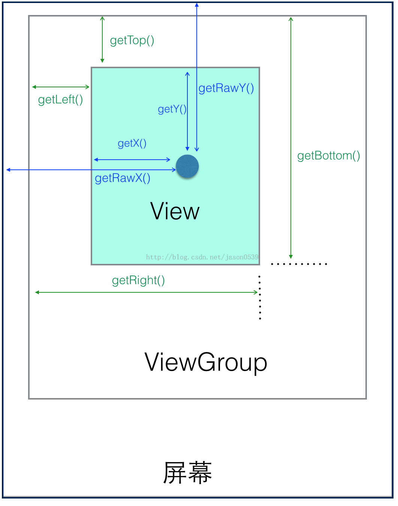

# View中的坐标系

- 坐标图解 

- 各种坐标的含义

Header One  | Header Two
:---------- | :----------------------------------------------------------------------
getLeft()   | 返回View自身左边到父布局左边的距离
getTop()    | 返回View自身顶边到父布局顶边的距离
getRight()  | 返回View自身右边到父布局左边的距离
getBottom() | 返回View自身底边到父布局顶边的距离
getX()      | View左上角相对于parent view中的横坐标
getY()      | View左上角相对于parent view中的纵坐标
getTranslationX()     | 水平相对于getLeft的值
getTranslationY()     | 纵向相对于getTop的值

- getX() = getLeft()+getTranslationX()，当setTranslationX()时getLeft()不变，getX()变。
- getY() = getTop()+getTranslationY()，当setTranslationY()时getTop()不变，getY()变。

## view的宽高

Header One          | Header Two
:------------------ | :--------------------------------------------------------------
getWidth()          | layout后有效，返回值是mRight-mLeft，一般会参考measure的宽度（measure可能没用），但不是必须的。
getHeight()         | layout后有效，返回值是mBottom-mTop，一般会参考measure的高度（measure可能没用），但不是必须的。
getMeasuredWidth()  | 返回measure过程得到的mMeasuredWidth值，供layout参考，或许没用。
getMeasuredHeight() | 返回measure过程得到的mMeasuredHeight值，供layout参考，或许没用。

## MotionEvent的坐标含义

Header One | Header Two
:--------- | :------------------
getX()     | 当前触摸事件距离当前View左边的距离
getY()     | 当前触摸事件距离当前View顶边的距离
getRawX()  | 当前触摸事件距离整个屏幕左边的距离
getRawY()  | 当前触摸事件距离整个屏幕顶边的距离

## view的rect方法

函数名            | View1           | View2         | 函数含义
:--------------------- | :------------------- | :------------------- | :---------------------------------------------------------------------------------------
getLocalVisibleRect()  | (0, 0 , 410, 100)    | (0, 0 , 410, 470)    | 获取View自身可见的坐标区域，坐标以自己的左上角为原点(0,0)，另一点为可见区域右下角相对自己(0,0)点的坐标
getGlobalVisibleRect() | (30, 100 , 440, 200) | (30, 250 , 440, 720) | 获取View在屏幕绝对坐标系中的可视区域，坐标以屏幕左上角为原点(0,0)，另一个点为可见区域右下角相对屏幕原点(0,0)点的坐标
getLocationOnScreen()  | (30, 100)            | (30, 250)            | 坐标是相对整个屏幕而言，Y坐标为View左上角到屏幕顶部的距离。
getLocationInWindow()  | (30, 100)            | (30, 250)            | 如果为普通Activity则Y坐标为View左上角到屏幕顶部；如果为对话框式的Activity则Y坐标为当前Dialog模式Activity的标题栏顶部到View左上角的距离。

## view的滑动

- 关于View提供的与坐标息息相关的另一组常用的重要方法就是滚动或者滑动相关的，下面我们给出相关的解释（改变View在屏幕中的位置可以使用offsetLeftAndRight()和offsetTopAndBottom()方法，他会导致getLeft()等值改变。）

Header One                     | Header Two
:----------------------------- | :--------------------------------------------------------------------
offsetLeftAndRight(int offset) | 水平方向挪动View，offset为正则x轴正向移动，移动的是整个View，getLeft()会变的，自定义View很有用。
offsetTopAndBottom(int offset) | 垂直方向挪动View，offset为正则y轴正向移动，移动的是整个View，getTop()会变的，自定义View很有用
scrollTo(int x, int y)         | 将View中内容（不是整个View）滑动到相应的位置，参考坐标原点为ParentView左上角，x，y为正则向xy轴反方向移动，反之同理。
scrollBy(int x, int y)         | 将View中的内容相对于当前位置滑动x, y,x，y为正则向xy轴反方向移动，反之同理。
setScrollX(int value)          | 实质为scrollTo()，只是只改变Y轴滑动
setScrollY(int value)          | 实质为scrollTo()，只是只改变X轴滑动
getScrollX()/getScrollY()      | 获取当前滑动位置偏移量
