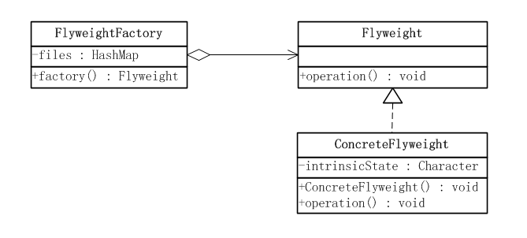
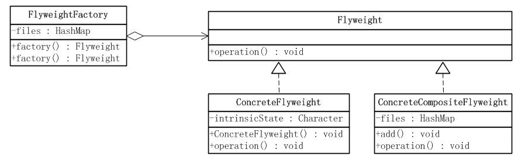

# 享元模式

## 定义

- 享元模式是对象的结构模式。
- 享元模式以共享的方式高效地支持大量的细粒度对象

## 内部／外部状态

- **内部状态**：享元对象中的部分状态是可以共享的，可以共享的状态称为内部状态，**内部状态不会随着环境变化而变化**
- **外部状态**：不可以共享的状态称为外部状态，**外部状态会随着环境变化而变化**
- 经典的享元模式实现中，**在内部有一个Map的容器，以内部状态作为Map的key,以享元对象本身作为Map的value**

## 应用场景

- 系统中存在大量的相似的对象
- 细粒度的对象都具备较接近的外部状态，而且内部状态与环境无关，也就是说对象没有特定身份
- 需要缓冲池的对象

## 简单享元模式



```java
public interface Flyweight {
    //一个示意性方法，参数state是外部状态
    public void operation(String state);
}
```

```java
public class ConcreteFlyweight implements Flyweight {
    private Character intrinsicState = null;
    /**
     * 构造函数，内部状态作为参数传入
     * @param state
     */
    public ConcreteFlyweight(Character state){
        this.intrinsicState = state;
    }

    /**
     * 外蕴状态作为参数传入方法中，改变方法的行为，
     * 但是并不改变对象的内蕴状态。
     */
    @Override
    public void operation(String state) {
        // TODO Auto-generated method stub
        System.out.println("Intrinsic State = " + this.intrinsicState);
        System.out.println("Extrinsic State = " + state);
    }

}
```

```java
public class FlyweightFactory {
    private Map<Character,Flyweight> files = new HashMap<Character,Flyweight>();

    public Flyweight factory(Character state){
        //先从缓存中查找对象
        Flyweight fly = files.get(state);
        if(fly == null){
            //如果对象不存在则创建一个新的Flyweight对象
            fly = new ConcreteFlyweight(state);
            //把这个新的Flyweight对象添加到缓存中
            files.put(state, fly);
        }
        return fly;
    }
}
```

## 复合享元模式



```java
public interface Flyweight {
    //一个示意性方法，参数state是外部状态
    public void operation(String state);
}
```

```java
public class ConcreteFlyweight implements Flyweight {
    private Character intrinsicState = null;
    /**
     * 构造函数，内部状态作为参数传入
     * @param state
     */
    public ConcreteFlyweight(Character state){
        this.intrinsicState = state;
    }

    /**
     * 外蕴状态作为参数传入方法中，改变方法的行为，
     * 但是并不改变对象的内蕴状态。
     */
    @Override
    public void operation(String state) {
        // TODO Auto-generated method stub
        System.out.println("Intrinsic State = " + this.intrinsicState);
        System.out.println("Extrinsic State = " + state);
    }

}
```

```java
public class ConcreteCompositeFlyweight implements Flyweight {

    private Map<Character,Flyweight> files = new HashMap<Character,Flyweight>();
    /**
     * 增加一个新的单纯享元对象到聚集中
     */
    public void add(Character key , Flyweight fly){
        files.put(key,fly);
    }
    /**
     * 外蕴状态作为参数传入到方法中
     */
    @Override
    public void operation(String state) {
        Flyweight fly = null;
        for(Object o : files.keySet()){
            fly = files.get(o);
            fly.operation(state);
        }

    }

}
```

```java
public class FlyweightFactory {
    private Map<Character,Flyweight> files = new HashMap<Character,Flyweight>();
    /**
     * 复合享元工厂方法
     */
    public Flyweight factory(List<Character> compositeState){
        ConcreteCompositeFlyweight compositeFly = new ConcreteCompositeFlyweight();
        //调用的自身的单个享元生成的方法！
        for(Character state : compositeState){
            compositeFly.add(state,this.factory(state));
        }
        return compositeFly;
    }

    /**
     * 单纯享元工厂方法
     */
    public Flyweight factory(Character state){
        //先从缓存中查找对象
        Flyweight fly = files.get(state);
        if(fly == null){
            //如果对象不存在则创建一个新的Flyweight对象
            fly = new ConcreteFlyweight(state);
            //把这个新的Flyweight对象添加到缓存中
            files.put(state, fly);
        }
        return fly;
    }
}
```