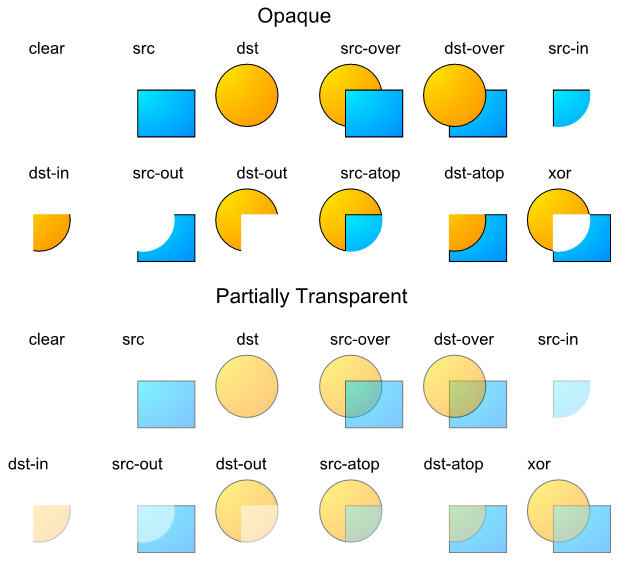

# 自定义View基础

- [颜色](#颜色)
    - [透明度](#透明度)
    - [颜色混合](#颜色混合)
    - [PorterDuff.Mode](#porterduffmode)

## 颜色

### 透明度

- **从0x00到0xff表示从透明到不透明**

### 颜色混合

- [安卓自定义View基础-颜色](http://www.gcssloop.com/customview/Color)

- 当一个颜色绘制到Canvas上时的混合模式默认是这样计算的：

```java
 (RGB通道) 最终颜色 = 绘制的颜色 + (1 - 绘制颜色的透明度) × Canvas上的原有颜色
```

- 把每个通道的取值从0(0x00)到255(0xff)映射到0到1的浮点数表示。
- **这里等式右边的“绘制的颜色”、“Canvas上的原有颜色” 都是经过预乘了自己的Alpha通道的值**
 如绘制颜色：0x88ffffff，那么参与运算时的每个颜色通道的值不是1.0，而是(1.0 * 0x88/0xff = 0.5333)
- 使用这种方式的混合，就会造成后绘制的内容以半透明的方式叠在上面的视觉效果

### PorterDuff.Mode

- 用Paint.setXfermode，指定不同的PorterDuff.Mode。

- PorterDuff.Mode混合计算公式：（D指原本在Canvas上的内容dst，S指绘制输入的内容src，a指alpha通道，c指RGB各个通道）

```java
public enum Mode {
        /** [0, 0] */
        CLEAR       (0),
        /** [Sa, Sc] */
        SRC         (1),
        /** [Da, Dc] */
        DST         (2),
        /** [Sa + (1 - Sa)*Da, Rc = Sc + (1 - Sa)*Dc] */
        SRC_OVER    (3),
        /** [Sa + (1 - Sa)*Da, Rc = Dc + (1 - Da)*Sc] */
        DST_OVER    (4),
        /** [Sa * Da, Sc * Da] */
        SRC_IN      (5),
        /** [Sa * Da, Sa * Dc] */
        DST_IN      (6),
        /** [Sa * (1 - Da), Sc * (1 - Da)] */
        SRC_OUT     (7),
        /** [Da * (1 - Sa), Dc * (1 - Sa)] */
        DST_OUT     (8),
        /** [Da, Sc * Da + (1 - Sa) * Dc] */
        SRC_ATOP    (9),
        /** [Sa, Sa * Dc + Sc * (1 - Da)] */
        DST_ATOP    (10),
        /** [Sa + Da - 2 * Sa * Da, Sc * (1 - Da) + (1 - Sa) * Dc] */
        XOR         (11),
        /** [Sa + Da - Sa*Da,
             Sc*(1 - Da) + Dc*(1 - Sa) + min(Sc, Dc)] */
        DARKEN      (16),
        /** [Sa + Da - Sa*Da,
             Sc*(1 - Da) + Dc*(1 - Sa) + max(Sc, Dc)] */
        LIGHTEN     (17),
        /** [Sa * Da, Sc * Dc] */
        MULTIPLY    (13),
        /** [Sa + Da - Sa * Da, Sc + Dc - Sc * Dc] */
        SCREEN      (14),
        /** Saturate(S + D) */
        ADD         (12),
        OVERLAY     (15);

        Mode(int nativeInt) {
            this.nativeInt = nativeInt;
        }

        /**
         * @hide
         */
        public final int nativeInt;
    }

```

- 主要分为两类
    - Alpha合成
    - 混合模式 DARKEN LIGHTEN MULTIPLY SCREEN OVERLAY

- Alpha合成（src表示输入的图，dst表示原Canvas上的内容）：



- 混合模式

