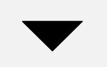
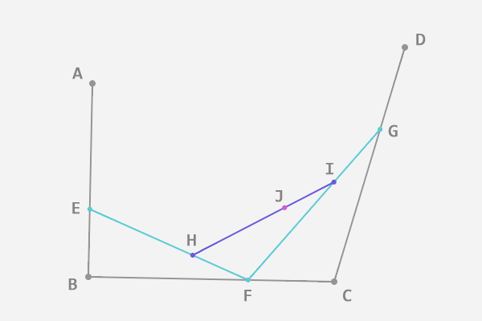

# Path

- [总结](#总结)
- [moveTo、 setLastPoint、 lineTo 和 close](#moveto-setlastpoint-lineto-和-close)
- [addXxx与arcTo](#addxxx与arcto)
    - [基本形状](#基本形状)
    - [addPath](#addpath)
    - [addArc与arcTo](#addarc与arcto)
    - [贝塞尔曲线](#贝塞尔曲线)
        - [二阶贝塞尔曲线](#二阶贝塞尔曲线)
        - [三阶贝塞尔曲线](#三阶贝塞尔曲线)
- [FillType](#filltype)
    - [奇偶规则](#奇偶规则)
    - [非零环绕数规则](#非零环绕数规则)
- [布尔操作](#布尔操作)
    - [DIFFERENCE](#difference)
    - [REVERSE_DIFFERENCE](#reverse_difference)
    - [INTERSECT](#intersect)
    - [UNION](#union)
    - [XOR](#xor)
- [重置路径](#重置路径)
- [其它函数](#其它函数)

## 总结

作用            | 相关方法                                                           | 备注
----------------|--------------------------------------------------------------------|-------------------------------------------------------------------------------------------------------
移动起点        | moveTo                                                             | 移动下一次操作的起点位置
设置终点        | setLastPoint                                                       | 重置当前path中最后一个点位置，如果在绘制之前调用，效果和moveTo相同
连接直线        | lineTo                                                             | 添加上一个点到当前点之间的直线到Path
闭合路径        | close                                                              | 连接第一个点连接到最后一个点，形成一个闭合区域
添加内容        | addRect, addRoundRect, addOval, addCircle, addPath, addArc, arcTo  | 添加(矩形， 圆角矩形， 椭圆， 圆， 路径， 圆弧) 到当前Path (注意addArc和arcTo的区别)
是否为空        | isEmpty                                                            | 判断Path是否为空
是否为矩形      | isRect                                                             | 判断path是否是一个矩形
替换路径        | set                                                                | 用新的路径替换到当前路径所有内容
偏移路径        | offset                                                             | 对当前路径之前的操作进行偏移(不会影响之后的操作)
贝塞尔曲线      | quadTo, cubicTo                                                    | 分别为二次和三次贝塞尔曲线的方法
rXxx方法        | rMoveTo, rLineTo, rQuadTo, rCubicTo                                | 不带r的方法是基于原点的坐标系(偏移量)， rXxx方法是基于当前点坐标系(偏移量)
填充模式        | setFillType, getFillType, isInverseFillType, toggleInverseFillType | 设置,获取,判断和切换填充模式
提示方法        | incReserve                                                         | 提示Path还有多少个点等待加入(这个方法貌似会让Path优化存储结构)
布尔操作(API19) | op                                                                 | 对两个Path进行布尔运算(即取交集、并集等操作)
计算边界        | computeBounds                                                      | 计算Path的边界
重置路径        | reset, rewind                                                      | 清除Path中的内容,reset不保留内部数据结构，但会保留FillType,rewind会保留内部的数据结构，但不保留FillType
矩阵操作        | transform                                                          | 矩阵变换

## moveTo、 setLastPoint、 lineTo 和 close

- lineTo 从前一个操作的点到下一个点画一条线
- movteTo与setLastPoint

方法名       | 简介                         | 是否影响之前的操作 | 是否影响之后操作
-------------|------------------------------|--------------------|------------------
moveTo       | 移动下一次操作的起点位置     | 否                 | 是
setLastPoint | 设置之前操作的最后一个点位置 | 是                 | 是

- moveTo示例

- **moveTo绝对坐标，rMoveTo相对坐标**

```java
canvas.translate(mWidth / 2, mHeight / 2);  // 移动坐标系到屏幕中心
Path path = new Path();                     // 创建Path
path.lineTo(200, 200);                      // lineTo
path.moveTo(200,100);                       // moveTo
path.lineTo(200,0);                         // lineTo
canvas.drawPath(path, mPaint);
```


- setLastPoint

```java
canvas.translate(mWidth / 2, mHeight / 2);  // 移动坐标系到屏幕中心
Path path = new Path();                     // 创建Path
path.lineTo(200, 200);                      // lineTo
path.setLastPoint(200,100);                 // setLastPoint
path.lineTo(200,0);                         // lineTo
canvas.drawPath(path, mPaint);
```


- **close方法用于连接当前最后一个点和最初的一个点，最终形成一个封闭的图形。**
- 不是所有的子图形都需要使用 close() 来封闭。当需要填充图形时（即 Paint.Style 为  FILL 或 FILL_AND_STROKE），Path 会自动封闭子图形



```java
  paint.setStyle(Style.FILL);
  path.moveTo(100, 100);
  path.lineTo(200, 100);
  path.lineTo(150, 150);
```

## addXxx与arcTo

### 基本形状

```java
// 圆形
public void addCircle (float x, float y, float radius, Path.Direction dir)
// 椭圆
public void addOval (RectF oval, Path.Direction dir)
// 矩形
public void addRect (float left, float top, float right, float bottom, Path.Direction dir)
public void addRect (RectF rect, Path.Direction dir)
// 圆角矩形
public void addRoundRect (RectF rect, float[] radii, Path.Direction dir)
public void addRoundRect (RectF rect, float rx, float ry, Path.Direction dir)
```

- Path.Direction： CW，顺时针，CCW 逆时针
- Path.Direction有两个作用，**一个是在添加图形时确定闭合顺序(各个点的记录顺序)，另一个是对图形的渲染结果有影响(是判断图形渲染的重要条件)**

```java
canvas.translate(mWidth / 2, mHeight / 2);  // 移动坐标系到屏幕中心
Path path = new Path();
path.addRect(-200,-200,200,200, Path.Direction.CW);
path.setLastPoint(-300,300);                // <-- 重置最后一个点的位置
canvas.drawPath(path,mPaint);
// 由于是顺时针，保存实际上是A-B-C-D，所以setLastPoint替换的是D
```


```java
canvas.translate(mWidth / 2, mHeight / 2);  // 移动坐标系到屏幕中心
Path path = new Path();
path.addRect(-200,-200,200,200, Path.Direction.CCW);
path.setLastPoint(-300,300);                // <-- 重置最后一个点的位置
canvas.drawPath(path,mPaint);
// 由于是逆时针，保存实际上是A-D-C-B，所以setLastPoint替换的是B
```


### addPath

```java
// 将两个Path合并
public void addPath (Path src)
// 将Path src 平移后合并
public void addPath (Path src, float dx, float dy)
// 将Path src 经过matrix变换后合并
public void addPath (Path src, Matrix matrix)
```

### addArc与arcTo

```java
// addArc
public void addArc (RectF oval, float startAngle, float sweepAngle)
// arcTo
public void arcTo (RectF oval, float startAngle, float sweepAngle)
public void arcTo (RectF oval, float startAngle, float sweepAngle, boolean forceMoveTo)
```

名称   | 作用               | 区别
-------|--------------------|--------------------------------------------------------------------------
addArc | 添加一个圆弧到path | 直接添加一个圆弧到path中
arcTo  | 添加一个圆弧到path | 添加一个圆弧到path，如果圆弧的起点和上次最后一个坐标点不相同，就连接两个点

forceMoveTo | 含义 | 等价方法
------------|----|-----
true | 将最后一个点移动到圆弧起点，即不连接最后一个点与圆弧起点 | public void addArc (RectF oval, float startAngle, float sweepAngle)
false | 不移动，而是连接最后一个点与圆弧起点 | public void arcTo (RectF oval, float startAngle, float sweepAngle)

- **sweepAngle取值范围是 [-360, 360)**,当 >= 360 或者 < -360 时将不会绘制任何内容
- **addArc() 只是一个直接使用了 forceMoveTo = true 的简化版 arcTo()**

### 贝塞尔曲线

```java
// 二阶贝塞尔曲线
// 其中开始点为上次最后一个点
// 结束为(x2, y2)
// 控制点为(x1,y1)
public void quadTo(float x1, float y1, float x2, float y2)
public void rQuadTo(float dx1, float dy1, float dx2, float dy2)


// 三阶贝塞尔曲线
// 开始点为最后一个点
// 终点为（x3,y3）
// 两个控制点为（x1,y1） (x2,y2)
public void cubicTo(float x1, float y1, float x2, float y2,
                        float x3, float y3)
public void rCubicTo(float x1, float y1, float x2, float y2,
                        float x3, float y3)
```

- [贝塞尔曲线扫盲](http://blog.csdn.net/cdnight/article/details/48468653)

#### 二阶贝塞尔曲线

- 开始点A,终点C，控制点B，连接AB，BC
- 在AB上找一点D，BC上找一点E，使得AD:AB=BE:BC
- 连接DE，在DE上找一点F，使得**DF:DE=AD:AB=BE:BC**
- 从开始移动点D生成曲线


#### 三阶贝塞尔曲线

- 与二阶类似
- AE:AB = BF:BC=CG:CD=EH:EF=FI:FG=HJ:HI
- 其中I就是曲线上的一点



## FillType

```java
public void setFillType(FillType ft)

public enum FillType {
  // these must match the values in SkPath.h
  /**
  * Specifies that "inside" is computed by a non-zero sum of signed
  * edge crossings.
  */
  WINDING(0),
  /**
  * Specifies that "inside" is computed by an odd number of edge
  * crossings.
  */
  EVEN_ODD(1),
  /**
  * Same as {@link #WINDING}, but draws outside of the path, rather than inside.
  */
  INVERSE_WINDING (2),
  /**
  * Same as {@link #EVEN_ODD}, but draws outside of the path, rather than inside.
  */
  INVERSE_EVEN_ODD(3);

  FillType(int ni) {
    nativeInt = ni;
  }

  final int nativeInt;
}

```

- 都是针对封密图形
- EVEN_ODD表示奇偶规则，而INVERSE_EVEN_ODD表示奇偶规则的反色版本
- WINDING表示非零环绕数规则，而INVERSE_WINDING表示对应的反色版本

### 奇偶规则

- **奇数表示在图形内，偶数表示在图形外**
- 从任意位置p作一条射线， 若与该射线相交的图形边的数目为奇数，则p是图形内部点，否则是外部点。


- P1: 从P1发出一条射线，发现图形与该射线相交边数为0，偶数，故P1点在图形外部。
- P2: 从P2发出一条射线，发现图形与该射线相交边数为1，奇数，故P2点在图形内部。
- P3: 从P3发出一条射线，发现图形与该射线相交边数为2，偶数，故P3点在图形外部。

### 非零环绕数规则

- 首先，它需要你图形中的所有线条都是有绘制方向的(Path.Direction指定)
- **若环绕数为0表示在图形外，非零表示在图形内**
- 然后，同样是从平面中的点向任意方向射出一条射线，但计算规则不一样：以 0 为初始值，对于射线和图形的所有交点，遇到每个顺时针的交点（图形从射线的左边向右穿过）把结果加 1，遇到每个逆时针的交点（图形从射线的右边向左穿过）把结果减 1，最终把所有的交点都算上，**得到的结果如果不是 0，则认为这个点在图形内部，是要被涂色的区域；如果是 0，则认为这个点在图形外部，是不被涂色的区域。**


## 布尔操作

```java
// op操作成功，返回true,否则返回false
public boolean op(Path path, Op op)
public boolean op(Path path1, Path path2, Op op)

// 对 path1 和 path2 执行布尔运算，运算方式由第二个参数指定，运算结果存入到path1中。
path1.op(path2, Path.Op.DIFFERENCE);

// 对 path1 和 path2 执行布尔运算，运算方式由第三个参数指定，运算结果存入到path3中。
path3.op(path1, path2, Path.Op.DIFFERENCE)
```

- 布尔操作是两个Path之间的运算，主要作用是用一些简单的图形通过一些规则合成一些相对比较复杂，或难以直接得到的图

### DIFFERENCE

- 差集
- Path1中减去Path2后剩下的部分


### REVERSE_DIFFERENCE

- 差集
- Path2中减去Path1后剩下的部分


### INTERSECT

- 交集
- Path1与Path2相交的部分


### UNION

- 并集
- 包含全部Path1和Path2


### XOR

- 异或
- 包含Path1与Path2但不包括两者相交的部分


## 重置路径

```java
public void reset() {
  isSimplePath = true;
  mLastDirection = null;
  if (rects != null) rects.setEmpty();
  // We promised not to change this, so preserve it around the native
  // call, which does now reset fill type.
  final FillType fillType = getFillType();
  nReset(mNativePath);
  setFillType(fillType);
}

public void rewind() {
  isSimplePath = true;
  mLastDirection = null;
  if (rects != null) rects.setEmpty();
  nRewind(mNativePath);
}
```

方法   | 是否保留FillType设置 | 是否保留原有数据结构
-------|----------------------|----------------------
reset  | 是                   | 否
rewind | 否                   | 是

## 其它函数

```java
// 判断path中是否包含内容
public boolean isEmpty ()

// 判断path是否是一个矩形，如果是一个矩形的话，会将矩形的信息存放进参数rect中
public boolean isRect (RectF rect)

// 将新的path赋值到现有path
public void set (Path src)

// 就是对path进行一段平移，它和Canvas中的translate作用很像，
// 但Canvas作用于整个画布，而path的offset只作用于当前path
// dst不为空,将当前path平移后的状态存入dst中，不会影响当前path
// dst为空(null),平移将作用于当前path，相当于第一种方法
public void offset (float dx, float dy)
public void offset (float dx, float dy, Path dst)

// 这个方法主要作用是计算Path所占用的空间以及所在位置,测量结果会放入这个矩形bounds
void computeBounds (RectF bounds, boolean exact)
```
