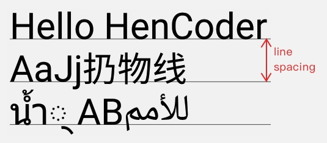
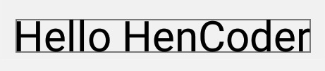
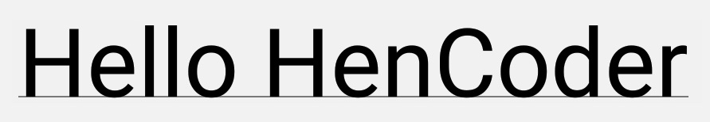

# Canvas的文字绘制

## Paint.FontMetrics

[FontMetrics](https://stackoverflow.com/questions/27631736/meaning-of-top-ascent-baseline-descent-bottom-and-leading-in-androids-font)

```java
public static class FontMetrics {
    /**
    * The maximum distance above the baseline for the tallest glyph in
    * the font at a given text size.
    */
    public float   top;
    /**
    * The recommended distance above the baseline for singled spaced text.
    */
    public float   ascent;
    /**
    * The recommended distance below the baseline for singled spaced text.
    */
    public float   descent;
    /**
    * The maximum distance below the baseline for the lowest glyph in
    * the font at a given text size.
    */
    public float   bottom;
    /**
    * The recommended additional space to add between lines of text.
    */
    public float   leading;
}
```


- **BaseLine**：基准线
- **ascent / descent**: 上图中绿色和橙色的线，它们的作用是限制普通字符的顶部和底部范围.
 普通的字符，上不会高过 ascent ，下不会低过 descent ，例如上图中大部分的字形都显示在  ascent 和 descent 两条线的范围内。具体到 Android 的绘制中， **ascent** 的值是图中绿线和  baseline 的相对位移，**它的值为负（因为它在 baseline 的上方）**； **descent** 的值是图中橙线和  baseline 相对位移，**值为正（因为它在 baseline 的下方）**
- **top / bottom**: 上图中蓝色和红色的线，**它们的作用是限制所有字形（ glyph ）的顶部和底部范围**。
 除了普通字符，有些字形的显示范围是会超过 ascent 和 descent 的，而 top 和 bottom 则限制的是所有字形的显示范围，包括这些特殊字形。例如上图的第二行文字里，就有两个泰文的字形分别超过了 ascent 和 descent 的限制，但它们都在 top 和 bottom 两条线的范围内。具体到 Android 的绘制中， top 的值是图中蓝线和 baseline 的相对位移，它的值为负（因为它在 baseline 的上方）；  bottom 的值是图中红线和 baseline 相对位移，值为正（因为它在 baseline 的下方）。
- **leading**: 这个词在上图中没有标记出来，因为它并不是指的某条线和 baseline 的相对位移。  **leading 指的是行的额外间距，即对于上下相邻的两行，上行的 bottom 线和下行的 top 线的距离**，也就是上图中第一行的红线和第二行的蓝线的距离
- **因为坐标系的关系，baseline向下为正，向右为正，所以bottom与top之间的距离应当为bottom-top**

## Canvas.drawText()

- 将文字从位置(x,y)开始绘制，**其中x并不是第一个字符左侧的坐标，而是第一个字符左侧稍稍偏左的位置**，字符的左右两边会留出一部分空隙，用于文字之间的间隔，以及文字和边框的间隔
- **而y是文字的基准线的坐标，并不是字符上面／下面的坐标**

```java
// 第一类
public void drawText(@NonNull char[] text, int index, int count, float x, float y,@NonNull Paint paint)
public void drawText(@NonNull CharSequence text, int start, int end, float x, float y,@NonNull Paint paint)
public void drawText(@NonNull String text, int start, int end, float x, float y, @NonNull Paint paint)
public void drawText(@NonNull String text, float x, float y, @NonNull Paint paint)

//第二类
//text：要绘制的文字
//start：从那个字开始绘制
//end：绘制到哪个字结束
//contextStart：上下文的起始位置。contextStart 需要小于等于 start
//contextEnd：上下文的结束位置。contextEnd 需要大于等于 end
//x：文字左边的坐标
//y：文字的基线坐标
//isRtl：是否是 RTL（Right-To-Left，从右向左）
public void drawTextRun(@NonNull CharSequence text, int start, int end, int contextStart,
            int contextEnd, float x, float y, boolean isRtl, @NonNull Paint paint)
public void drawTextRun(@NonNull char[] text, int index, int count, int contextIndex,
            int contextCount, float x, float y, boolean isRtl, @NonNull Paint paint)

// 第三类
public void drawTextOnPath (String text, Path path, float hOffset, float vOffset, Paint paint)
public void drawTextOnPath (char[] text, int index, int count, Path path, float hOffset, float vOffset, Paint paint)

// 第四类
@Deprecated
public void drawPosText(@NonNull String text, @NonNull @Size(multiple=2) float[] pos, @NonNull Paint paint)

@Deprecated
public void drawPosText(@NonNull char[] text, int index, int count,
            @NonNull @Size(multiple=2) float[] pos,@NonNull Paint paint)

```

### 第一类

- 第一类可以指定了文本开始的位置，可以截取文本中部分内容进行绘制

### 第二类

- 文字在不同上下文可能有不同的显示方式
- RTL的支持

### 第三类

- 与 Path相关
- **drawTextOnPath() 使用的 Path ，拐弯处全用圆角，别用尖角**，也就是说Paint.setPathEffect(CornorPathEffect effect)

### 第四类

- **必须指定每一个字符的位置，来绘制文本**
- 不建议使用，标记为Deprecated

序号 | 反对理由
-----|-------------------------------------------------
1    | 必须指定所有字符位置，否则直接crash掉，反人类设计
2    | 性能不佳，在大量使用的时候可能导致卡顿
3    | 不支持emoji等特殊字符，不支持字形组合与分解

## StaticLayout

```java
// width 是文字区域的宽度，文字到达这个宽度后就会自动换行
// align 是文字的对齐方向
// spacingmult 是行间距的倍数，通常情况下填 1 就好
// spacingadd 是行间距的额外增加值，通常情况下填 0 就好
// includeadd 是指是否在文字上下添加额外的空间，来避免某些过高的字符的绘制出现越界
// TextView.setLineSpacing(float add, float mult)
 public StaticLayout(CharSequence source, TextPaint paint,
                        int width,Alignment align,
                        float spacingmult, float spacingadd,
                        boolean includepad)
```

- **相比Canvas.drawText，还支持自动换行，在换行符"\n"换行**

## Paint对文字绘制的辅助类

### 显示效果类

```java
//设置字体大小
public void setTextSize(float textSize)

//设置字体样式，可以是Typeface设置的样式，
// 也可以通过Typeface的createFromAsset(AssetManager mgr, String path)方法加载样式
public Typeface setTypeface(Typeface typeface)
public static Typeface createFromAsset(AssetManager mgr, String path)

// 是否使用伪粗体
//之所以叫伪粗体（fake bold），因为它并不是通过选用更高weight的字体让文字变粗，而是通过程序在运行时把文字给「描粗」了
public static final int FAKE_BOLD_TEXT_FLAG = 0x20
public void setFakeBoldText(boolean fakeBoldText)

// 是否使用删除线
public static final int STRIKE_THRU_TEXT_FLAG = 0x10;
public void setStrikeThruText(boolean strikeThruText)

// 下滑线
public static final int UNDERLINE_TEXT_FLAG = 0x08;
public void setUnderlineText(boolean underlineText)

// 水平斜切，默认为0，官方建议为-0.25
public void setTextSkewX(float skewX)

// 设置文字横向放缩。也就是文字变胖变瘦
public void setTextScaleX(float scaleX)

// 设置字符间距。默认值是 0
// 如果要稍稍扩大间跑，官方建议是0.05
public void setLetterSpacing(float letterSpacing)

//用 CSS 的 font-feature-settings 的方式来设置文字
// https://drafts.csswg.org/css-fonts/#propdef-font-feature-settings
public void setFontFeatureSettings()

// Align.LEFT,Align.CENTER,Align.RIGHT
// 设置文字的对齐方式
public void setTextAlign(Align align)

//设置绘制所使用的 Locale
//通过Paint.setTextLocale(Locale locale) 可以在不改变系统设置的情况下，直接修改绘制时的Locale
public void setTextLocale(@NonNull Locale locale)
public void setTextLocales(@NonNull @Size(min=1) LocaleList locales)

//设置是否启用字体的 hinting （字体微调
//通过向字体中加入 hinting 信息，让矢量字体在尺寸过小的时候得到针对性的修正，从而提高显示效果
public static final int HINTING_OFF = 0x0;
public static final int HINTING_ON = 0x1;
public void setHinting(int mode)

// 把「大高个」文字的高度恢复为原始高度
// 增大每行文字的上下边界，来容纳被加高了的文字
// 对中英文没什么效果
public void setElegantTextHeight(boolean elegant)

//是否开启次像素级的抗锯齿从而达到更好的抗锯齿效果
public void setSubpixelText(boolean subpixelText)

//这个是文本缓存，设置线性文本，如果设置为true就不需要缓存，
public static final int LINEAR_TEXT_FLAG    = 0x40;
public void setLinearText(boolean linearText)
```

## Paint文字测量尺寸类

### getFontSpacing()

```java
public float getFontSpacing()
```

- 获取推荐的行距。**即推荐的两行文字的 baseline 的距离**



### getFontMetrics()

- 根据FontMetrics的定义，可以认为两行文字的 font spacing (即相邻两行的 baseline 的距离) 可以通过  bottom - top + leading
- **bottom - top + leading 的结果是要大于 getFontSpacing() 的返回值的**。这是因为 getFontSpacing() 的结果并不是通过 FontMetrics 的标准值计算出来的，而是另外计算出来的一个值，它能够做到在两行文字不显得拥挤的前提下缩短行距，以此来得到更好的显示效果。
- **所以如果你要对文字手动换行绘制，多数时候应该选取 getFontSpacing() 来得到行距，不但使用更简单，显示效果也会更好。**

```java
// 返回FontMetrics
public FontMetrics getFontMetrics()
// 计算结果直接填进传入的 FontMetrics 对象
public float getFontMetrics(FontMetrics metrics)

// int版本
public FontMetricsInt getFontMetricsInt()
public int getFontMetricsInt(FontMetricsInt fmi)
```

### getTextBounds

```java
public void getTextBounds(String text, int start, int end, Rect bounds)
public void getTextBounds(char[] text, int index, int count, Rect bounds)
```

```java
paint.setStyle(Paint.Style.FILL);
canvas.drawText(text, offsetX, offsetY, paint);

paint.getTextBounds(text, 0, text.length(), bounds);
bounds.left += offsetX;
bounds.top += offsetY;
bounds.right += offsetX;
bounds.bottom += offsetY;
paint.setStyle(Paint.Style.STROKE);
canvas.drawRect(bounds, paint);
```



### measureText

```java
public float measureText(char[] text, int index, int count)
public float measureText(String text, int start, int end)
public float measureText(String text)
public float measureText(CharSequence text, int start, int end)
```

- **getTextBounds**: 它测量的是文字的显示范围（关键词：显示）。形象点来说，你这段文字外放置一个可变的矩形，然后把矩形尽可能地缩小，一直小到这个矩形恰好紧紧包裹住文字，那么这个矩形的范围，就是这段文字的 bounds。
- **measureText()**: 它测量的是文字绘制时所占用的宽度（关键词：占用）。前面已经讲过，一个文字在界面中，往往需要占用比他的实际显示宽度更多一点的宽度，以此来让文字和文字之间保留一些间距，不会显得过于拥挤。下面的这幅图，并没有设置 setLetterSpacing() ，这里的 letter spacing 是默认值 0，但你可以看到，图中每两个字母之间都是有空隙的。另外，下方那条用于表示文字宽度的横线，在左边超出了第一个字母 H 一段距离的，在右边也超出了最后一个字母 r（虽然右边这里用肉眼不太容易分辨），而就是两边的这两个「超出」，导致了 measureText() 比 getTextBounds() 测量出的宽度要大一些



### getTextWidths

- **获取字符串中每个字符的宽度，并把结果填入参数 widths**

```java
public int getTextWidths(char[] text, int index, int count,float[] widths)
public int getTextWidths(CharSequence text, int start, int end,float[] widths)
public int getTextWidths(String text, int start, int end, float[] widths)
public int getTextWidths(String text, float[] widths)
```

### breakText

- 和 measureText() 的区别是， **breakText() 是在给出宽度上限的前提下测量文字的宽度**。如果文字的宽度超出了上限，那么在临近超限的位置截断文字

```java
//返回值是截取的文字个数（如果宽度没有超限，则是文字的总个数)
//text 是要测量的文字；
//measureForwards 表示文字的测量方向，true 表示由左往右测量；
//maxWidth 是给出的宽度上限；
//measuredWidth,方法测量完成后会把截取的文字宽度（如果宽度没有超限，则为文字总宽度）赋值给 measuredWidth[0]
public int breakText(String text, boolean measureForwards,
    float maxWidth, float[] measuredWidth)
public int breakText(char[] text, int index, int count,float maxWidth, float[] measuredWidth)
public int breakText(CharSequence text, int start, int end,
    boolean measureForwards,float maxWidth, float[] measuredWidth)

```

## Paint其它与文字相关

### hasGlyph

- **检查指定的字符串是否是一个单独的字形 (glyph)**

```java
public boolean hasGlyph(String string)
```

### 光标相关

- 对于一段文字，计算出某个字符处光标的 x 坐标。

```java
//text要测量的文字
//start end 是文字的起始和结束位置；
//contextStart contextEnd 是上下文的起始和结束坐标；
//isRtl 是文字的方向；
//offset 是字数的偏移，即计算第几个字符处的光标。
public float getRunAdvance(CharSequence text, int start, int end, int contextStart,
            int contextEnd, boolean isRtl, int offset)
public float getRunAdvance(char[] text, int start, int end, int contextStart, int contextEnd,
            boolean isRtl, int offset)
```

- 给出一个位置的像素值，计算出文字中最接近这个位置的字符偏移量（即第几个字符最接近这个坐标）

```java
//text 是要测量的文字；
//start end 是文字的起始和结束坐标；
//contextStart contextEnd 是上下文的起始和结束坐标；
//isRtl 是文字方向；
//advance 是给出的位置的像素值。
//填入参数，对应的字符偏移量将作为返回值返回
public int getOffsetForAdvance(char[] text, int start, int end, int contextStart,
            int contextEnd, boolean isRtl, float advance)
```

- **getOffsetForAdvance() 配合上 getRunAdvance() 一起使用，就可以实现「获取用户点击处的文字坐标」的需求**