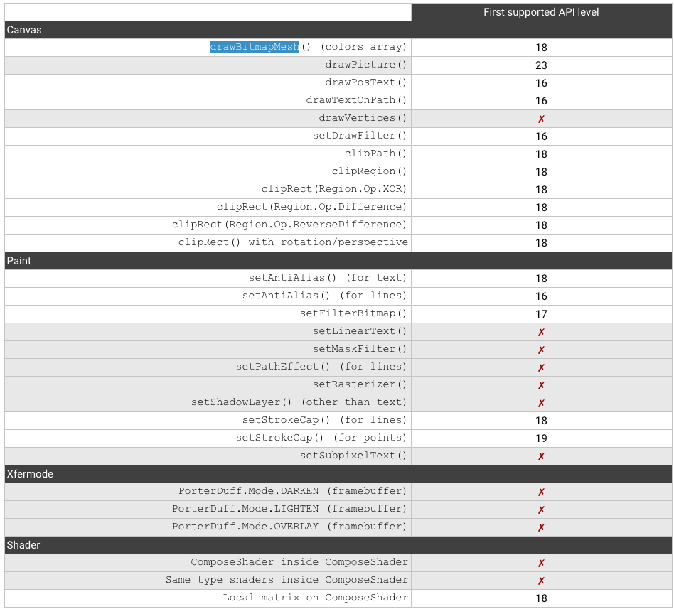

# 硬件加速

## 相关资料

- [Hardware Acceleration](https://developer.android.google.cn/guide/topics/graphics/hardware-accel.html#controlling)

## 开启硬件加速

- Application级别

```xml
<application android:hardwareAccelerated="true" ...>
```

- activity级别

```xml
<application android:hardwareAccelerated="true">
    <activity ... />
    <activity android:hardwareAccelerated="false" />
</application>
```

- window级别：**如果设置了硬件加速，目前为止，Android还不支持在Window级别关闭硬件加速**

```java
getWindow().setFlags(
    WindowManager.LayoutParams.FLAG_HARDWARE_ACCELERATED,
    WindowManager.LayoutParams.FLAG_HARDWARE_ACCELERATED);
```

- View级别:**目前为止，Android还不支持在View级别开启硬件加速**
- **setLayerType方法的本来作用并不是用来开关硬件加速的，它真正的作用是使用离屏缓冲，只是当它的参数为 LAYER_TYPE_SOFTWARE 的时候，可以「顺便」把硬件加速关掉而已**

```java
myView.setLayerType(View.LAYER_TYPE_SOFTWARE, null);
```

## 判断是否开启了硬件加速

- **如果硬是要检测的话，使用Canvas.isHardwareAccelerated()**

```java
// 如果view附在一个硬件加速的window下，返回true
View.isHardwareAccelerated()

// Canvas使用了硬件加速
Canvas.isHardwareAccelerated()
```

## 硬件加速限制

- 并不是所有的Canvas和Paint操作都支持硬件加速



## ViewLayer

- setLayerType() 这个方法，它的作用其实就是名字里的意思：设置 View Layer 的类型。
- **所谓 View Layer，又称为离屏缓冲（Off-screen Buffer）**，它的作用是单独启用一块地方来绘制这个 View ，而不是使用软件绘制的 Bitmap 或者通过硬件加速的 GPU。这块「地方」可能是一块单独的 Bitmap，也可能是一块 OpenGL 的纹理，具体取决于硬件加速是否开启。采用什么来绘制 View 不是关键，**关键在于当设置了 View Layer 的时候，它的绘制会被缓存下来**,而且缓存的是最终的绘制结果，而不是像硬件加速那样只是把 GPU 的操作保存下来再交给 GPU 去计算。**通过这样更进一步的缓存方式，View 的重绘效率进一步提高了：只要绘制的内容没有变，那么不论是 CPU 绘制还是 GPU 绘制，它们都不用重新计算，而只要只用之前缓存的绘制结果就可以了**

### 分类

- **LAYER_TYPE_NONE**：不使用离屏缓存
- **LAYER_TYPE_HARDWARE**：如果开启硬件加速，使用硬件纹理，**如果没有开启硬件加速，效果与LAYER_TYPE_SOFTWARE相同**
- **LAYER_TYPE_SOFTWARE**：使用bitmap进行离屏缓存，**如果由于开启硬件加速出现了一些兼容性问题，可以通过设置为LAYER_TYPE_SOFTWARE,解决相应的问题**

### ViewLayer与动画

- **一些不需要调用invalidate()的属性动画，可以通过开启硬件加速来提升动画执行效率**
- 这些属性主要包括：
    - **alpha**: Changes the layer's opacity
    - **x, y, translationX, translationY**: Changes the layer's position
    - **scaleX, scaleY**: Changes the layer's size
    - **rotation, rotationX, rotationY**: Changes the layer's orientation in 3D space
    - **pivotX, pivotY**: Changes the layer's transformations origin

```java
// 最有效的效View绕y旋转180度
view.setLayerType(View.LAYER_TYPE_HARDWARE, null);
ObjectAnimator.ofFloat(view, "rotationY", 180).start();
```

```java
view.setLayerType(View.LAYER_TYPE_HARDWARE, null);
ObjectAnimator animator = ObjectAnimator.ofFloat(view, "rotationY", 180);
animator.addListener(new AnimatorListenerAdapter() {
    @Override
    public void onAnimationEnd(Animator animation) {
        view.setLayerType(View.LAYER_TYPE_NONE, null);
    }
});
animator.start();
```

## 优化建议

- 减少View的数目
- 避免过度绘制
- 不要在绘制相关的方法中创建绘制相关的对象，比如Paint或Path，这样每一个调用都要创建对应的对象
- 不要经常修改形状
- 不要经常修改图片
- 小心使用与Alpha相关的函数，比如setAlpha,AlphaAnimation,ObjectAnimator,因为使用透明度相关的方法
 会使用离屏缓存，如果对于很大的View要使用透明度相关的函数，应当使用LAYER_TYPE_HARDWARE