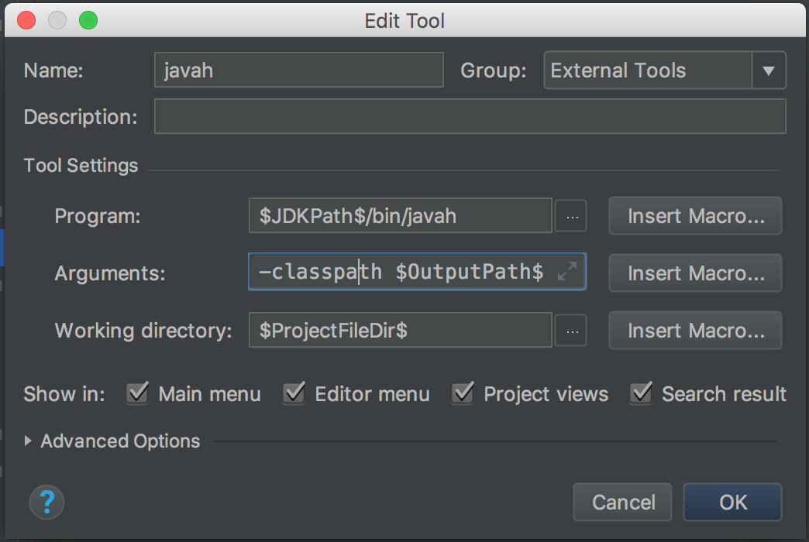

# Jni开发

[向您的项目添加C和C++代码](https://developer.android.com/studio/projects/add-native-code.html)

## 编写含有native方法Java类

```java
package cradle.rancune.ndktest.jni;

public class JniUtils {
    public native String getKey();

    public static native String encrypt(String args);
}
```

## 生成头文件

### javah生成头文件

- 编译项目，生成class文件

- 利用javah生成.h文件

```bash
cd build/intermediates/classes/debug
```

```bash
javah -jni cradle.rancune.ndktest.jni.JniUtils
```

- 生成的.h文件

```c++
/* DO NOT EDIT THIS FILE - it is machine generated */
#include <jni.h>
/* Header for class cradle_rancune_ndktest_jni_JniUtils */

#ifndef _Included_cradle_rancune_ndktest_jni_JniUtils
#define _Included_cradle_rancune_ndktest_jni_JniUtils
#ifdef __cplusplus
extern "C" {
#endif
/*
 * Class:     cradle_rancune_ndktest_jni_JniUtils
 * Method:    getKey
 * Signature: ()Ljava/lang/String;
 */
JNIEXPORT jstring JNICALL Java_cradle_rancune_ndktest_jni_JniUtils_getKey
  (JNIEnv *, jobject);

/*
 * Class:     cradle_rancune_ndktest_jni_JniUtils
 * Method:    encrypt
 * Signature: (Ljava/lang/String;)Ljava/lang/String;
 */
JNIEXPORT jstring JNICALL Java_cradle_rancune_ndktest_jni_JniUtils_encrypt
  (JNIEnv *, jclass, jstring);

#ifdef __cplusplus
}
#endif
#endif

```

### Android studio 新增快捷键

- 

- Program: $JDKPath$/bin/javah
- Arguments: -classpath $OutputPath$ -d $SourcepathEntry$/../cpp -jni $FileClass$
- Working directory: $ProjectFileDir$

## 创建对应的source文件

- 编写对应的cpp文件

```c++
#include "cradle_rancune_ndktest_jni_JniUtils.h"

JNIEXPORT jstring JNICALL Java_cradle_rancune_ndktest_jni_JniUtils_getKey
        (JNIEnv *env, jobject obj) {
    return env->NewStringUTF("String from Jni");
}
```

## 编写CMakeLists.txt

```CMake
# For more information about using CMake with Android Studio, read the
# documentation: https://d.android.com/studio/projects/add-native-code.html

# Sets the minimum version of CMake required to build the native library.

cmake_minimum_required(VERSION 3.4.1)

# Creates and names a library, sets it as either STATIC
# or SHARED, and provides the relative paths to its source code.
# You can define multiple libraries, and CMake builds them for you.
# Gradle automatically packages shared libraries with your APK.

add_library( # Sets the name of the library.
             jniTest

             # Sets the library as a shared library.
             SHARED

             # Provides a relative path to your source file(s).
             src/main/cpp/cradle_rancune_ndktest_jni_JniUtils.cpp)
```

## 将 Gradle 关联到原生库

### 关联原生库

- 需要将 externalNativeBuild {} 块添加到模块级 build.gradle 文件中，
 并使用 cmake {} 或 ndkBuild {} 对其进行配置

```Groovy
android {
  ...
  defaultConfig {...}
  buildTypes {...}

  // Encapsulates your external native build configurations.
  externalNativeBuild {

    // Encapsulates your CMake build configurations.
    cmake {

      // Provides a relative path to your CMake build script.
      path "CMakeLists.txt"
    }
  }
}
```

### 配置可选参数

- 可以在模块级 build.gradle 文件的 defaultConfig {} 块中配置另一个 externalNativeBuild {} 块，
 为 CMake 或 ndk-build 指定可选参数和标志。与 defaultConfig {} 块中的其他属性类似，也可以在构建配置中为每个产品风味重写这些属性

```groovy
android {
  ...
  defaultConfig {
    ...
    // This block is different from the one you use to link Gradle
    // to your CMake or ndk-build script.
    externalNativeBuild {

      // For ndk-build, instead use ndkBuild {}
      cmake {

        // Passes optional arguments to CMake.
        arguments "-DANDROID_ARM_NEON=TRUE", "-DANDROID_TOOLCHAIN=clang"

        // Sets optional flags for the C compiler.
        cFlags "-D_EXAMPLE_C_FLAG1", "-D_EXAMPLE_C_FLAG2"

        // Sets a flag to enable format macro constants for the C++ compiler.
        cppFlags "-D__STDC_FORMAT_MACROS"
      }
    }
  }

  buildTypes {...}

  productFlavors {
    ...
    demo {
      ...
      externalNativeBuild {
        cmake {
          ...
          // Specifies which native libraries to build and package for this
          // product flavor. If you don't configure this property, Gradle
          // builds and packages all shared object libraries that you define
          // in your CMake or ndk-build project.
          targets "native-lib-demo"
        }
      }
    }

    paid {
      ...
      externalNativeBuild {
        cmake {
          ...
          targets "native-lib-paid"
        }
      }
    }
  }

  // Use this block to link Gradle to your CMake or ndk-build script.
  externalNativeBuild {
    cmake {...}
    // or ndkBuild {...}
  }
}
```

### 指定abi

```groovy
android {
  ...
  defaultConfig {
    ...
    externalNativeBuild {
      cmake {...}
      // or ndkBuild {...}
    }

    ndk {
      // Specifies the ABI configurations of your native
      // libraries Gradle should build and package with your APK.
      abiFilters 'x86', 'x86_64', 'armeabi', 'armeabi-v7a',
                   'arm64-v8a'
    }
  }
  buildTypes {...}
  externalNativeBuild {...}
}
```

## 加载lib文件

```java
public class MainActivity extends AppCompatActivity {

    static {
        System.loadLibrary("jniTest");
    }

    @Override
    protected void onCreate(Bundle savedInstanceState) {
        super.onCreate(savedInstanceState);
        setContentView(R.layout.activity_main);

        // Example of a call to a native method
        TextView tv = (TextView) findViewById(R.id.sample_text);
        JniUtils utils = new JniUtils();
        tv.setText(utils.getKey());
    }
}
```