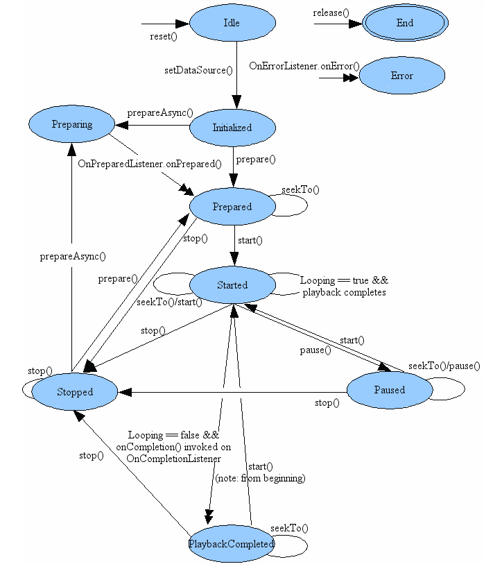

# Mediaplayer

## 状态图

### Idle

- MediaPlayer对象使用new被创建或者调用了reset（），该MediaPlayer对象处于Idle状态
- 处于idle状态下MediaPlayer对象，如果调用以下方法会产生程序错误：getCurrentPosition(), getDuration(), getVideoHeight(), getVideoWidth(), setAudioStreamType(int), setLooping(boolean), setVolume(float, float), pause(), start(), stop(), seekTo(int), prepare() ，prepareAsync(),**如果上述任何方法在一个MediaPlayer对象被创建（通过new创建）时调用，将不会回调方法OnErrorListener.onError()，对象的状态保持不变;如果在调用reset()之后这些方法被调用，会回调OnErrorListener.onError()方法，并且对象将被转移到错误状态**

### Initialized

- **只能在处于Idle状态的时候，调用setDataSource()方法，其它状态调用必定会抛出IllegalStateException**
- 监听setDataSource 方法产生的IllegalArgumentException  和IOException是一个很好的编程习惯

### Prepared

- 通过调用prepare()同步方法，或者prepareAsync()异步方法，进入Prepared状态
- **prepareAsync()异步方法通过OnPreparedListener.onPrepared回调**
- **只有处理Prepared状态的才能够调用start()方法**

### Started

- **只有调用了start()处于started状态，才会进行缓冲，缓冲过程中会回调OnBufferingUpdateListener**
- 处于Started可以多次调用start()方法

### Paused

- 调用pause()后，mediaplayer会进入paused状态
- **处理Paused状态时，调用start()方法，可以将一个被暂停的MediaPlayer恢复，被暂停的MediaPlayer对象回到Started 状态**。恢复后开始播放的位置就是该对象被暂停的位置。

### Stopped

- **一旦处于Stopped 状态，播放不能启动，直到prepare（）或prepareAsync（）被调用将MediaPlayer对象重新设置到Prepared状态，然后才能调用start()**
- 如果一个对象处于Stopped状态，调用stop（）不会对该对象产生任何影响

### Completed

- 播放结束后，如果循环模式已被设置为true通过setLooping（boolean），MediaPlayer对象将回到Started状态
- 如果循环模式被设置为false，播放器引擎会回调OnCompletion.onCompletion()
- **对于处理Completed状态，可以调用start() 播放将重新开始**

### Error

- 当由于各种各样的原因出错时，会回调OnErrorListener.onError()方法，并且player处理Error状态
- **当处于Error状态时，不能够再调用prepare()或prepareAsync()**
- **如果想要复用一个处于Error状态的player,必须调用reset()方法**

### End

- 当调用了release()，该MediaPlayer处于End状态,**没有任何方法将一个处理End状态的player复原**

### seekTo

- 调用seekTo(int)可以调整播放的位置
- **seekTo(int) 也可以在其他的状态被调用，例如Prepared, Paused and PlaybackCompleted 状态。此外，当前实际的播放位置可以通过调用getCurrentPosition()来获取**

## 状态和对应可以调用的方法

- 具体参看[Valid and invalid states](https://developer.android.google.cn/reference/android/media/MediaPlayer.html)