# 3D绘图基本概念

## 参考资料

- [LearnOpenGL CN](https://learnopengl-cn.github.io/)
- [OpenGL教程](https://blog.csdn.net/junzia/article/list/3)
- [OpenGL-投影和摄像机](https://cloud.tencent.com/developer/article/1015587)
- [OpenGL 学习系列---投影矩阵](https://juejin.im/post/5b0ec5fef265da092a2b79b1)
- [android平台下OpenGL ES 3.0从零开始](https://blog.csdn.net/byhook/article/details/83715360)
- [Transform Feedback](https://www.jianshu.com/p/dcb6543745d5)

## 图形渲染管线(Graphics Pipeline)


### 顶点着色器

- 顶点着色器实现了顶点操作的通用可编程方法，着色器（Shader）是在GPU上运行的小程序。顶点着色器的输入包括：
    - 着色器程序一一描述顶点上执行操作的顶点着色器程序源代码或者可执行文件。
    - 顶点着色器输人(或者属性)一一用顶点数组提供的每个顶点的数据。
    - 统一变量(uniform)一一顶点(或者片段)着色器使用的不变数据。
    - 采样器一一代表顶点着色器使用纹理的特殊统一变量类型

## Vertex Array

- Android中使用ByteBuffer存储我们定义的顶点数组数据

```java
private final float vertices[] = {
    -0.5f, 0.5f, 0.0f,  // 0, Top Left
    -0.5f, -0.5f, 0.0f,  // 1, Bottom Left
    0.5f, -0.5f, 0.0f,  // 2, Bottom Right
    0.5f, 0.5f, 0.0f,  // 3, Top Right
};

private final FloatBuffer vertexBuffer;

// 每个float有4位, 没有分配在JVM中
ByteBuffer vb = ByteBuffer.allocateDirect(vertices.length * 4);
vb.order(ByteOrder.nativeOrder());
vertexBuffer = vb.asFloatBuffer();
vertexBuffer.put(vertices);
vertexBuffer.position(0);
```

## 变换

### 矩阵

#### 左右手坐标系

- **OpenGL都是右手坐标系**

#### 单位矩阵

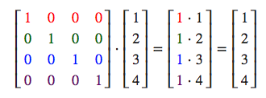

#### 缩放

- 如果我们把缩放变量表示为(S1,S2,S3)我们可以为任意向量(x,y,z)定义一个缩放矩阵

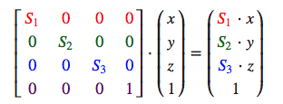

#### 位移

- 如果我们把位移向量表示为(Tx,Ty,Tz)，我们就能把位移矩阵定义为：

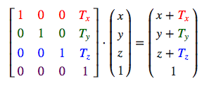

#### 旋转

- 旋转矩阵在3D空间中每个单位轴都有不同定义，旋转角度用θ表示

- 沿X轴旋转


- 沿Y轴旋转


- 沿Z轴旋转


#### 矩阵的组合

- 假设我们有一个顶点(x, y, z)，我们希望将其缩放2倍，然后位移(1, 2, 3)个单位。我们需要一个位移和缩放矩阵来完成这些变换
- **矩阵按我们想要操作的顺序从右向左书写**

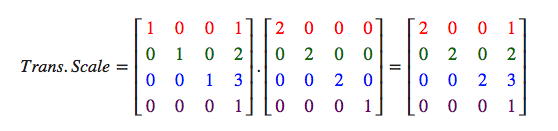

## 坐标系统

### 坐标变换

- 坐标系总结
  - 局部空间(Local Space，或者称为物体空间(Object Space))
  - 世界空间(World Space)
  - 观察空间(View Space，或者称为视觉空间(Eye Space))
  - 裁剪空间(Clip Space)
  - 屏幕空间(Screen Space)
- 为了将坐标从一个坐标系变换到另一个坐标系，我们需要用到几个变换矩阵，最重要的几个分别是模型(Model)、观察(View)、投影(Projection)三个矩阵。我们的顶点坐标起始于局部空间(Local Space)，在这里它称为局部坐标(Local Coordinate)，它在之后会变为世界坐标(World Coordinate)，观察坐标(View Coordinate)，裁剪坐标(Clip Coordinate)，并最后以屏幕坐标(Screen Coordinate)的形式结束。下面的这张图展示了整个流程以及各个变换过程做了什么：


- 一个顶点坐标将会根据以下过程被变换到裁剪坐标：注意矩阵运算的顺序是相反的（记住我们需要从右往左阅读矩阵的乘法）。最后的顶点应该被赋值到顶点着色器中的gl_Position，OpenGL将会自动进行透视除法和裁剪

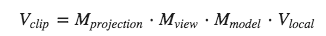

- 转换成Shader脚本

```glsl
attribute vec4 a_Position;
uniform mat4 u_ModelMatrix;
uniform mat4 u_ProjectionMatrix;
uniform mat4 u_ViewMatrix;
void main()
{
    gl_Position  = u_ProjectionMatrix * u_ViewMatrix * u_ModelMatrix * a_Position;
}
```

### 局部空间

- 局部空间是指物体所在的坐标空间，即对象最开始所在的地方

### 世界空间

- **物体的坐标从局部变换到世界空间，该变换是由模型矩阵(Model Matrix)实现的**
- 模型矩阵是一种变换矩阵，它能通过对物体进行位移、缩放、旋转来将它置于它本应该在的位置或朝向

### 观察空间

- 观察空间经常被人们称之OpenGL的摄像机(Camera)。
- 观察空间是将世界空间坐标转化为用户视野前方的坐标而产生的结果。因此观察空间就是从摄像机的视角所观察到的空间。而这通常是由一系列的位移和旋转的组合来完成，平移/旋转场景从而使得特定的对象被变换到摄像机的前方。**这些组合在一起的变换通常存储在一个观察矩阵(View Matrix)里，它被用来将世界坐标变换到观察空间**
- 使用Matrix.setLookAtM()来设置摄像机位置,**在设置up向量时，一般总是设置为(0,1,0)**
  - 第一组eyex, eyey,eyez 相机在世界坐标的位置
  - 第二组centerx,centery,centerz 相机镜头对准的物体在世界坐标的位置
  - 第三组upx,upy,upz 相机向上的方向在世界坐标中的方向
  - 第一组眼睛就相当于你的头在一个三维坐标中的具体坐标。
  - 第二组就是你眼睛要看的物体的坐标。
  - 第三组就是你的头的方向。
  - 如果你把upx=0;upz=0;upy=1,那么说明你的头是正常人一样的方向，如果upy=-1那么就相当于你是倒立的。
  - 如果upx=1;upz=0;upy=0；那么相当于我们看的是右边，如果upx=-1，就相当于看的左边。
  - 如果upx=0;upz=1;upy=0；相当于我们看的是屏幕朝我们的方向，如果upz=-1,相当于我们看的是屏幕向里的方向。

```java
    /**
     *
     * @param rm 生成的摄像机矩阵，float[16]
     * @param rmOffset 填充时候的起始偏移量
     * @param eyeX 摄像机x坐标
     * @param eyeY 摄像机y坐标
     * @param eyeZ 摄像机z坐标
     * @param centerX 观察目标点的x坐标
     * @param centerY 观察目标点的y坐标
     * @param centerZ 观察目标点的z坐标
     * @param upX 摄像机up向量在x上的分量
     * @param upY 摄像机up向量在y上的分量
     * @param upZ 摄像机up向量在z上的分量
     */
    public static void setLookAtM(float[] rm, int rmOffset,
            float eyeX, float eyeY, float eyeZ,
            float centerX, float centerY, float centerZ, float upX, float upY,
            float upZ) {
    }
```

### 裁剪空间

- 在一个顶点着色器运行的最后，OpenGL期望所有的坐标都能落在一个特定的范围内，且任何在这个范围之外的点都应该被裁剪掉(Clipped)。**被裁剪掉的坐标就会被忽略，所以剩下的坐标就将变为屏幕上可见的片段**
- **裁剪空间背后的逻辑很简单，对于给定的任何位置(x,y,z,w)，其中x,y,z必须在-w与w之前才能够显示**
- 因为将所有可见的坐标都指定在-1.0到1.0的范围内不是很直观，所以**我们会指定自己的坐标集(Coordinate Set)并将它变换回标准化设备坐标系**

#### 透视除法

- OpenGL会把每一个gl_Position的x,y,z都除以它的w分量，**当w分量用来表示距离时，使得较远处的物体被移动到距离渲染中心更近的地方，这个中心就像一个消失点。**
- (0,0,0)就是归一化设备坐标的渲染中心点

#### 同质话坐标

- 因为透视除法，裁剪空间中的坐标经常被称为同质化坐标，比如(1,1,1,1)(2,2,2,2)(3,3,3,3)(4,4,4,4)等都可以被映射到归一化坐标(1,1,1,1)

## 投影

- **为了将顶点坐标从观察变换到裁剪空间，我们需要定义一个投影矩阵(Projection Matrix)**，它指定了一个范围的坐标
- **由投影矩阵创建的观察箱(Viewing Box)被称为平截头体(Frustum)，每个出现在平截头体范围内的坐标都会最终出现在用户的屏幕上**。将特定范围内的坐标转化到标准化设备坐标系的过程（而且它很容易被映射到2D观察空间坐标）被称之为投影(Projection)，因为使用投影矩阵能将3D坐标投影(Project)到很容易映射到2D的标准化设备坐标系中

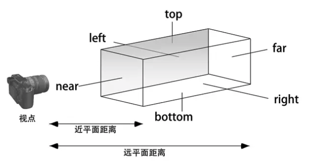

### 正交投影

- 不管是正交投影还是透视投影，最终都是**将视景体内的物体投影在近平面上**，这也是3D坐标转换到2D坐标的关键一步。**而近平面上的坐标接着也会转换成归一化设备坐标，再映射到屏幕视口上。**

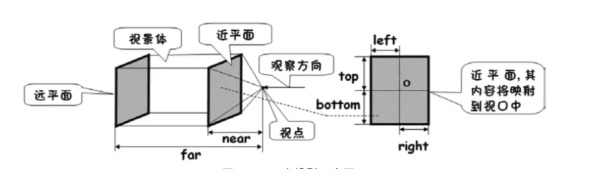

- **需要注意的是，我们的左、上、右、下距离都是相对于近平面中心的**。近平面的坐标原点位于中心，向右为X轴正方向，向上为Y轴正方向，所以**我们的left、bottom要为负数，而right、top要为正数**。
- 同时，近平面和远平面的距离都是指相对于视点的距离，所以 near、far 要为正数，而且 far > near。

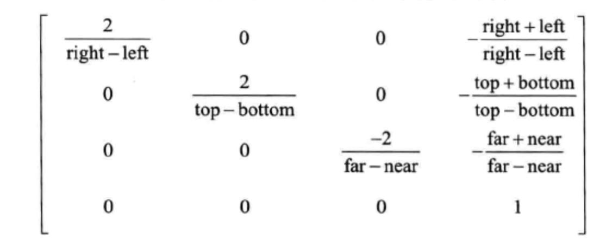

```java
    /**
     * @param m 生成的投影矩阵,float[4*4]
     * @param mOffset 填充时候起始的偏移量
     * @param left  近平面left边的x坐标
     * @param right 近平面right边的x坐标
     * @param bottom  近平面bottom边的y坐标
     * @param top   近平面top边的y坐标
     * @param near  近平面距离摄像机的距离
     * @param far   远平面距离摄像机的距离
     */
    public static void orthoM(float[] m, int mOffset,
        float left, float right, float bottom, float top,
        float near, float far) {
}
```

- **为了保证图像不被拉伸，就是要保证近平面的宽高比和视口的宽高比一致，而且是以较短的那一边作为1的标准，让图像保持居中**

```java
    @Override
    public void onSurfaceChanged(GL10 gl, int width, int height) {
        float aspectRatio = width > height ? (float) width / (float) height : (float) height / (float) width;
        if (width > height){
            Matrix.orthoM(projectionMatrix,0,-aspectRatio,aspectRatio,-1f,1f,0f,10f);
        }else {
            Matrix.orthoM(projectionMatrix,0,-1f,1f,-aspectRatio,aspectRatio,0f,10f);
        }
    }
```

### 透视投影

- 透视投影是能够产生近大远小效果

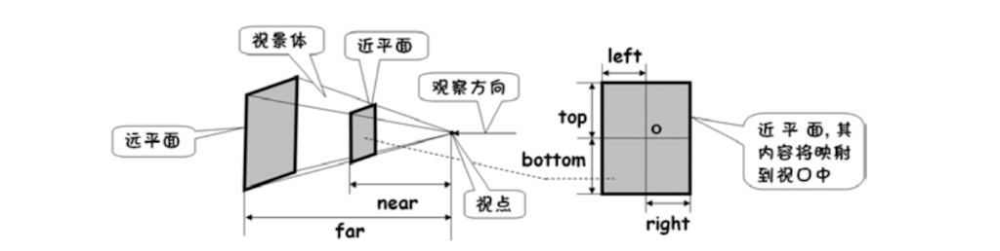

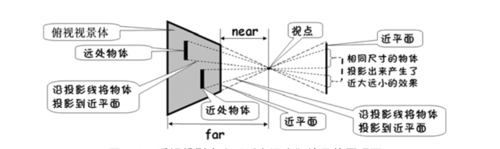

#### frustumM

- **frustumM,它的视景体有点类似于正交投影，在参数理解上基本都相同的**
- 需要注意的是 near 和 far 变量的值必须要大于0。因为它们都是相对于视点的距离，也就是照相机的距离。
- 当用视图矩阵确定了照相机的位置时，**要确保物体距离视点的位置在 near和 far的区间范围内，否则就会看不到物体。**由于透视投影会产生近大远小的效果，当照相机位置不变，改变near的值时也会改变物体大小，near越小,则离视点越近，相当于物体越远，那么显示的物体也就越小了。当然也可以near和far的距离不动，改变摄像机的位置来改变观察到的物体大小

```java
/**
     * Defines a projection matrix in terms of six clip planes.
     *
     * @param m the float array that holds the output perspective matrix
     * @param offset the offset into float array m where the perspective
     *        matrix data is written
     * @param left
     * @param right
     * @param bottom
     * @param top
     * @param near
     * @param far
     */
    public static void frustumM(float[] m, int offset,
            float left, float right, float bottom, float top,
            float near, float far)

```

#### perspectiveM


- 下面图片左边是 90 视角，右边是 45 度视角。显然，视野角度越大，则看到的内容更多，但是物体显得更小，而视野角度越小，则看的内容更少，但物体显得更大

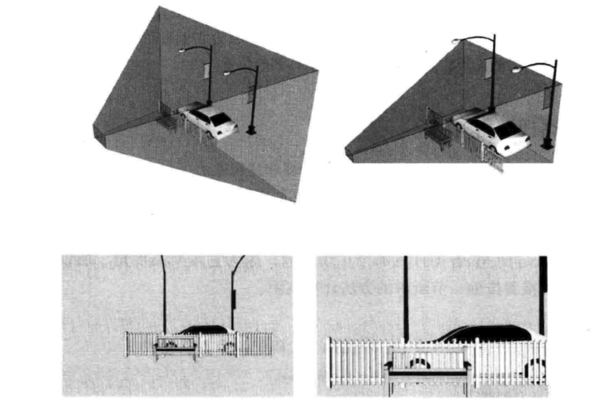

#### near与far的取值

- 正交投影时，摄像机可位于视景体中间，此时near < 0，far > 0，近平面位于视点后面（Z轴正方向），远平面位于视点前面（Z轴负方向）
- 正交投影时，视景体也可位于视点后面(Z轴正方向)，此时near < 0, far < 0
- 正交投影时，far 和 near没有规定的大小关系，既可以far > near 也可以 far < near，只要物体在视景体内都可以被观察到。
- 透视投影时，摄像机必须位于视景体前面：eyeZ>近平面Z坐标 && eyeZ > 远平面Z坐标，即：eyeZ > (eyeZ - near) && eyeZ > (eyeZ - far)。