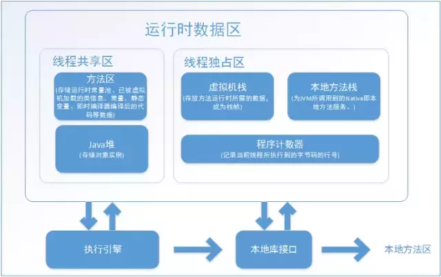

# 内存

- [相关文章](#相关文章)
- [内存相关概念](#内存相关概念)
- [内存抖动](#内存抖动)
- [内存泄漏](#内存泄漏)
- [内存优化](#内存优化)
    - [Reckon（计算）](#reckon计算)
        - [ActivityManager.getMemoryClass/ActivityManager.getLargeMemoryClass()](#activitymanagergetmemoryclassactivitymanagergetlargememoryclass)
        - [其它代码小细节](#其它代码小细节)
    - [Reduce（减少）](#reduce减少)
        - [避免创建不必要的对象](#避免创建不必要的对象)
        - [Bitmap](#bitmap)
        - [谨慎使用external libraries](#谨慎使用external-libraries)
        - [节制地使用Service](#节制地使用service)
        - [使用优化过的数据集合](#使用优化过的数据集合)
    - [Reuse（重用）](#reuse重用)
        - [Bitmap的重用](#bitmap的重用)
        - [Adapter](#adapter)
        - [池的使用](#池的使用)
    - [Recycle（回收）](#recycle回收)
        - [在Activity/Fragment生命周期中释放资源](#在activityfragment生命周期中释放资源)
        - [onTrimMemory](#ontrimmemory)
        - [常见需要回收的对象](#常见需要回收的对象)
        - [释放对象的引用](#释放对象的引用)
    - [其它](#其它)


## 相关文章

- [ANDROID内存优化(大汇总——全)](https://blog.csdn.net/a396901990/article/details/38904543)
- [看完这篇文章,解决 APP 中 90 % 的内存异常问题](https://mp.weixin.qq.com/s?__biz=MzAxMTI4MTkwNQ==&mid=2650828463&idx=1&sn=414bdd7012ed465664d3b99ec8f55566&chksm=80b7ba31b7c03327e86c08a9be9216b51788bce46a33be3444e1f306802be3f62d9f72a3e45d&mpshare=1&scene=1&srcid=#rd)
- [Android 性能优化必知必会](https://androidperformance.com/2018/05/07/Android-performance-optimization-skills-and-tools/)

## 内存相关概念

- 查看总内存情况，如果系统处于低内存的话 , 会有如下特征:
    - FreeRam 的值非常少 , Used RAM 的值非常大
    - ZRAM 使用率非常高（如果开了 Zram 的话)

```bash
adb shell dumpsys meminfo

Total RAM: 5,861,796K (status normal)
 Free RAM: 2,232,045K (  394,549K cached pss + 1,736,352K cached kernel +    21,328K cached ion +    79,816K free)
 Used RAM: 5,394,215K (4,570,419K used pss +   823,796K kernel)
 Lost RAM:   106,799K
     ZRAM:   453,740K physical used for 1,675,584K in swap (2,621,436K total swap)
   Tuning: 256 (large 512), oom   322,560K, restore limit   107,520K (high-end-gfx)
```

- 

## 内存抖动

- 通过memory monitor看是否有大量的上下波动
- 短时间创建大量的对象，又被回收掉
- 瞬间产生大量的对象，达到阀值，造成内存gc
- 常见
    - 避免for循环创建对象，比如StringBuilder
    - 避免在onDraw创建对象，比如Rect对象
    - 使用对象池技术，比如Message, SomeArgs,ArrayMap中的int和Object数组，fresco中的pool
    - 使用LRU缓存将来可能会用的对象

## 内存泄漏

- 内存泄漏表示的是不再用到的对象因为被错误引用而无法进行回收
- 内存泄漏导致这个对象一直留在内存当中，**占用了宝贵的内存空间**。显然，这还使得每级Generation的内存区域可用空间变小，**GC就会更容易被触发，从而引起性能问题**
- LeakCanary
- 常见内存泄漏原因
    - static
    - 匿名内部类
    - Thread
    - handler,timer,timerTask,CountDownTimer，AnsyncTask
    - 广播,资源未释放
    - JNI
- 解决办法
    - 手动释放
    - finalize guardian
    - 静态内部类 + 弱引用

## 内存优化

### Reckon（计算）

- 首先需要知道你的app所消耗内存的情况，知己知彼才能百战不殆
- 了解gc,了解内存泄漏，了解内存抖动
- 了解提高性能的一些代码

#### ActivityManager.getMemoryClass/ActivityManager.getLargeMemoryClass()

- 通过最大内存，来确定缓存的大小

```java
// com/facebook/imagepipeline/cache/DefaultBitmapMemoryCacheParamsSupplier
public class DefaultBitmapMemoryCacheParamsSupplier implements Supplier<MemoryCacheParams> {
  private static final int MAX_CACHE_ENTRIES = 256;
  private static final int MAX_EVICTION_QUEUE_SIZE = Integer.MAX_VALUE;
  private static final int MAX_EVICTION_QUEUE_ENTRIES = Integer.MAX_VALUE;
  private static final int MAX_CACHE_ENTRY_SIZE = Integer.MAX_VALUE;

  private final ActivityManager mActivityManager;

  public DefaultBitmapMemoryCacheParamsSupplier(ActivityManager activityManager) {
    mActivityManager = activityManager;
  }

  @Override
  public MemoryCacheParams get() {
    return new MemoryCacheParams(
        getMaxCacheSize(),
        MAX_CACHE_ENTRIES,
        MAX_EVICTION_QUEUE_SIZE,
        MAX_EVICTION_QUEUE_ENTRIES,
        MAX_CACHE_ENTRY_SIZE);
  }

  private int getMaxCacheSize() {
    final int maxMemory =
        Math.min(mActivityManager.getMemoryClass() * ByteConstants.MB, Integer.MAX_VALUE);
    if (maxMemory < 32 * ByteConstants.MB) {
      return 4 * ByteConstants.MB;
    } else if (maxMemory < 64 * ByteConstants.MB) {
      return 6 * ByteConstants.MB;
    } else {
      // We don't want to use more ashmem on Gingerbread for now, since it doesn't respond well to
      // native memory pressure (doesn't throw exceptions, crashes app, crashes phone)
      if (Build.VERSION.SDK_INT < Build.VERSION_CODES.HONEYCOMB) {
        return 8 * ByteConstants.MB;
      } else {
        // 使用最大内存的1/4
        return maxMemory / 4;
      }
    }
  }
}
```

#### 其它代码小细节

- 选择Static而不是Virtual，static方法访问更快
- 常量声明为Static Final，减少访问时的查找
- 在面向对象的设计当中应该使用getter/setter，但是在类的内部你应该避免setter/getter,直接访问变量
- 使用增强for循环
- 使用包级访问而不是内部类的私有访问,内部类访问外部类的private会转变为访问它的生成的getter方法
- 避免使用float类型
- 枚举比静态常量大

### Reduce（减少）

- **减少资源的使用**

#### 避免创建不必要的对象

- 比如StringBuilder

#### Bitmap

- 图片按大小加载，inSampleSize, fresco的downSample等
- 少使用大的png,多使用.9图
- 是否可以用代码替换图片资源
- Bitmap.recycle()

#### 谨慎使用external libraries

- 避免为了一个小功能引入一个大的library
- 避免引入重复功能的library

#### 节制地使用Service

- 当我们启动一个Service时，系统会倾向于将这个Service所依赖的进程进行保留，这样就会导致这个进程变得非常消耗内存

#### 使用优化过的数据集合

- SparseArray,LongSparseArray,SparseBooleanArray,ArrayMap
- HashMap需要一个额外的实例对象来记录Mapping,而且loadFactor
- SparseArray,避免了自动装箱与解箱

### Reuse（重用）

- 当第一次使用完以后，尽量给其他的使用

#### Bitmap的重用

- Bitmap的LRU缓存
- Bitmap解析时的inBitmap
- Bitmap解析时的inTempStorage,Fresco中使用各种pool重用这个解析图片的ByteBuffer

#### Adapter

- ListView, RecyclerView

#### 池的使用

- **对象池**，比如Message, AMS通信中的SomeArg类，ArrayMap中的int和Object数组，Fresco中的用于解码用的ByteBuffer
- 线程池

### Recycle（回收）

#### 在Activity/Fragment生命周期中释放资源

- onStop/onDestroy释放资源

#### onTrimMemory

- 尽管系统在内存不足的时候杀进程的顺序是按照LRU Cache中从低到高来的，但是它同时也会考虑杀掉那些占用内存较高的应用来让系统更快地获得更多的内存
- 当界面不可见时释放内存, 重写onTrimMemory,**在TRIM_MEMORY_UI_HIDDEN()中释放资源，常见的比如图片缓存资源**

#### 常见需要回收的对象

- cursor.close()
- BroadcastReceiver
- intputStream/OutputStream.close()

#### 释放对象的引用

- 内存泄漏
- 当一个生命周期较短的对象A，被一个生命周期较长的对象B保有其引用的情况下，在A的生命周期结束时，要在B中清除掉对A的引用

```java
public class DemoActivity extends Activity {
    ... ...
    private Handler mHandler = ...
    private Object obj;
    public void operation() {
        obj = initObj();
        ...

    mHandler.post(new Runnable() {
        public void run() {
            // Runnable中对象用完了，但是还有成员变量引用，内存没释放
            useObj(obj);
        }
    });
}

public void operation() {
    obj = initObj();
    ...
    final Object o = obj;
    obj = null;
    mHandler.post(new Runnable() {
        public void run() {
            useObj(o);
        }
    }
}
```

### 其它

- proguard
- zipalign
- 考虑使用多进程，比如音乐播放器