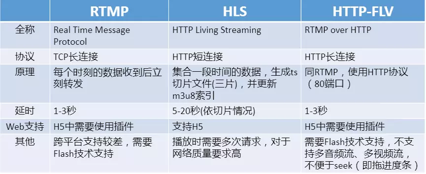

# 直播

## 相关文档

-   [Android 原生编解码接口 MediaCodec 之——完全解析](https://blog.csdn.net/gb702250823/article/details/81627503)
-   [H264 三种码率控制方法(CBR, VBR, CVBR)](https://blog.csdn.net/szfhy/article/details/50820119)
-   [Android 原生编解码接口 MediaCodec 之——踩坑](https://blog.csdn.net/gb702250823/article/details/81669684)

## 卡顿

### 网络带宽

-   主播端的网络不好，导致推流上行不稳定
    -   带宽测试，是否明显低于码率
    -   后台或 CDN 的帧率统计
-   服务端的线路质量不好，导致分发不稳定
    -   一方面可以通过联系 CDN 厂商来排查
    -   也可以通过播放端的打点上报，统计出各家 CDN 的线路质量（比如：首开，卡顿率），分地区做一些线路的调整和优化
-   观众端的网络不好，导致拉流下行不稳定
    -   ping
    -   带宽测试

### 手机性能

-   尽可能选择使用硬解，充分利用 GPU 加速
-   如果有多种码流，尽可能在低端机上选择非高清码流
-   增大缓冲区，有助于缓解解码不稳定带来的卡顿

### 视频流时间戳问题

-   如果视频流的 pts 有问题，也可能出现卡顿

## 首开

### 播放地址获取时机

-   提前获取播放地址

### DNS 解析慢

-   换成 ip 直连
-   提前完成 DNS 解析，并缓存，DNS 解析有一个 TTL 超时时间，到期前要记得重新解析刷新
-   当网络变化时，清除 DNS 缓存
-   http 的 header host,rtmp 的 tcUrl 参数

### 服务器优化

-   CDN 加速
-   GOP 缓存
-   **冷热流**,当你去附近的边缘服务器节点拉取某个流的时候，如果最近没有任何人从该服务器拉过这个流，那么这台服务器就需要逐级向源头拉流，而且该服务器也没有任何 GOP 缓存，从而产生比较大的首开延时
-   **边缘节点的 TTL**,同等大小的数据，客户端距离服务器越近，ttl 越小，那么传输速度也就越快，首开也会越快
-   **服务器的响应速度,影响服务器响应速度的因素**，一个是跟服务器的协议层优化有关，另一个就是服务端的负载和性能了，服务器当前负载越大，响应自然越慢

### 视频流的媒体信息解析优化

-   所有基于 ffmpeg 的播放器，都会遇到 `avformat_find_stream_info` 这个函数耗时比较久，从而增大了首开时间，该函数主要作用是通过读取一定字节的码流数据，来分析码流的基本信息，如编码信息、时长、码率、帧率等等
-   减小 probesize analyzeduration，分别用来控制其读取的数据量大小和时长,减少`avformat_find_stream_info`耗时，从而加快首开，但是需要注意的是，设置地太小可能会导致读取的数据量不足，从而无法解析出码流信息，导致播放失败，或者出现只有音频没有视频，只有视频没有音频的问题
-   analyzeduration 为 1000ms, probsize 默认为 1M,改为了 200K
-   预设码流的音视频格式,也就是设置自己设置解码参数

### 优化首帧的解码与渲染

-   首帧确保送入解码器的是 I 帧
-   服务器的 GOP 缓存
-   解码算法优化，硬解码

## 延迟

### 采集

-   与硬件有关

### 图像音频处理

-   比如美颜，水印，混音，去噪
-   调优算法

### 视频编码

#### 分辨率，帧率

-   帧率一般控制在 15~24
-   帧率决定了视频的流畅性，帧率越高，视频越流畅，但每秒钟编码器要处理的数据量也就越大，同等码率下压缩出来的视频质量就越差

```java
SHD(1280, 720, 1000 * 1800,20),
HD(854, 480, 1000 * 800,20),
SD(640, 360, 1000 * 500,20),
CAMERA_SHD(960,540,1000 * 1300,15);
```

#### 码率

-   [如何计算视频最佳码率](https://blog.csdn.net/tanningzhong/article/details/80505640)
-   **码率决定了视频被压缩的程度，码率越低，丢失的信息也就越多，画质也就越差。但是，带来的好处是占用的网络带宽会比较小，容易在互联网上传输，不容易出现卡顿**
-   固定码率编码 CBR 可以一定程度上消除网络抖动影响, 如果能够使用可变码率编码 VBR 可以节省一些不必要的网络带宽，降低一定的延迟。因此建议尽量使用 VBR 进行编码
-   **CBR（Constant Bit Rate）**,是以恒定比特率方式进行编码，有 Motion 发生时，由于码率恒定，只能通过增大 QP 来减少码字大小，图像质量变差，当场景静止时，图像质量又变好，因此图像质量不稳定。这种算法优先考虑码率(带宽)
-   **VBR（Variable Bit Rate）**,动态比特率，其码率可以随着图像的复杂程度的不同而变化，因此其编码效率比较高，Motion 发生时，马赛克很少。码率控制算法根据图像内容确定使用的比特率，图像内容比较简单则分配较少的码率(似乎码字更合适)，图像内容复杂则分配较多的码字，这样既保证了质量，又兼顾带宽限制。这种算法优先考虑图像质量
-   **CVBR（Constrained VariableBit Rate）**,它是 VBR 的一种改进方法。但是 Constrained 又体现在什么地方呢？这种算法对应的 Maximum bitRate 恒定或者 Average BitRate 恒定。这种方法的兼顾了以上两种方法的优点：在图像内容静止时，节省带宽，有 Motion 发生时，利用前期节省的带宽来尽可能的提高图像质量，达到同时兼顾带宽和图像质量的目的。这种方法通常会让用户输入最大码率和最小码率，静止时，码率稳定在最小码率，运动时，码率大于最小码率，但是又不超过最大码率

```java
//指定目标码率和码率控制模式
mediaFormat.setInteger(MediaFormat.KEY_BIT_RATE, bitRate);
// KEY_BITRATE_MODE api 21以上
mediaFormat.setInteger(MediaFormat.KEY_BITRATE_MODE, MediaCodecInfo.EncoderCapabilities.BITRATE_MODE_VBR);
mMediaCodec.configure(mediaFormat, null, null, MediaCodec.CONFIGURE_FLAG_ENCODE);
```

-   根据带宽，生产端根据发送缓冲区情况，动态调整码率

```java
// 动态调整目标码率
Bundle param = new Bundle();
param.putInt(MediaCodec.PARAMETER_KEY_VIDEO_BITRATE, bitrate);
mediaCodec.setParameters(param);
```

#### profile level

-   [Advanced Video Coding](https://en.wikipedia.org/wiki/Advanced_Video_Coding#Levels)
-   [H.264 的 profile 与 level 概念解释。](https://blog.csdn.net/yuhengyue/article/details/88184678)
-   [H264 的 level 的计算方法](https://blog.csdn.net/dong_beijing/article/details/85236832)
-   Profile 是对视频压缩特性的描述,简单来说，Profile 越高，就说明采用了越高级的压缩特性,算法复杂度更高,功耗也更高
    -   Baseline profile
    -   Extended profile
    -   Main profile
    -   High profile
-   Level 是对视频本身特性的描述（码率、分辨率、fps）
-   直播为了减小延迟，要确保没有使用 B 帧，因为 B 帧的解析依赖于前后的 I 帖和 P 帧，当只有 B 帧时是不能够解码的，因而能选用的 profile 也就只有**Baseline Profile**

#### 硬编码

-   软编较好的兼容性，硬编效率更高，占用 cpu 小
-   使用 surface 作为编码输入，ImageReadeer, egl 的 surfaceTexture
-   [Android 原生编解码接口 MediaCodec 之——踩坑](https://blog.csdn.net/gb702250823/article/details/81669684)
-   [Android 硬编硬解退坑指南](https://mp.weixin.qq.com/s/SqP-AcEh5EMbkVDP83cCrw)
-   [Android MediaCodec 退坑指南](https://www.sohu.com/a/277940408_495677)

### 业务代码中的缓冲区

-   推流端的发送缓冲区，可以在网络恢复良好的时候，快送发送出去，从而消除掉这个累积延时，或者推送端积累的帧太多时，只能采取丢帧处理
-   服务器的 tcp 的缓存区，也会导致延迟
-   播放端的接收缓冲区，可以通过丢帧或者加速播放的方式快速消费掉缓冲区中的数据，从而消除累计延时

### 网络传输的延时

#### CDN

-   网络带宽与传输距离，CDN 加速
    -   测速选线，动态监测，智能调度
    -   CDN 节点之间采用 rtmp，而不是 hls
    -   客户端（推流和播放）通过查询服务端准实时获取当前最优节点，准实时下线当前故障节点和线路
    -   优先级推流

#### 传输协议

-   [理解 RTMP、HttpFlv 和 HLS 的正确姿势](https://www.jianshu.com/p/32417d8ee5b6)
    
-   RTMP，HLV，HLS，均是基于 tcp 的协议
-   RTMP/HLV 协议的延时在 1 ～ 3s，HLS 协议的直播延时则会更大
-   tcp 协议的多个特性导致其延时明显要高于基于 udp 的私有协议
    -   三次握手
    -   应用层协议的握手，rtmp 的 c0,c1, c2, s0,s1,s2
    -   ACK 机制
    -   丢包重传
    -   某些拥塞控制策略等，因此在网络频繁抖动的弱网下，延时会比较大
-   hls 的延迟主要在于 flv to ts 切片的时间，一方面，切片的时间长一般为 3~10s,时间不足不是一个完整的切片，另外 flv 输出 ts，输出 m3u8,拉流端需要获取 m3u8,还要获取 ts,**由于需要等数据，所以时间较长**
-   **h5 的 flv.js 的存在，不需要用到 flash 技术，rtmp 需要 flash 的支持，但是 falsh 本身慢慢就要被淘汰！！**
-   基于 tcp 的直播协议都会慢一些，为了更好的降低延迟，可以使用基于 udp 的协议，quic rtp/rtcp

#### GOP 缓存

-   [视频编解码 GOP 基本概念](https://blog.csdn.net/daiqiao_ios/article/details/80751322)
-   GOP 决定了视频的延时，GOP 越小，延时就越小，但 GOP 小带来的问题是关键帧数量多，数据量变大，因此，同等码率下压缩出来的视频质量就会越差
-   GOP 缓存造成延迟的原因
    -   cdn 实现 gop 缓存，首开比较快，但是因为 gop 的存在，这一段视频播放是需要时间的，所以会造成一定的延迟
    -   GOP 越大，那么根据 I 帧来解码 P 帧更复杂，也就是解码越耗时
-   解决办法，生产端减小 gop 大小，从而减少服务端 GOP 缓存的大小

```java
 format.setInteger(MediaFormat.KEY_I_FRAME_INTERVAL, config.iFrameRate());
```

## 音画不同步

-   采集源距离太远
-   采集设备内部问题
-   时间戳没有在采集的时候获取
-   播放端性能问题
    -   使用硬解
    -   选择较低清的码流
    -   增大播放缓冲
