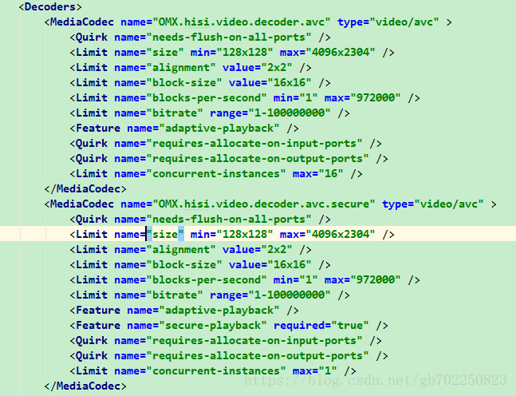

# MediaCodec

## 常见问题

### Android 7.0以下，profile,level无效

- 在android7.0以下，android 内部写死了参数，编码出来的只能是Baseline

```java
// 不支持设置Profile和Level，而应该采用默认设置
mediaFormat.setInteger(MediaFormat.KEY_PROFILE, MediaCodecInfo.CodecProfileLevel.AVCProfileHigh);
mediaFormat.setInteger("level", MediaCodecInfo.CodecProfileLevel.AVCLevel41);
```

### bitrate_mode无效

```java
//android/media/MediaCodecInfo.java
public boolean isBitrateModeSupported(int mode) {
    for (Feature feat: bitrates) {
        if (mode == feat.mValue) {
            return (mBitControl & (1 << mode)) != 0;
        }
    }
    return false;
}
```

### 16位对齐

-  硬编时，分辨率宽和高必须是16的整数倍

```java
private void alignDevice() {
    // ...
    // 16-align for device compatibility
    newWidth = (newWidth + 15) / 16 * 16;
    newHeight = (newHeight + 15) / 16 * 16;
    // ...
}
```

### 硬解MediaCodec.configure直接crash

- 如果初始化MediaFormat视频流的预设宽高高于当前手机支持的解码最大分辨率那么在调用MediaCodec.configure的时候就会crash。把MediaFormat.createVideoFormat时候的宽高设置小一点就ok了，那么就会有另外一个问题，就是如果我设置1080 720的后，视频流来了一个1920 1080的会不会有影响？如果当前设备的最大分辨率高于这个值，就算预设值不一样，也还是可以正常解码并显示1920*1080的画面。那么如果低于这个值呢？两种情况 绿屏／MediaCodec.dequeueInputBuffer的值一直IllegalStateException

#### 如何获取当前手机支持的解码最大分辨率

- 每个手机下都有这样一个文件，/system/etc/media_codecs.xml (your path)

