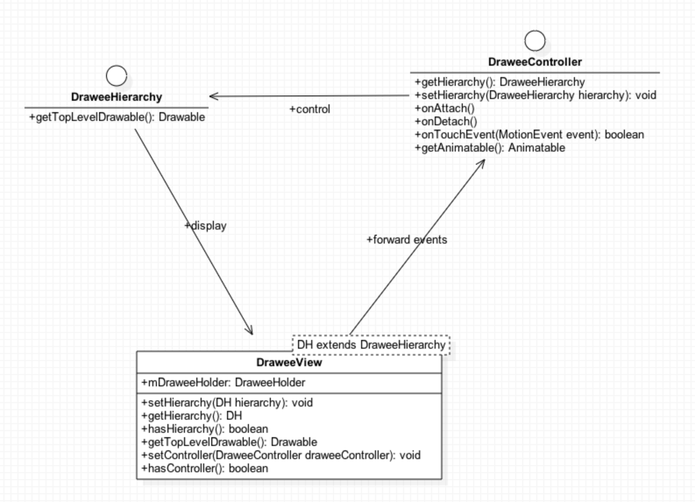

# Fresco

## 相关文章

- [Fresco源码解析 - Hierarchy / View / Controller](https://blog.csdn.net/FeeLang/article/details/45126421)

## 基本概念

### MVC

- Fresco是一个典型的MVC架构

- 

- DraweeView 会把获得的 Event 转发给 Controller
- DraweeController根据Event 来决定是否需要显示和隐藏图像（包括动画），而这些图像都存储在 Hierarchy 中
- DraweeView 绘制时直接通过 getTopLevelDrawable 就可以获取需要显示的图像

### DraweeHolder

- 内部有DraweeController和DraweeView的引用，解耦设计，如果以后DraweeView不再继承于ImageView，也可以很方便的使用

### DraweeControllerBuilder

- DraweeController由DraweeControllerBuilder 采用 Builder 模式创建，创建之后，不可修改

### Listeners

- 使用 ControllerListener 的一个场景就是设置一个 Listener监听图片的下载

### Image Pipeline

- Fresco 的 Image Pipeline 负责图片的获取和管理
- 在5.0系统以下，Image Pipeline 使用 pinned purgeables 将Bitmap数据避开Java堆内存，存在ashmem中。这要求图片不使用时，要显式地释放内存，也就是有CloseableReference的原因