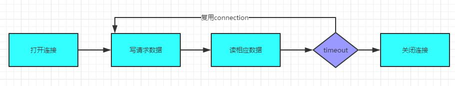
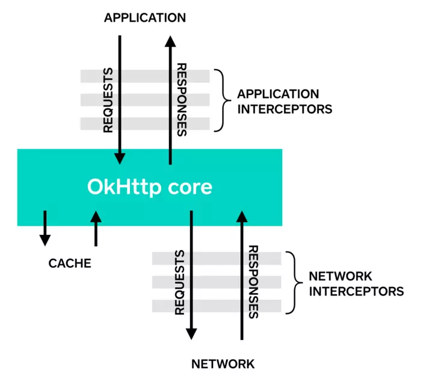

# Okhttp

## 相关文章

-   [Android 网络编程（八）源码解析 OkHttp 后篇[复用连接池]](https://blog.csdn.net/itachi85/article/details/52335403)
-   [荔枝的 Okhttp 解析](https://www.jianshu.com/p/484097dde0a5)

## RetryAndFollowUpInterceptor

-   主要是请求失败，或者需要重定向的时候进行新的请求

```java
    // RetryAndFollowUpInterceptor.kt
    @Throws(IOException::class)
  override fun intercept(chain: Interceptor.Chain): Response {
    var request = chain.request()
    val realChain = chain as RealInterceptorChain
    val transmitter = realChain.transmitter()
    var followUpCount = 0
    var priorResponse: Response? = null
    // 循环操作
    while (true) {
      //1、
      transmitter.prepareToConnect(request)

      if (transmitter.isCanceled) {
        throw IOException("Canceled")
      }

      var response: Response
      var success = false
      try {
        //2、realChain.proceed 调用到下一个拦截器，该行代码之后都是请求回来后的处理
        response = realChain.proceed(request, transmitter, null)
        success = true
      } catch (e: RouteException) {
        // The attempt to connect via a route failed. The request will not have been sent.
        // 路由错误，如果不可以恢复则直接抛出异常
        // 否则则进行下一次尝试
        if (!recover(e.lastConnectException, transmitter, false, request)) {
          throw e.firstConnectException
        }
        continue
      } catch (e: IOException) {
        // An attempt to communicate with a server failed. The request may have been sent.
        val requestSendStarted = e !is ConnectionShutdownException
        // IO 错误，如果不可以恢复则直接抛出异常
        if (!recover(e, transmitter, requestSendStarted, request)) throw e
        continue
      } finally {
        // The network call threw an exception. Release any resources.
        // 3、
        if (!success) {
          transmitter.exchangeDoneDueToException()
        }
      }

      // Attach the prior response if it exists. Such responses never have a body.
      // 4、第一次 priorResponse 肯定是空的，如果经过重试的话则会把之前的 Response 赋值给新的 Response 的 priorResponse 成员变量，
      // 并且显示的将 priorResponse 的 body 置空。这个对象的赋值意义是什么？其实作用是在步骤 5 中，作为停止重试的判断使用：如果先后两次 Http // 求结果获取的状态码都是 408（请求超时）或者都是 503（服务不可用）则直接停止重试

      if (priorResponse != null) {
        response = response.newBuilder()
            .priorResponse(priorResponse.newBuilder()
                .body(null)
                .build())
            .build()
      }

      val exchange = response.exchange
      val route = exchange?.connection()?.route()
      // 5、followUpRequest 根据请求回来的 Response 的响应码构建新的 Request，其中就包含了 301，302 等重定向的处
      // 理，步骤 4 提到的处理，以及我们一开始初始化 OkHttpClient 对象的是否允许重试的处理等。如果需要重新请求则
      //  followUp 对象不为空，否则为 null 停止继续请求。
      // 407 需要proxy的的授权
      // 401  HTTP Status-Code 401: Unauthorized.
      // 300 301  302 303 307 308  重定向相关
      // 408 但是第一次timeOut
      val followUp = followUpRequest(response, route)
            // 6、
      if (followUp == null) {
        if (exchange != null && exchange.isDuplex) {
          transmitter.timeoutEarlyExit()
        }
        return response
      }

      val followUpBody = followUp.body
      // 7、一次性请求的话直接返回
      if (followUpBody != null && followUpBody.isOneShot()) {
        return response
      }

      response.body?.closeQuietly()
      // 8、
      if (transmitter.hasExchange()) {
        exchange?.detachWithViolence()
      }
            // 9、次数判断，最大为20
      if (++followUpCount > MAX_FOLLOW_UPS) {
        throw ProtocolException("Too many follow-up requests: $followUpCount")
      }
            // 10、更新 Request 对象为新生成的对象，priorResponse 赋值，进入下一次循环。
      request = followUp
      priorResponse = response
    }
  }
```

-   realChain.proceed 调用到下一个拦截器，该行代码之后都是请求回来后的处理。
-   catch 和 finally，catch 中主要是出现异常后，判断是否可以重试，如果可以就 continue 继续重试，否则抛出异常并进入 finally 做回收操作。稍微看下 recover 方法

```java
  private fun recover(
    e: IOException,
    transmitter: Transmitter,
    requestSendStarted: Boolean,
    userRequest: Request
  ): Boolean {
    // OkHttpClient 初始化时候设置不允许重试，则直接失败
    if (!client.retryOnConnectionFailure) return false

    // 已经发起过请求，
    // 但是有些RequestBody只允许发送一次
    // 或者e是FileNotFoundException,那也不用再尝试了
    if (requestSendStarted && requestIsOneShot(e, userRequest)) return false

    // 一些致命问题，比如证书认证错误等
    if (!isRecoverable(e, requestSendStarted)) return false

    // 没有更多的路由去尝试
    if (!transmitter.canRetry()) return false
    // For failure recovery, use the same route selector with a new connection.
    return true
  }
```

```java
// RequestBody.kt
/**
   * Returns true if this body expects at most one call to [writeTo] and can be transmitted
   * at most once. This is typically used when writing the request body is destructive and it is not
   * possible to recreate the request body after it has been sent.
   *
   * This method returns false unless it is overridden by a subclass.
   *
   * By default OkHttp will attempt to retransmit request bodies when the original request fails
   * due to any of:
   *
   *  * A stale connection. The request was made on a reused connection and that reused connection
   *    has since been closed by the server.
   *  * A client timeout (HTTP 408).
   *  * A authorization challenge (HTTP 401 and 407) that is satisfied by the [Authenticator].
   *  * A retryable server failure (HTTP 503 with a `Retry-After: 0` response header).
   *  * A misdirected request (HTTP 421) on a coalesced connection.
   */
  open fun isOneShot(): Boolean = false
```

```java
private fun isRecoverable(e: IOException, requestSendStarted: Boolean): Boolean {
    // If there was a protocol problem, don't recover.
    if (e is ProtocolException) {
      return false
    }

    // If there was an interruption don't recover, but if there was a timeout connecting to a route
    // we should try the next route (if there is one).
    if (e is InterruptedIOException) {
      return e is SocketTimeoutException && !requestSendStarted
    }

    // Look for known client-side or negotiation errors that are unlikely to be fixed by trying
    // again with a different route.
    if (e is SSLHandshakeException) {
      // If the problem was a CertificateException from the X509TrustManager,
      // do not retry.
      // 证书错误，则直接不用尝试了
      if (e.cause is CertificateException) {
        return false
      }
    }
    if (e is SSLPeerUnverifiedException) {
      // e.g. a certificate pinning error.
      return false
    }
    // An example of one we might want to retry with a different route is a problem connecting to a
    // proxy and would manifest as a standard IOException. Unless it is one we know we should not
    // retry, we return true and try a new route.
    return true
  }
```

-   followUpRequest,重定向，重试

```java
private fun followUpRequest(userResponse: Response, exchange: Exchange?): Request? {
    val route = exchange?.connection?.route()
    val responseCode = userResponse.code

    val method = userResponse.request.method
    when (responseCode) {
     //  HTTP Status-Code 407: Proxy Authentication Required.
      HTTP_PROXY_AUTH -> {
        val selectedProxy = route!!.proxy
        if (selectedProxy.type() != Proxy.Type.HTTP) {
          throw ProtocolException("Received HTTP_PROXY_AUTH (407) code while not using proxy")
        }
        return client.proxyAuthenticator.authenticate(route, userResponse)
      }

    // HTTP Status-Code 401: Unauthorized.
      HTTP_UNAUTHORIZED -> return client.authenticator.authenticate(route, userResponse)

    // 重定向相关
    // 取出loacaltion进行重定向
      HTTP_PERM_REDIRECT, HTTP_TEMP_REDIRECT, HTTP_MULT_CHOICE, HTTP_MOVED_PERM, HTTP_MOVED_TEMP, HTTP_SEE_OTHER -> {
        return buildRedirectRequest(userResponse, method)
      }

     // HTTP Status-Code 408: Request Time-Out
      HTTP_CLIENT_TIMEOUT -> {
        // 408's are rare in practice, but some servers like HAProxy use this response code. The
        // spec says that we may repeat the request without modifications. Modern browsers also
        // repeat the request (even non-idempotent ones.)
        if (!client.retryOnConnectionFailure) {
          // The application layer has directed us not to retry the request.
          return null
        }

        val requestBody = userResponse.request.body
        // 不是那种只能发一次的requestBody
        if (requestBody != null && requestBody.isOneShot()) {
          return null
        }
        val priorResponse = userResponse.priorResponse
        // 连续二次服务器超时，就不尝试了
        if (priorResponse != null && priorResponse.code == HTTP_CLIENT_TIMEOUT) {
          // We attempted to retry and got another timeout. Give up.
          return null
        }

        if (retryAfter(userResponse, 0) > 0) {
          return null
        }

        return userResponse.request
      }

       // HTTP Status-Code 503: Service Unavailable.
      HTTP_UNAVAILABLE -> {
        val priorResponse = userResponse.priorResponse
        if (priorResponse != null && priorResponse.code == HTTP_UNAVAILABLE) {
          // We attempted to retry and got another timeout. Give up.
          return null
        }

        if (retryAfter(userResponse, Integer.MAX_VALUE) == 0) {
          // specifically received an instruction to retry without delay
          return userResponse.request
        }

        return null
      }

      // /** RFC 7540, Section 9.1.2. Retry these if the exchange used connection coalescing. */
      HTTP_MISDIRECTED_REQUEST -> {
        // OkHttp can coalesce HTTP/2 connections even if the domain names are different. See
        // RealConnection.isEligible(). If we attempted this and the server returned HTTP 421, then
        // we can retry on a different connection.
        val requestBody = userResponse.request.body
        if (requestBody != null && requestBody.isOneShot()) {
          return null
        }

        if (exchange == null || !exchange.isCoalescedConnection) {
          return null
        }

        exchange.connection.noCoalescedConnections()
        return userResponse.request
      }

      else -> return null
    }
  }
```

## BridgeInterceptor

```java
  // BridgeInterceptor.kt
    @Throws(IOException::class)
  override fun intercept(chain: Interceptor.Chain): Response {
    val userRequest = chain.request()
    val requestBuilder = userRequest.newBuilder()

    val body = userRequest.body
    if (body != null) {
      // content-type
      // application/x-www-form-urlencoded
      // application/json
      val contentType = body.contentType()
      if (contentType != null) {
        requestBuilder.header("Content-Type", contentType.toString())
      }

      // Transfer-Encoding: chunked 表示输出的内容长度不能确定
      // 比如结合GZip就比较合适
      // Chunked编码使用若干个Chunk串连而成，由一个标明长度为0的chunk标示结束
      // 比如http-flv的直播就会带上这种
      val contentLength = body.contentLength()
      if (contentLength != -1L) {
        requestBuilder.header("Content-Length", contentLength.toString())
        requestBuilder.removeHeader("Transfer-Encoding")
      } else {
        requestBuilder.header("Transfer-Encoding", "chunked")
        requestBuilder.removeHeader("Content-Length")
      }
    }
    // 2、如果cdn使用ip直连，就需要使用host,告诉cdn我们是哪个网站请求的
    if (userRequest.header("Host") == null) {
      requestBuilder.header("Host", userRequest.url.toHostHeader())
    }

    // http 1.1默认开启Keep-Alive
    // "Connection", "close"也有，比如http-flv直接的流就会带上这个
    if (userRequest.header("Connection") == null) {
      requestBuilder.header("Connection", "Keep-Alive")
    }

    var transparentGzip = false
    // range主要用于断点续传，或下载
    if (userRequest.header("Accept-Encoding") == null && userRequest.header("Range") == null) {
      transparentGzip = true
      requestBuilder.header("Accept-Encoding", "gzip")
    }
    // 3、cookie
    val cookies = cookieJar.loadForRequest(userRequest.url)
    if (cookies.isNotEmpty()) {
      requestBuilder.header("Cookie", cookieHeader(cookies))
    }

    if (userRequest.header("User-Agent") == null) {
      requestBuilder.header("User-Agent", userAgent)
    }

    val networkResponse = chain.proceed(requestBuilder.build())
    // 4、okhttp中的cookieJar是空实现
    cookieJar.receiveHeaders(userRequest.url, networkResponse.headers)

    val responseBuilder = networkResponse.newBuilder()
        .request(userRequest)
        // 5、gzip还原
    if (transparentGzip &&
        "gzip".equals(networkResponse.header("Content-Encoding"), ignoreCase = true) &&
        networkResponse.promisesBody()) {
      val responseBody = networkResponse.body
      if (responseBody != null) {
        val gzipSource = GzipSource(responseBody.source())
        val strippedHeaders = networkResponse.headers.newBuilder()
            .removeAll("Content-Encoding")
            .removeAll("Content-Length")
            .build()
        responseBuilder.headers(strippedHeaders)
        val contentType = networkResponse.header("Content-Type")
        responseBuilder.body(RealResponseBody(contentType, -1L, gzipSource.buffer()))
      }
    }

    return responseBuilder.build()
  }
```

## CacheInterceptor

```java
  // CacheInterceptor.kt
    @Throws(IOException::class)
  override fun intercept(chain: Interceptor.Chain): Response {
    // 1、Cache 对象可以在 OkHttpClient 初始化的时候构建，里面是通过 DiskLruCache 进行缓存的，
    // 以 url 生成 key 在缓存中查找到目标之后重新构造成 Response，然后进一步对比 Request 和从缓存恢复 Response，
    // 如果没命中则会返回 null，否则返回 Response
    val cacheCandidate = cache?.get(chain.request())

    val now = System.currentTimeMillis()
    // 2、获取缓存策略
    val strategy = CacheStrategy.Factory(now, chain.request(), cacheCandidate).compute()
    val networkRequest = strategy.networkRequest
    val cacheResponse = strategy.cacheResponse

    cache?.trackResponse(strategy)

    if (cacheCandidate != null && cacheResponse == null) {
      // The cache candidate wasn't applicable. Close it.
      cacheCandidate.body?.closeQuietly()
    }

    // If we're forbidden from using the network and the cache is insufficient, fail.
    // 3、如果 networkRequest 和 cacheResponse 都为 null，则不再进行网络请求，直接构造失败的 Response
    if (networkRequest == null && cacheResponse == null) {
      return Response.Builder()
          .request(chain.request())
          .protocol(Protocol.HTTP_1_1)
          .code(HTTP_GATEWAY_TIMEOUT)
          .message("Unsatisfiable Request (only-if-cached)")
          .body(EMPTY_RESPONSE)
          .sentRequestAtMillis(-1L)
          .receivedResponseAtMillis(System.currentTimeMillis())
          .build()
    }

    // If we don't need the network, we're done.
    // 4、如果只有 networkRequest 为 null，则表示缓存可用，结束
    if (networkRequest == null) {
      return cacheResponse!!.newBuilder()
          .cacheResponse(stripBody(cacheResponse))
          .build()
    }

    // 5、如果 networkRequest 不为 null，则进行网络请求
    var networkResponse: Response? = null
    try {
      networkResponse = chain.proceed(networkRequest)
    } finally {
      // If we're crashing on I/O or otherwise, don't leak the cache body.
      if (networkResponse == null && cacheCandidate != null) {
        cacheCandidate.body?.closeQuietly()
      }
    }

    // If we have a cache response too, then we're doing a conditional get.
    // 6、当 cacheResponse 不为 null 且 networkResponse 的相应码为 304,表示缓存没有过期
    // 对比缓存，304表示缓存可用，否则会返回200和新擞据
    //  Last-Modified  /  If-Modified-Since  Etag  /  If-None-Match
    // 则合并两个响应头，更新缓存，结束
    if (cacheResponse != null) {
      if (networkResponse?.code == HTTP_NOT_MODIFIED) {
        val response = cacheResponse.newBuilder()
            .headers(combine(cacheResponse.headers, networkResponse.headers))
            .sentRequestAtMillis(networkResponse.sentRequestAtMillis)
            .receivedResponseAtMillis(networkResponse.receivedResponseAtMillis)
            .cacheResponse(stripBody(cacheResponse))
            .networkResponse(stripBody(networkResponse))
            .build()

        networkResponse.body!!.close()

        // Update the cache after combining headers but before stripping the
        // Content-Encoding header (as performed by initContentStream()).
        cache!!.trackConditionalCacheHit()
        cache.update(cacheResponse, response)
        return response
      } else {
        cacheResponse.body?.closeQuietly()
      }
    }
        // 7、如果 cache 不为 null，验证 networkResponse 是否需要缓存，并缓存，结束；否则返回结果，结束。
    val response = networkResponse!!.newBuilder()
        .cacheResponse(stripBody(cacheResponse))
        .networkResponse(stripBody(networkResponse))
        .build()

    if (cache != null) {
      if (response.promisesBody() && CacheStrategy.isCacheable(response, networkRequest)) {
        // Offer this request to the cache.
        val cacheRequest = cache.put(response)
        return cacheWritingResponse(cacheRequest, response)
      }

      if (HttpMethod.invalidatesCache(networkRequest.method)) {
        try {
          cache.remove(networkRequest)
        } catch (_: IOException) {
          // The cache cannot be written.
        }
      }
    }

    return response
  }

```

```java

fun compute(): CacheStrategy {
      val candidate = computeCandidate()

      // We're forbidden from using the network and the cache is insufficient.
      if (candidate.networkRequest != null && request.cacheControl.onlyIfCached) {
        // networkRequest不为null,但是不允许使用网络，那么直接返回null
        return CacheStrategy(null, null)
      }

      return candidate
    }

/**
   * This field's name "only-if-cached" is misleading. It actually means "do not use the network".
   * It is set by a client who only wants to make a request if it can be fully satisfied by the
   * cache. Cached responses that would require validation (ie. conditional gets) are not permitted
   * if this header is set.
   */
  @get:JvmName("onlyIfCached") val onlyIfCached: Boolean,

 private fun computeCandidate(): CacheStrategy {
      // No cached response.
      // 缓存没有命中，发起网络请求，对应前面步骤 5
      if (cacheResponse == null) {
        return CacheStrategy(request, null)
      }

        // 请求为 https，缓存没有握手信息，发起网络请求，对应前面步骤 5
      // Drop the cached response if it's missing a required handshake.
      if (request.isHttps && cacheResponse.handshake == null) {
        return CacheStrategy(request, null)
      }

      // If this response shouldn't have been stored, it should never be used as a response source.
      // This check should be redundant as long as the persistence store is well-behaved and the
      // rules are constant.
     // isCacheable 中对 cacheResponse 的响应码以及 request 和 cacheResponse
      // Cache-Control 头做了判断，如果不满足，则对应前面步骤 5
      if (!isCacheable(cacheResponse, request)) {
        return CacheStrategy(request, null)
      }

      val requestCaching = request.cacheControl
      // hasConditions 中对请求头中是否存在 If-Modified-Since 和 If-None-Match 做了判断，
      // 事实上如果有这两个字段，需要发起请求，如果服务端验证没有过期，则只发送响应头回来304，否则返回200
      // 对应步骤 5 以及后续验证的步骤 6
      if (requestCaching.noCache || hasConditions(request)) {
        return CacheStrategy(request, null)
      }

      val responseCaching = cacheResponse.cacheControl

      val ageMillis = cacheResponseAge()
      var freshMillis = computeFreshnessLifetime()

      if (requestCaching.maxAgeSeconds != -1) {
        freshMillis = minOf(freshMillis, SECONDS.toMillis(requestCaching.maxAgeSeconds.toLong()))
      }

      var minFreshMillis: Long = 0
      if (requestCaching.minFreshSeconds != -1) {
        minFreshMillis = SECONDS.toMillis(requestCaching.minFreshSeconds.toLong())
      }

      var maxStaleMillis: Long = 0
      if (!responseCaching.mustRevalidate && requestCaching.maxStaleSeconds != -1) {
        maxStaleMillis = SECONDS.toMillis(requestCaching.maxStaleSeconds.toLong())
      }

       // 有缓存，不新鲜则进行标记，但是没必要发起网络请求，对应步骤 4
      if (!responseCaching.noCache && ageMillis + minFreshMillis < freshMillis + maxStaleMillis) {
        val builder = cacheResponse.newBuilder()
        if (ageMillis + minFreshMillis >= freshMillis) {
          builder.addHeader("Warning", "110 HttpURLConnection \"Response is stale\"")
        }
        val oneDayMillis = 24 * 60 * 60 * 1000L
        if (ageMillis > oneDayMillis && isFreshnessLifetimeHeuristic()) {
          builder.addHeader("Warning", "113 HttpURLConnection \"Heuristic expiration\"")
        }
        return CacheStrategy(null, builder.build())
      }

      // Find a condition to add to the request. If the condition is satisfied, the response body
      // will not be transmitted.
      val conditionName: String
      val conditionValue: String?
      when {
        etag != null -> {
            // 对应 cacheResponse 响应头中的 ETag 字段，
          // 如果不为空则给新的请求头添加 If-None-Match
          conditionName = "If-None-Match"
          conditionValue = etag
        }

        lastModified != null -> {
            / / 对应 cacheResponse 响应头中的 Last-Modified 字段，
          // 如果不为空则给新的请求头添加 If-Modified-Since
          conditionName = "If-Modified-Since"
          conditionValue = lastModifiedString
        }

        servedDate != null -> {
        // 对应 cacheResponse 响应头中的 Date 字段，
        // 如果不为空则给新的请求头添加 If-Modified-Since
          conditionName = "If-Modified-Since"
          conditionValue = servedDateString
        }

        // 如果不满足以上情况，则直接发起请求，对应步骤 5
        else -> return CacheStrategy(request, null) // No condition! Make a regular request.
      }

      val conditionalRequestHeaders = request.headers.newBuilder()
      conditionalRequestHeaders.addLenient(conditionName, conditionValue!!)

      val conditionalRequest = request.newBuilder()
          .headers(conditionalRequestHeaders.build())
          .build()
      return CacheStrategy(conditionalRequest, cacheResponse)
    }
```

## ConnectInterceptor

```java
object ConnectInterceptor : Interceptor {
  @Throws(IOException::class)
  override fun intercept(chain: Interceptor.Chain): Response {
    val realChain = chain as RealInterceptorChain
    val exchange = realChain.call.initExchange(chain)
    val connectedChain = realChain.copy(exchange = exchange)
    return connectedChain.proceed(realChain.request)
  }
}

// RealCall.kt
internal fun initExchange(chain: RealInterceptorChain): Exchange {
    synchronized(connectionPool) {
      check(!noMoreExchanges) { "released" }
      check(exchange == null)
    }

    val codec = exchangeFinder!!.find(client, chain)
    val result = Exchange(this, eventListener, exchangeFinder!!, codec)
    this.interceptorScopedExchange = result

    synchronized(connectionPool) {
      this.exchange = result
      this.exchangeRequestDone = false
      this.exchangeResponseDone = false
      return result
    }
  }

```

```java
// ExchangeFinder.kt
fun find(
    client: OkHttpClient,
    chain: RealInterceptorChain
  ): ExchangeCodec {
    try {
      // 核心部分，找到一个可用的连接
      val resultConnection = findHealthyConnection(
          connectTimeout = chain.connectTimeoutMillis,
          readTimeout = chain.readTimeoutMillis,
          writeTimeout = chain.writeTimeoutMillis,
          pingIntervalMillis = client.pingIntervalMillis,
          connectionRetryEnabled = client.retryOnConnectionFailure,
          doExtensiveHealthChecks = chain.request.method != "GET"
      )
      return resultConnection.newCodec(client, chain)
    } catch (e: RouteException) {
      trackFailure(e.lastConnectException)
      throw e
    } catch (e: IOException) {
      trackFailure(e)
      throw RouteException(e)
    }
  }

  private fun findHealthyConnection(
    connectTimeout: Int,
    readTimeout: Int,
    writeTimeout: Int,
    pingIntervalMillis: Int,
    connectionRetryEnabled: Boolean,
    doExtensiveHealthChecks: Boolean
  ): RealConnection {
    // 循环查找可用的连接
    while (true) {
      val candidate = findConnection(
          connectTimeout = connectTimeout,
          readTimeout = readTimeout,
          writeTimeout = writeTimeout,
          pingIntervalMillis = pingIntervalMillis,
          connectionRetryEnabled = connectionRetryEnabled
      )

      // Confirm that the connection is good.
      // 检查连接是否可用，如果可用直接返回
      if (candidate.isHealthy(doExtensiveHealthChecks)) {
        return candidate
      }

      // If it isn't, take it out of the pool.
      // 否则，标识这个连接不可用了，connectionPool时的cleanUpRunnable会异步会清掉掉这个连接
      candidate.noNewExchanges()

      // Make sure we have some routes left to try. One example where we may exhaust all the routes
      // would happen if we made a new connection and it immediately is detected as unhealthy.
      synchronized(connectionPool) {
        if (nextRouteToTry != null) return@synchronized

        val routesLeft = routeSelection?.hasNext() ?: true
        if (routesLeft) return@synchronized

        val routesSelectionLeft = routeSelector?.hasNext() ?: true
        if (routesSelectionLeft) return@synchronized

        throw IOException("exhausted all routes")
      }
    }
  }

   fun isHealthy(doExtensiveChecks: Boolean): Boolean {
    val nowNs = System.nanoTime()

    // 底层的socket应当可用
    val rawSocket = this.rawSocket!!
    val socket = this.socket!!
    val source = this.source!!
    if (rawSocket.isClosed || socket.isClosed || socket.isInputShutdown ||
            socket.isOutputShutdown) {
      return false
    }

    // http 2的检测
    val http2Connection = this.http2Connection
    if (http2Connection != null) {
      return http2Connection.isHealthy(nowNs)
    }

    // 如果这个连接处理空闲，并且超过10s了，那么会进行简单的healthy检验
    val idleDurationNs = nowNs - idleAtNs
    if (idleDurationNs >= IDLE_CONNECTION_HEALTHY_NS && doExtensiveChecks) {
      return socket.isHealthy(source)
    }

    return true
  }

  /**
 * Returns true if new reads and writes should be attempted on this.
 *
 * Unfortunately Java's networking APIs don't offer a good health check, so we go on our own by
 * attempting to read with a short timeout. If the fails immediately we know the socket is
 * unhealthy.
 *
 * @param source the source used to read bytes from the socket.
 */
fun Socket.isHealthy(source: BufferedSource): Boolean {
  try {
    val readTimeout = soTimeout
    try {
      soTimeout = 1
      return !source.exhausted()
    } finally {
      soTimeout = readTimeout
    }
  } catch (_: SocketTimeoutException) {
    return true // Read timed out; socket is good.
  } catch (_: IOException) {
    return false // Couldn't read; socket is closed.
  }
}

@Throws(IOException::class)
  private fun findConnection(
    connectTimeout: Int,
    readTimeout: Int,
    writeTimeout: Int,
    pingIntervalMillis: Int,
    connectionRetryEnabled: Boolean
  ): RealConnection {
    var foundPooledConnection = false
    var result: RealConnection? = null
    var selectedRoute: Route? = null
    var releasedConnection: RealConnection?
    val toClose: Socket?
    synchronized(connectionPool) {
      // RealCall是否取消了
      if (call.isCanceled()) throw IOException("Canceled")

      val callConnection = call.connection // changes within this overall method
      releasedConnection = callConnection
      // 如果原先的连接不为空，但是被标记为应当释放掉，并且host/port不一样的话，则不能使用这一个连接了
      // 第一次这里的connection肯定为空，但是比如走了retryAndFollowUpInterceptor，这里的connection就可能不为空了
      // 比如重定向后，这里的host/port就可能一样了，需要重新查找
      toClose = if (callConnection != null && (callConnection.noNewExchanges ||
              !sameHostAndPort(callConnection.route().address.url))) {
        call.releaseConnectionNoEvents()
      } else {
        null
      }

      if (call.connection != null) {
        // We had an already-allocated connection and it's good.
        // 复用连接
        result = call.connection
        releasedConnection = null
      }

      // 不能复用连接
      if (result == null) {
        // The connection hasn't had any problems for this call.
        refusedStreamCount = 0
        connectionShutdownCount = 0
        otherFailureCount = 0

        // Attempt to get a connection from the pool.
        // 需要从连接池中获取一个连接
        if (connectionPool.callAcquirePooledConnection(address, call, null, false)) {
          foundPooledConnection = true
          result = call.connection
        } else if (nextRouteToTry != null) {
          selectedRoute = nextRouteToTry
          nextRouteToTry = null
        }
      }
    }

    // 关闭上面需要释放的连接
    toClose?.closeQuietly()

    if (releasedConnection != null) {
      eventListener.connectionReleased(call, releasedConnection!!)
    }
    if (foundPooledConnection) {
      eventListener.connectionAcquired(call, result!!)
    }
    if (result != null) {
       // 复用，或者是从连接池里面获取到的
      // If we found an already-allocated or pooled connection, we're done.
      return result!!
    }

    // If we need a route selection, make one. This is a blocking operation.
    var newRouteSelection = false
    if (selectedRoute == null && (routeSelection == null || !routeSelection!!.hasNext())) {
        // 如果我们没有自己给 OkHttpClient 设置额外的 Proxy 或者 ProxySelector 的话，
      // routeSelector 创建的时候，会走到 sun.net.spi.DefaultProxySelector 获取 Routes
      // next 里面会把 Routes 依次通过 dns 解析地址之后重新封装成 Route，
      // 再经过之前是否存在失败的情况筛选，
      // 最终保存在 Selection 对象里，返回
      var localRouteSelector = routeSelector
      if (localRouteSelector == null) {
        localRouteSelector = RouteSelector(address, call.client.routeDatabase, call, eventListener)
        this.routeSelector = localRouteSelector
      }
      newRouteSelection = true
      routeSelection = localRouteSelector.next()
    }

    var routes: List<Route>? = null
    synchronized(connectionPool) {
      if (call.isCanceled()) throw IOException("Canceled")

      if (newRouteSelection) {
        // Now that we have a set of IP addresses, make another attempt at getting a connection from
        // the pool. This could match due to connection coalescing.
        // 通过上一步创建 routeSelection 的操作，我们获取了一个 ip 地址的集合
        // 再次尝试从连接池中匹配是否有合适的连接
        // 与上一次不同的是 routes 对象不为空
        routes = routeSelection!!.routes
        if (connectionPool.callAcquirePooledConnection(address, call, routes, false)) {
          foundPooledConnection = true
          result = call.connection
        }
      }

      if (!foundPooledConnection) {
        if (selectedRoute == null) {
         // 连接池没有找到，那么我们从路由选择中选中一个路由
          selectedRoute = routeSelection!!.next()
        }

        // Create a connection and assign it to this allocation immediately. This makes it possible
        // for an asynchronous cancel() to interrupt the handshake we're about to do.
        // 创建一个全新的连接
        result = RealConnection(connectionPool, selectedRoute!!)
        connectingConnection = result
      }
    }

    // If we found a pooled connection on the 2nd time around, we're done.
    if (foundPooledConnection) {
        // // 如果是复用的那么到这里就结束了，如果是新建的还需要进行其他的操作
      eventListener.connectionAcquired(call, result!!)
      return result!!
    }

    // Do TCP + TLS handshakes. This is a blocking operation.
    //  新建的连接，建立 TCP 连接，如果是 Https 那么还需要进行密钥的协商
    result!!.connect(
        connectTimeout,
        readTimeout,
        writeTimeout,
        pingIntervalMillis,
        connectionRetryEnabled,
        call,
        eventListener
    )
    // // 从失败的路由集合中移除成功的路由
    call.client.routeDatabase.connected(result!!.route())

    var socket: Socket? = null
    synchronized(connectionPool) {
      connectingConnection = null
      // Last attempt at connection coalescing, which only occurs if we attempted multiple
      // concurrent connections to the same host.
      // // 最终再次从连接池中获取可以多路复用的连接，注意和之前两次不同的是最后一个参数为 true
      // 如果有多个并发的连接到同一个 host 这时候后来的就能找到前面的
      if (connectionPool.callAcquirePooledConnection(address, call, routes, true)) {
        // We lost the race! Close the connection we created and return the pooled connection.
        // // 走到这里，就表示可以从连接池中获取的现成的，那么刚刚新建的就可以回收掉了
        result!!.noNewExchanges = true
        socket = result!!.socket()
        result = call.connection

        // It's possible for us to obtain a coalesced connection that is immediately unhealthy. In
        // that case we will retry the route we just successfully connected with.
        // // 有可能刚获取到的之后马上这个连接就不可用了，那么我们把之前能成功连接的路由暂时保存一下
        // 见前面注释中标记 1 的位置
        nextRouteToTry = selectedRoute
      } else {
        connectionPool.put(result!!)
        call.acquireConnectionNoEvents(result!!)
      }
    }
    socket?.closeQuietly()

    eventListener.connectionAcquired(call, result!!)
    return result!!
  }

  fun callAcquirePooledConnection(
    address: Address,
    call: RealCall,
    routes: List<Route>?,
    requireMultiplexed: Boolean
  ): Boolean {
    this.assertThreadHoldsLock()

    for (connection in connections) {
      if (requireMultiplexed && !connection.isMultiplexed) continue
      if (!connection.isEligible(address, routes)) continue
      call.acquireConnectionNoEvents(connection)
      return true
    }
    return false
  }

  internal fun isEligible(address: Address, routes: List<Route>?): Boolean {
    // If this connection is not accepting new exchanges, we're done.
    if (calls.size >= allocationLimit || noNewExchanges) return false

    // If the non-host fields of the address don't overlap, we're done.
    if (!this.route.address.equalsNonHost(address)) return false

    // If the host exactly matches, we're done: this connection can carry the address.
    if (address.url.host == this.route().address.url.host) {
      return true // This connection is a perfect match.
    }

    // At this point we don't have a hostname match. But we still be able to carry the request if
    // our connection coalescing requirements are met. See also:
    // https://hpbn.co/optimizing-application-delivery/#eliminate-domain-sharding
    // https://daniel.haxx.se/blog/2016/08/18/http2-connection-coalescing/

    // 1. This connection must be HTTP/2.
    if (http2Connection == null) return false

    // 2. The routes must share an IP address.
    if (routes == null || !routeMatchesAny(routes)) return false

    // 3. This connection's server certificate's must cover the new host.
    if (address.hostnameVerifier !== OkHostnameVerifier) return false
    if (!supportsUrl(address.url)) return false

    // 4. Certificate pinning must match the host.
    try {
      address.certificatePinner!!.check(address.url.host, handshake()!!.peerCertificates)
    } catch (_: SSLPeerUnverifiedException) {
      return false
    }

    return true // The caller's address can be carried by this connection.
  }
```

```java
// RealCall.kt
 fun acquireConnectionNoEvents(connection: RealConnection) {
    connectionPool.assertThreadHoldsLock()

    check(this.connection == null)
    this.connection = connection
    // 把请求本身作为弱引用保存在Connection
    connection.calls.add(CallReference(this, callStackTrace))
  }

  internal fun releaseConnectionNoEvents(): Socket? {
    connectionPool.assertThreadHoldsLock()

    //  // 从 RealConnection 的请求集合中查找的自己的索引，然后移除并置空 this.connection 的引用
    val index = connection!!.calls.indexOfFirst { it.get() == this@RealCall }
    check(index != -1)

    val released = this.connection
    released!!.calls.removeAt(index)
    this.connection = null

    // 如果没有其它的请求了
    if (released.calls.isEmpty()) {
      released.idleAtNs = System.nanoTime()
      if (connectionPool.connectionBecameIdle(released)) {
        return released.socket()
      }
    }

    return null
  }

  fun connectionBecameIdle(connection: RealConnection): Boolean {
    this.assertThreadHoldsLock()
    return if (connection.noNewExchanges || maxIdleConnections == 0) {
      connections.remove(connection)
      if (connections.isEmpty()) cleanupQueue.cancelAll()
      true
    } else {
      cleanupQueue.schedule(cleanupTask)
      false
    }
  }
```

## CallServerInterceptor

-   真正的向开始向服务器发送请求，读取 response

```java
class CallServerInterceptor(private val forWebSocket: Boolean) : Interceptor {

  @Throws(IOException::class)
  override fun intercept(chain: Interceptor.Chain): Response {
    val realChain = chain as RealInterceptorChain
    val exchange = realChain.exchange!!
    val request = realChain.request
    val requestBody = request.body
    val sentRequestMillis = System.currentTimeMillis()

    // 写入header
    exchange.writeRequestHeaders(request)

    var invokeStartEvent = true
    var responseBuilder: Response.Builder? = null
    // 如果不为 GET 或者 HEAD 请求，而且请求体不为空，
    // 检查到 Expect: 100-continue 包含在请求头中，则先发送请求头，暂时不发送请求体。
    // 等待读取响应头，如果这里得到服务器的响应码为 100，则获得的 responseBuilder 为 null，否则不为 null
    if (HttpMethod.permitsRequestBody(request.method) && requestBody != null) {
      // If there's a "Expect: 100-continue" header on the request, wait for a "HTTP/1.1 100
      // Continue" response before transmitting the request body. If we don't get that, return
      // what we did get (such as a 4xx response) without ever transmitting the request body.
      if ("100-continue".equals(request.header("Expect"), ignoreCase = true)) {
        exchange.flushRequest()
        // 发送header后，暂不发送body,开始读取response header
        responseBuilder = exchange.readResponseHeaders(expectContinue = true)
        exchange.responseHeadersStart()
        invokeStartEvent = false
      }
      if (responseBuilder == null) {
        if (requestBody.isDuplex()) {
          // Prepare a duplex body so that the application can send a request body later.
          exchange.flushRequest()
          val bufferedRequestBody = exchange.createRequestBody(request, true).buffer()
          requestBody.writeTo(bufferedRequestBody)
        } else {
          // Write the request body if the "Expect: 100-continue" expectation was met.
          val bufferedRequestBody = exchange.createRequestBody(request, false).buffer()
          requestBody.writeTo(bufferedRequestBody)
          bufferedRequestBody.close()
        }
      } else {
        // 如果是http 1.1, 并且 Expect: 100-continue 的请求没有被服务器同意，那么就不发送请求体，并
        // 标记请求完成，针对不可以多路复用的连接则直接标记使用完成
        exchange.noRequestBody()
        // http 2才有多路复用，所以这里针对的http 1.1
        if (!exchange.connection.isMultiplexed) {
          // If the "Expect: 100-continue" expectation wasn't met, prevent the HTTP/1 connection
          // from being reused. Otherwise we're still obligated to transmit the request body to
          // leave the connection in a consistent state.
          exchange.noNewExchangesOnConnection()
        }
      }
    } else {
      // get/head 方法，本身没有request body
      exchange.noRequestBody()
    }

    if (requestBody == null || !requestBody.isDuplex()) {
      exchange.finishRequest()
    }
    if (responseBuilder == null) {
        // 读取header
      responseBuilder = exchange.readResponseHeaders(expectContinue = false)!!
      if (invokeStartEvent) {
        exchange.responseHeadersStart()
        invokeStartEvent = false
      }
    }
    var response = responseBuilder
        .request(request)
        .handshake(exchange.connection.handshake())
        .sentRequestAtMillis(sentRequestMillis)
        .receivedResponseAtMillis(System.currentTimeMillis())
        .build()
    var code = response.code
    if (code == 100) {
      // Server sent a 100-continue even though we did not request one. Try again to read the actual
      // response status.
      responseBuilder = exchange.readResponseHeaders(expectContinue = false)!!
      if (invokeStartEvent) {
        exchange.responseHeadersStart()
      }
      response = responseBuilder
          .request(request)
          .handshake(exchange.connection.handshake())
          .sentRequestAtMillis(sentRequestMillis)
          .receivedResponseAtMillis(System.currentTimeMillis())
          .build()
      code = response.code
    }

    exchange.responseHeadersEnd(response)

    response = if (forWebSocket && code == 101) {
       // 如果返回101,并且是WebSocket, responseBody则直接返回空的
      // Connection is upgrading, but we need to ensure interceptors see a non-null response body.
      response.newBuilder()
          .body(EMPTY_RESPONSE)
          .build()
    } else {
      response.newBuilder()
          .body(exchange.openResponseBody(response))
          .build()
    }
    // 如果response header中有Connection:close，则标记连接使用完毕，防止被重用
    if ("close".equals(response.request.header("Connection"), ignoreCase = true) ||
        "close".equals(response.header("Connection"), ignoreCase = true)) {
      exchange.noNewExchangesOnConnection()
    }
   // 针对响应码为 204（没有新文档）205（没有新内容），但是内容长度又大于 0 的响应，直接抛出异常
    if ((code == 204 || code == 205) && response.body?.contentLength() ?: -1L > 0L) {
      throw ProtocolException(
          "HTTP $code had non-zero Content-Length: ${response.body?.contentLength()}")
    }
    return response
  }
}
```

## 连接池

-   原理是 KeepAlive 的连接
-   ConnectionPool，最多保持 5 个空闲的连接，每个连接最多保留 5 分钟
-   使用类似引用计算来看判断连接是否正在使用
-   

## addInterceptor 和 addNetworkInterceptor

-   

-   [Okhttp 的 addInterceptor 和 addNetworkInterceptor 的区别](https://blog.csdn.net/OneDeveloper/article/details/88381817)
-   [Okhttp-wiki 之 Interceptors 拦截器](https://www.jianshu.com/p/2710ed1e6b48)

## Websocket
