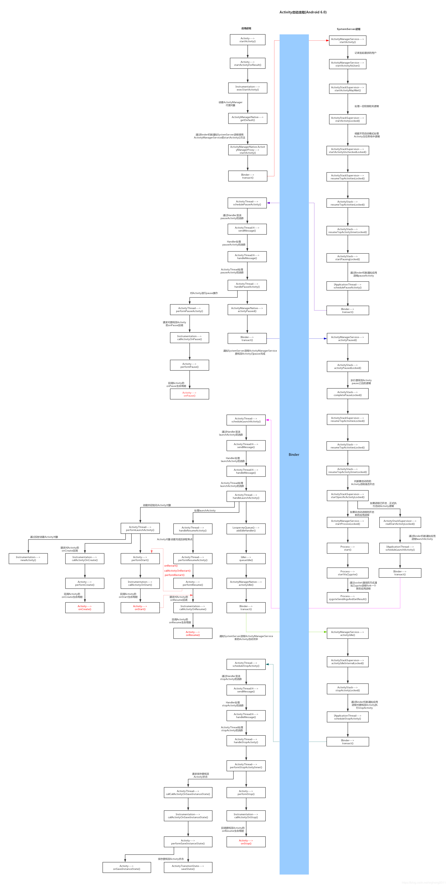

# Activity启动过程

- [Android 9.0）Activity启动流程源码分析](https://www.jianshu.com/p/89fd44083c1c)
- [Android源码解析之（十四）-->Activity启动流程](https://blog.csdn.net/qq_23547831/article/details/51224992)
- [Android系统启动流程图 —— 源码执行流程（android 6.0）](https://blog.csdn.net/wgheng2011/article/details/79420451)

## Activity启动流程图



## Activity的启动流程

### 总结

- Step 1~Step4总结：这4步都是在Launcher中执行的

### Step 1: Launcher.startActivitySafely

- Launcher继承于Activity
- 在 Launcher点击icon的时候，执行了startActivitySafely方法，其实就是调用startActivity方法

```java
boolean startActivitySafely(View v, Intent intent, Object tag) {
    boolean success = false;
    try {
        success = startActivity(v, intent, tag);
    } catch (ActivityNotFoundException e) {
        Toast.makeText(this, R.string.activity_not_found, Toast.LENGTH_SHORT).show();
        Log.e(TAG, "Unable to launch. tag=" + tag + " intent=" + intent, e);
    }
    return success;
}
```

### Step2: Activity.startActivity

- Activity的startActivity方法，会调用的startActivityForResult，只不过requestCode为-1
- **所有requestCode小于0都不会回调onActivityResult**

```java
    // android/app/Activity.java
    @Override
    public void startActivity(Intent intent) {
        this.startActivity(intent, null);
    }

    @Override
    public void startActivity(Intent intent, @Nullable Bundle options) {
        if (options != null) {
            startActivityForResult(intent, -1, options);
        } else {
            // Note we want to go through this call for compatibility with
            // applications that may have overridden the method.
            startActivityForResult(intent, -1);
        }
    }

public void startActivityForResult(@RequiresPermission Intent intent, int requestCode,@Nullable Bundle options) {
        if (mParent == null) {
            options = transferSpringboardActivityOptions(options);
            Instrumentation.ActivityResult ar =
                mInstrumentation.execStartActivity(
                    this, mMainThread.getApplicationThread(), mToken, this,
                    intent, requestCode, options);
            if (ar != null) {
                mMainThread.sendActivityResult(
                    mToken, mEmbeddedID, requestCode, ar.getResultCode(),
                    ar.getResultData());
            }
            if (requestCode >= 0) {
                // If this start is requesting a result, we can avoid making
                // the activity visible until the result is received.  Setting
                // this code during onCreate(Bundle savedInstanceState) or onResume() will keep the
                // activity hidden during this time, to avoid flickering.
                // This can only be done when a result is requested because
                // that guarantees we will get information back when the
                // activity is finished, no matter what happens to it.
                mStartedActivity = true;
            }

            cancelInputsAndStartExitTransition(options);
            // TODO Consider clearing/flushing other event sources and events for child windows.
        } else {
           ...
        }
    }
```

### Step3: Instrumentation.execStartActivity

- Instrumentation用来监控应用程序与系统之间的交互操作
- 可以跟踪application及activity生命周期，一般用在测试框架中较多
- contextThread 为ActivityThread内的ApplicationThread
- IBinder token
    - token是Activity的内部成员变量mToken，类型为IBinder,**指向了ActivityManagerService中一个类型为ActivityRecord的Binder本地对象**
    - 每一个已经启动的Activity组件在ActivityManagerService中都有一个对应的ActivityRecord对象，用来维护Activity组件的运行状态和信息，
    - **mToken对象的赋值是发生在在Activity的attach方法中进行的**

```java
// android/app/Instrumentation.java
 public ActivityResult execStartActivity(
            Context who, IBinder contextThread, IBinder token, Activity target,
            Intent intent, int requestCode, Bundle options) {
        IApplicationThread whoThread = (IApplicationThread) contextThread;
        Uri referrer = target != null ? target.onProvideReferrer() : null;
        if (referrer != null) {
            intent.putExtra(Intent.EXTRA_REFERRER, referrer);
        }
        if (mActivityMonitors != null) {
            synchronized (mSync) {
                ...
                // 忽略
            }
        }
        try {
            intent.migrateExtraStreamToClipData();
            intent.prepareToLeaveProcess(who);
            int result = ActivityManager.getService()
                .startActivity(whoThread, who.getBasePackageName(), intent,
                        intent.resolveTypeIfNeeded(who.getContentResolver()),
                        token, target != null ? target.mEmbeddedID : null,
                        requestCode, 0, null, options);
            // 检查startActivity的结果，其中最常见的错误就是我们没有的AndroidManifest
            // 中声明这个Activity
            checkStartActivityResult(result, intent);
        } catch (RemoteException e) {
            throw new RuntimeException("Failure from system", e);
        }
        return null;
    }

```

### Step4: ActivityManager.getService().startActivity

- ActivityManager.getService返回的实际上是ActivityManagerService在本地的一个代理对象
- 这其中涉及到了AIDL通信，
    - **IAcitivityManager是AIDL接口**， IActivityManager中的Stub和Proxy和我们使用AIDL代码自动生成的代码一样
    - 因为**不在system_server进程**中的，所以这里返回的其实是IActivityManager.Stub.Proxy对象
- 调用IActivityManager.Stub.Proxy中startActivity方法,向ActivityManagerService发起了RPC请求

```java
// android/app/ActivityManager.java
public static IActivityManager getService() {
        return IActivityManagerSingleton.get();
}

 private static final Singleton<IActivityManager> IActivityManagerSingleton =
            new Singleton<IActivityManager>() {
                @Override
                protected IActivityManager create() {
                    final IBinder b = ServiceManager.getService(Context.ACTIVITY_SERVICE;
                    // 因为不在system_server进程中，所以这里返回的是IActivityManager.Stub.Proxy
                    final IActivityManager am = IActivityManager.Stub.asInterface(b);
                    return am;
                }
            };
```

### Step5:ActivityManagerService.startActivity,ActivityManagerService.startActivityAsUser

```java
// com/android/server/am/ActivityManagerService.java
@Override
    public final int startActivity(IApplicationThread caller, String callingPackage,
            Intent intent, String resolvedType, IBinder resultTo, String resultWho, int requestCode,
            int startFlags, ProfilerInfo profilerInfo, Bundle bOptions) {
        return startActivityAsUser(caller, callingPackage, intent, resolvedType, resultTo,
                resultWho, requestCode, startFlags, profilerInfo, bOptions,
                UserHandle.getCallingUserId());
    }

    public final int startActivityAsUser(IApplicationThread caller, String callingPackage,
            Intent intent, String resolvedType, IBinder resultTo, String resultWho, int requestCode,
            int startFlags, ProfilerInfo profilerInfo, Bundle bOptions, int userId,
            boolean validateIncomingUser) {
        enforceNotIsolatedCaller("startActivity");

        userId = mActivityStartController.checkTargetUser(userId, validateIncomingUser,
                Binder.getCallingPid(), Binder.getCallingUid(), "startActivityAsUser");

        // 这里变成了调用ActivityStarter的execute方法
        // 因为设置了Request的mayWait为true
        // 后面会调用ActivityStarter的startActivityMayWait方法
        return mActivityStartController.obtainStarter(intent, "startActivityAsUser")
                .setCaller(caller)
                .setCallingPackage(callingPackage)
                .setResolvedType(resolvedType)
                .setResultTo(resultTo)
                .setResultWho(resultWho)
                .setRequestCode(requestCode)
                .setStartFlags(startFlags)
                .setProfilerInfo(profilerInfo)
                .setActivityOptions(bOptions)
                // 这里设置了Request的mayWait为true
                .setMayWait(userId)
                .execute();

    }
```

### Step6:ActivityStarter.execute(),ActivityStarter.startActivityMayWait

```java
// com/android/server/am/ActivityStarter.java
final int startActivityMayWait(IApplicationThread caller, int callingUid,
            String callingPackage, Intent intent, String resolvedType,
            IVoiceInteractionSession voiceSession, IVoiceInteractor voiceInteractor,
            IBinder resultTo, String resultWho, int requestCode, int startFlags,
            ProfilerInfo profilerInfo, WaitResult outResult,
            Configuration globalConfig, Bundle bOptions, boolean ignoreTargetSecurity, int userId,
            TaskRecord inTask, String reason) {
        // Refuse possible leaked file descriptors

        ...
       // 省略若干行代码

        boolean componentSpecified = intent.getComponent() != null;

         ...
       // 省略若干行代码

        //解析Intent
        ResolveInfo rInfo = mSupervisor.resolveIntent(intent, resolvedType, userId);
         ...
       // 省略若干行代码

        // Collect information about the target of the Intent.
        // 根据Intent和上面的resolveInfo获得我们真正要启动的Activity的信息
        ActivityInfo aInfo = mSupervisor.resolveActivity(intent, rInfo, startFlags, profilerInfo);

        ActivityOptions options = ActivityOptions.fromBundle(bOptions);
        synchronized (mService) {
            ...
            // 省略若干行代码

            final ActivityRecord[] outRecord = new ActivityRecord[1];
             // 调用 startActivityLocked进行下一步的启动
            int res = startActivityLocked(caller, intent, ephemeralIntent, resolvedType,
                    aInfo, rInfo, voiceSession, voiceInteractor,
                    resultTo, resultWho, requestCode, callingPid,
                    callingUid, callingPackage, realCallingPid, realCallingUid, startFlags,
                    options, ignoreTargetSecurity, componentSpecified, outRecord, inTask,
                    reason);

            Binder.restoreCallingIdentity(origId);

            ...
             // 省略若干行代码
            return res;
        }
    }
```

### Step7:一系列ActivityStarter.startActivity

```java
// ActivityStarter.java 263
    // com/android/server/am/ActivityStarter.java
    private int startActivityMayWait(IApplicationThread caller, int callingUid,
            String callingPackage, Intent intent, String resolvedType,
            IVoiceInteractionSession voiceSession, IVoiceInteractor voiceInteractor,
            IBinder resultTo, String resultWho, int requestCode, int startFlags,
            ProfilerInfo profilerInfo, WaitResult outResult,
            Configuration globalConfig, SafeActivityOptions options, boolean ignoreTargetSecurity,
            int userId, TaskRecord inTask, String reason,
            boolean allowPendingRemoteAnimationRegistryLookup) {
            ...
            int res = startActivity(caller, intent, ephemeralIntent, resolvedType, aInfo, rInfo,
                    voiceSession, voiceInteractor, resultTo, resultWho, requestCode, callingPid,
                    callingUid, callingPackage, realCallingPid, realCallingUid, startFlags, options,
                    ignoreTargetSecurity, componentSpecified, outRecord, inTask, reason,
                    allowPendingRemoteAnimationRegistryLookup);
            ...
            return res;
        }
    }

    private int startActivity(IApplicationThread caller, Intent intent, Intent ephemeralIntent,
            String resolvedType, ActivityInfo aInfo, ResolveInfo rInfo,
            IVoiceInteractionSession voiceSession, IVoiceInteractor voiceInteractor,
            IBinder resultTo, String resultWho, int requestCode, int callingPid, int callingUid,
            String callingPackage, int realCallingPid, int realCallingUid, int startFlags,
            SafeActivityOptions options, boolean ignoreTargetSecurity, boolean componentSpecified,
            ActivityRecord[] outActivity, TaskRecord inTask, String reason,
            boolean allowPendingRemoteAnimationRegistryLookup) {
        ...
        mLastStartActivityResult = startActivity(caller, intent, ephemeralIntent, resolvedType,
                aInfo, rInfo, voiceSession, voiceInteractor, resultTo, resultWho, requestCode,
                callingPid, callingUid, callingPackage, realCallingPid, realCallingUid, startFlags,
                options, ignoreTargetSecurity, componentSpecified, mLastStartActivityRecord,
                inTask, allowPendingRemoteAnimationRegistryLookup);
        ...
        return getExternalResult(mLastStartActivityResult);
    }

    private int startActivity(IApplicationThread caller, Intent intent, Intent ephemeralIntent,
            String resolvedType, ActivityInfo aInfo, ResolveInfo rInfo,
            IVoiceInteractionSession voiceSession, IVoiceInteractor voiceInteractor,
            IBinder resultTo, String resultWho, int requestCode, int callingPid, int callingUid,
            String callingPackage, int realCallingPid, int realCallingUid, int startFlags,
            SafeActivityOptions options,
            boolean ignoreTargetSecurity, boolean componentSpecified, ActivityRecord[] outActivity,
            TaskRecord inTask, boolean allowPendingRemoteAnimationRegistryLookup) {
        ...
        return startActivity(r, sourceRecord, voiceSession, voiceInteractor, startFlags,
                true /* doResume */, checkedOptions, inTask, outActivity);
    }

    private int startActivity(final ActivityRecord r, ActivityRecord sourceRecord,
                IVoiceInteractionSession voiceSession, IVoiceInteractor voiceInteractor,
                int startFlags, boolean doResume, ActivityOptions options, TaskRecord inTask,
                ActivityRecord[] outActivity) {
        ...
            result = startActivityUnchecked(r, sourceRecord, voiceSession, voiceInteractor,
                    startFlags, doResume, options, inTask, outActivity);
        ...

        postStartActivityProcessing(r, result, mTargetStack);

        return result;
    }
```

### Step8:ActivityStarter.startActivityUnchecked

- 会根据启动标志位和Activity启动模式来决定如何启动一个Activity

```java
// ActivityStarter.java 1015
private int startActivityUnchecked(final ActivityRecord r, ActivityRecord sourceRecord,
            IVoiceInteractionSession voiceSession, IVoiceInteractor voiceInteractor,
            int startFlags, boolean doResume, ActivityOptions options, TaskRecord inTask) {

        setInitialState(r, options, inTask, doResume, startFlags, sourceRecord, voiceSession,
                voiceInteractor);

        // 启动模式，比如singleTask之类
        computeLaunchingTaskFlags();
        // 确定ActivityStack
        computeSourceStack();
        mIntent.setFlags(mLaunchFlags);
        mReusedActivity = getReusableIntentActivity();
        ......
}
```

- setInitialState里设置了一些参数，其中有个函数 **sendNewTaskResultRequestIfNeeded, 如果我们调用startActivityForResult来启动Flag为FLAG_ACTIVITY_NEW_TASK的activity,onActivityForResult的结果是不正常的，只要我们一启动，原activity就会收到一个RESULT_CANCELED的返回值**。

```java
private void sendNewTaskResultRequestIfNeeded() {
        if (mStartActivity.resultTo != null && (mLaunchFlags & FLAG_ACTIVITY_NEW_TASK) != 0
                && mStartActivity.resultTo.task.stack != null) {
            // For whatever reason this activity is being launched into a new task...
            // yet the caller has requested a result back.  Well, that is pretty messed up,
            // so instead immediately send back a cancel and let the new task continue launched
            // as normal without a dependency on its originator.
            Slog.w(TAG, "Activity is launching as a new task, so cancelling activity result.");
            mStartActivity.resultTo.task.stack.sendActivityResultLocked(-1, mStartActivity.resultTo,
                    mStartActivity.resultWho, mStartActivity.requestCode, RESULT_CANCELED, null);
            mStartActivity.resultTo = null;
        }
    }
```

- getReusableIntentActivity是获取是否可以复用的Activity,如果是singleTask，如果存在满足条件的Activity，可能要将上面的Activity clear掉，
 而singleInstance则要查找是存否在满足条件的Activity

```java
// com/android/server/am/ActivityStarter.java
// Line 1234
 mReusedActivity = getReusableIntentActivity();
...
if (reusedActivity != null) {
    ...
    //省略若干行
}

 ...
//省略若干行

        // 满足SingleTop条件的特殊处理
        // If the activity being launched is the same as the one currently at the top, then
        // we need to check if it should only be launched once.
        // If the activity being launched is the same as the one currently at the top, then
        // we need to check if it should only be launched once.
        final ActivityStack topStack = mSupervisor.mFocusedStack;
        final ActivityRecord topFocused = topStack.getTopActivity();
        final ActivityRecord top = topStack.topRunningNonDelayedActivityLocked(mNotTop);
        final boolean dontStart = top != null && mStartActivity.resultTo == null
                && top.realActivity.equals(mStartActivity.realActivity)
                && top.userId == mStartActivity.userId
                && top.app != null && top.app.thread != null
                && ((mLaunchFlags & FLAG_ACTIVITY_SINGLE_TOP) != 0
                || isLaunchModeOneOf(LAUNCH_SINGLE_TOP, LAUNCH_SINGLE_TASK));
        if (dontStart) {
            // For paranoia, make sure we have correctly resumed the top activity.
            topStack.mLastPausedActivity = null;
            if (mDoResume) {
                mSupervisor.resumeFocusedStackTopActivityLocked();
            }
            ActivityOptions.abort(mOptions);
            if ((mStartFlags & START_FLAG_ONLY_IF_NEEDED) != 0) {
                // We don't need to start a new activity, and the client said not to do
                // anything if that is the case, so this is it!
                return START_RETURN_INTENT_TO_CALLER;
            }

            deliverNewIntent(top);

            // Don't use mStartActivity.task to show the toast. We're not starting a new activity
            // but reusing 'top'. Fields in mStartActivity may not be fully initialized.
            mSupervisor.handleNonResizableTaskIfNeeded(top.getTask(), preferredWindowingMode,
                    preferredLaunchDisplayId, topStack);

            return START_DELIVERED_TO_TOP;
        }

```

- 判断是我们启动的Activity的任务栈的归属

```java
    // ActivityStarter.java 1169
        boolean newTask = false;
        final TaskRecord taskToAffiliate = (mLaunchTaskBehind && mSourceRecord != null)
                ? mSourceRecord.getTask() : null;

        // Should this be considered a new task?
        //下面的一段代码 实际上就是判断我们启动的activity应当放到哪一个任务栈中
        int result = START_SUCCESS;
        if (mStartActivity.resultTo == null && mInTask == null && !mAddingToTask
                && (mLaunchFlags & FLAG_ACTIVITY_NEW_TASK) != 0) {
            // SingleTask的情况
            // 我们从Lanucher启动一个应用，一般就是这种情况
            newTask = true;
            result = setTaskFromReuseOrCreateNewTask(
                    taskToAffiliate, preferredLaunchStackId, topStack);
        } else if (mSourceRecord != null) {
            //  与调用startActivity相同的Task
            result = setTaskFromSourceRecord();
        } else if (mInTask != null) {
             // 如果我们设置了希望将启动的Activity放到哪个task中，一般指使用了taskaffiiliate
            result = setTaskFromInTask();
        } else {
            // 最后的情况，放在现在task的上面，或创建新的task
            // This not being started from an existing activity, and not part of a new task...
            // just put it in the top task, though these days this case should never happen.
            setTaskToCurrentTopOrCreateNewTask();
        }
        if (result != START_SUCCESS) {
            return result;
        }

    ...
    //省略若干行
```

- setTaskFromReuseOrCreateNewTask

```java
private int setTaskFromReuseOrCreateNewTask(
            TaskRecord taskToAffiliate, int preferredLaunchStackId, ActivityStack topStack) {
                // computeStackFocus返回一个mTargetStack，
                // 这个ActivityStack是为即将启动的Activity的容器所在的Activity任务栈
        mTargetStack = computeStackFocus(
                mStartActivity, true, mLaunchBounds, mLaunchFlags, mOptions);

        // Do no move the target stack to front yet, as we might bail if
        // isLockTaskModeViolation fails below.

        // Task复用
        if (mReuseTask == null) {
            final TaskRecord task = mTargetStack.createTaskRecord(
                    mSupervisor.getNextTaskIdForUserLocked(mStartActivity.userId),
                    mNewTaskInfo != null ? mNewTaskInfo : mStartActivity.info,
                    mNewTaskIntent != null ? mNewTaskIntent : mIntent, mVoiceSession,
                    mVoiceInteractor, !mLaunchTaskBehind /* toTop */, mStartActivity.mActivityType);
            addOrReparentStartingActivity(task, "setTaskFromReuseOrCreateNewTask - mReuseTask");
            if (mLaunchBounds != null) {
                final int stackId = mTargetStack.mStackId;
                if (StackId.resizeStackWithLaunchBounds(stackId)) {
                    mService.resizeStack(
                            stackId, mLaunchBounds, true, !PRESERVE_WINDOWS, ANIMATE, -1);
                } else {
                    mStartActivity.getTask().updateOverrideConfiguration(mLaunchBounds);
                }
            }
            if (DEBUG_TASKS) Slog.v(TAG_TASKS, "Starting new activity " + mStartActivity
                    + " in new task " + mStartActivity.getTask());
        } else {
            addOrReparentStartingActivity(mReuseTask, "setTaskFromReuseOrCreateNewTask");
        }

        // TaskAffiliate的设置
        if (taskToAffiliate != null) {
            mStartActivity.setTaskToAffiliateWith(taskToAffiliate);
        }

        if (mSupervisor.isLockTaskModeViolation(mStartActivity.getTask())) {
            Slog.e(TAG, "Attempted Lock Task Mode violation mStartActivity=" + mStartActivity);
            return START_RETURN_LOCK_TASK_MODE_VIOLATION;
        }

        if (!mMovedOtherTask) {
            // If stack id is specified in activity options, usually it means that activity is
            // launched not from currently focused stack (e.g. from SysUI or from shell) - in
            // that case we check the target stack.
            updateTaskReturnToType(mStartActivity.getTask(), mLaunchFlags,
                    preferredLaunchStackId != INVALID_STACK_ID ? mTargetStack : topStack);
        }
        if (mDoResume) {
            mTargetStack.moveToFront("reuseOrNewTask");
        }
        return START_SUCCESS;
    }
```

### Step9:ActivityStackSupervisor.resumeFocusedStackTopActivityLocked

- 无论以何种模式启动最终都会调用ActivityStackSupervisor.resumeFocusedStackTopActivityLocked方法

```java
    // com/android/server/am/ActivityStackSupervisor.java
    boolean resumeFocusedStackTopActivityLocked() {
        return resumeFocusedStackTopActivityLocked(null, null, null);
    }

    boolean resumeFocusedStackTopActivityLocked(
            ActivityStack targetStack, ActivityRecord target, ActivityOptions targetOptions) {

        if (!readyToResume()) {
            return false;
        }

        if (targetStack != null && isFocusedStack(targetStack)) {
            return targetStack.resumeTopActivityUncheckedLocked(target, targetOptions);
        }

        final ActivityRecord r = mFocusedStack.topRunningActivityLocked();
        if (r == null || !r.isState(RESUMED)) {
            mFocusedStack.resumeTopActivityUncheckedLocked(null, null);
        } else if (r.isState(RESUMED)) {
            // Kick off any lingering app transitions form the MoveTaskToFront operation.
            mFocusedStack.executeAppTransition(targetOptions);
        }

        return false;
    }

    // com/android/server/am/ActivityStack.java
    boolean resumeTopActivityUncheckedLocked(ActivityRecord prev, ActivityOptions options) {
            ...
            result = resumeTopActivityInnerLocked(prev, options);
            ...

        return result;
    }

    private boolean resumeTopActivityInnerLocked(ActivityRecord prev, ActivityOptions options) {
        ...
        boolean pausing = mStackSupervisor.pauseBackStacks(userLeaving, next, false);
        if (mResumedActivity != null) {
            // pause 当前resumed的Activity
            pausing |= startPausingLocked(userLeaving, false, next, false);
        }
        ...
        // 真正的启动新的Activity
        mStackSupervisor.startSpecificActivityLocked(next, true, true);
        ...
        return true;
    }
```

### Step10:栈顶Activity执行onPause方法

```java
    // com/android/server/am/ActivityStack.java
    final boolean startPausingLocked(boolean userLeaving, boolean uiSleeping,
            ActivityRecord resuming, boolean pauseImmediately) {
        ...
        if (prev.app != null && prev.app.thread != null) {
            try {
                EventLogTags.writeAmPauseActivity(prev.userId, System.identityHashCode(prev),
                        prev.shortComponentName, "userLeaving=" + userLeaving);
                mService.updateUsageStats(prev, false);
                // Android 9.0在这里引入了ClientLifecycleManager和
                // ClientTransactionHandler来辅助管理Activity生命周期，
                // 他会发送EXECUTE_TRANSACTION消息到ActivityThread.H里面继续处理。
                // prev.app.thread为需要Pause的应用的主线程中的ApplicationThread
                // PauseActivityItem表示一个需要对应Activity pause的请求
                mService.getLifecycleManager().scheduleTransaction(prev.app.thread, prev.appToken,
                        PauseActivityItem.obtain(prev.finishing, userLeaving,
                                prev.configChangeFlags, pauseImmediately));
            } catch (Exception e) {
                // Ignore exception, if process died other code will cleanup.
                Slog.w(TAG, "Exception thrown during pause", e);
                mPausingActivity = null;
                mLastPausedActivity = null;
                mLastNoHistoryActivity = null;
            }
        } else {
            mPausingActivity = null;
            mLastPausedActivity = null;
            mLastNoHistoryActivity = null;
        }
        ...
    }
```

```java
    // com/android/server/am/ClientLifecycleManager.java
    void scheduleTransaction(@NonNull IApplicationThread client, @NonNull IBinder activityToken,
            @NonNull ActivityLifecycleItem stateRequest) throws RemoteException {
        final ClientTransaction clientTransaction = transactionWithState(client, activityToken,
                stateRequest);
        scheduleTransaction(clientTransaction);
    }

    void scheduleTransaction(ClientTransaction transaction) throws RemoteException {
        final IApplicationThread client = transaction.getClient();
        transaction.schedule();
        ...
    }

    // android/app/servertransaction/ClientTransaction.java
    public void schedule() throws RemoteException {
        mClient.scheduleTransaction(this);
    }
```

- ClientTransaction.schedule方法的mClient是一个IApplicationThread类型，也就是应用进程提供的可供AMS调用的AIDL业务接口，ActivityThread的内部类ApplicationThread派生这个接口类并实现了对应的方法。
- ActivityThread类中并没有定义scheduleTransaction方法，所以调用的是他父类ClientTransactionHandler的scheduleTransaction方法

```java
// android/app/ActivityThread.java
// 内部类ApplicationThread,实际也就是应用进程提供给AMS的调用的AIDL接口的实现类
 private class ApplicationThread extends IApplicationThread.Stub {
     @Override
        public void scheduleTransaction(ClientTransaction transaction) throws RemoteException {
            ActivityThread.this.scheduleTransaction(transaction);
        }
 }

    // android/app/ClientTransactionHandler.java
    // ActivityThread类中并没有定义scheduleTransaction方法，
    // 所以调用的是他父类ClientTransactionHandler的scheduleTransaction方法
    void scheduleTransaction(ClientTransaction transaction) {
        transaction.preExecute(this);
        // ActivityThread中的实现方法sendMessage
        sendMessage(ActivityThread.H.EXECUTE_TRANSACTION, transaction);
    }
```

- 在ClientTransactionHandler.scheduleTransaction方法中调用了sendMessage方法，这个方法是一个抽象方法，其实现在ClientTransactionHandler派生类的ActivityThread中，ActivityThread.sendMessage方法会把消息发送给内部名字叫H的Handler。

```java
    // android/app/ActivityThread.java
    // 内部类H
    void sendMessage(int what, Object obj) {
        sendMessage(what, obj, 0, 0, false);
    }

    private void sendMessage(int what, Object obj, int arg1) {
        sendMessage(what, obj, arg1, 0, false);
    }

    private void sendMessage(int what, Object obj, int arg1, int arg2) {
        sendMessage(what, obj, arg1, arg2, false);
    }

    private void sendMessage(int what, Object obj, int arg1, int arg2, boolean async) {
        if (DEBUG_MESSAGES) Slog.v(
            TAG, "SCHEDULE " + what + " " + mH.codeToString(what)
            + ": " + arg1 + " / " + obj);
        Message msg = Message.obtain();
        msg.what = what;
        msg.obj = obj;
        msg.arg1 = arg1;
        msg.arg2 = arg2;
        if (async) {
            msg.setAsynchronous(true);
        }
        mH.sendMessage(msg);
    }

    public void handleMessage(Message msg) {
        ...
        case EXECUTE_TRANSACTION:
            // handler的消息处理函数
            // 这样后面的执行函数都到了应用的主线程
            final ClientTransaction transaction = (ClientTransaction) msg.obj;
            mTransactionExecutor.execute(transaction);
            ...
            break;
        ...
    }
```

```java
    // app/servertransaction/TransactionExecutor.java
    public void execute(ClientTransaction transaction) {
        ...
        executeCallbacks(transaction);
        // 直接执行executeLifecycleState
        executeLifecycleState(transaction);
        ...
    }

    /** Transition to the final state if requested by the transaction. */
    private void executeLifecycleState(ClientTransaction transaction) {
        // lifecycleItem这里实际是system_server发送的PauseActivityItem类型
        final ActivityLifecycleItem lifecycleItem = transaction.getLifecycleStateRequest();
        ...
        // Cycle to the state right before the final requested state.
        cycleToPath(r, lifecycleItem.getTargetState(), true /* excludeLastState */);

        // Execute the final transition with proper parameters.
        // lifecycleItem.execute,在这里实际就是执行PauseActivityItem的execute方法
        lifecycleItem.execute(mTransactionHandler, token, mPendingActions);
        lifecycleItem.postExecute(mTransactionHandler, token, mPendingActions);
    }

```

```java
    // android/app/servertransaction/PauseActivityItem
    @Override
    public void execute(ClientTransactionHandler client, IBinder token,
            PendingTransactionActions pendingActions) {
        Trace.traceBegin(TRACE_TAG_ACTIVITY_MANAGER, "activityPause");
        // client即为ActivityThread类型
        client.handlePauseActivity(token, mFinished, mUserLeaving, mConfigChanges, pendingActions,
                "PAUSE_ACTIVITY_ITEM");
        Trace.traceEnd(TRACE_TAG_ACTIVITY_MANAGER);
    }
```

```java
// android/app/ClientTransactionHandler.java
public abstract void handlePauseActivity(IBinder token, boolean finished, boolean userLeaving,
            int configChanges, PendingTransactionActions pendingActions, String reason);

// android/app/ActivityThread.java
// ActivityThread继承ClientTransactionHandler
    @Override
    public void handlePauseActivity(IBinder token, boolean finished, boolean userLeaving,
            int configChanges, PendingTransactionActions pendingActions, String reason) {
        ActivityClientRecord r = mActivities.get(token);
        if (r != null) {
            if (userLeaving) {
                // 这里实际就是下面的两个方法的调用
                //onUserInteraction();onUserLeaveHint();
                performUserLeavingActivity(r);
            }

            r.activity.mConfigChangeFlags |= configChanges;

            // PauseActivity
            performPauseActivity(r, finished, reason, pendingActions);

            // Make sure any pending writes are now committed.
            if (r.isPreHoneycomb()) {
                QueuedWork.waitToFinish();
            }
            mSomeActivitiesChanged = true;
        }
    }

    // android/app/ActivityThread.java
    private Bundle performPauseActivity(ActivityClientRecord r, boolean finished, String reason,
            PendingTransactionActions pendingActions) {
        if (r.paused) {
            if (r.activity.mFinished) {
                // If we are finishing, we won't call onResume() in certain cases.
                // So here we likewise don't want to call onPause() if the activity
                // isn't resumed.
                return null;
            }
            RuntimeException e = new RuntimeException(
                    "Performing pause of activity that is not resumed: "
                    + r.intent.getComponent().toShortString());
            Slog.e(TAG, e.getMessage(), e);
        }
        if (finished) {
            r.activity.mFinished = true;
        }

        // Pre-Honeycomb apps always save their state before pausing
        // Android 11以前调用onSaveInstanceState
        final boolean shouldSaveState = !r.activity.mFinished && r.isPreHoneycomb();
        if (shouldSaveState) {
            callActivityOnSaveInstanceState(r);
        }

        // 真正的执行的PauseActivity
        performPauseActivityIfNeeded(r, reason);

        // Notify any outstanding on paused listeners
        ArrayList<OnActivityPausedListener> listeners;
        synchronized (mOnPauseListeners) {
            listeners = mOnPauseListeners.remove(r.activity);
        }
        int size = (listeners != null ? listeners.size() : 0);
        for (int i = 0; i < size; i++) {
            listeners.get(i).onPaused(r.activity);
        }

        final Bundle oldState = pendingActions != null ? pendingActions.getOldState() : null;
        if (oldState != null) {
            // We need to keep around the original state, in case we need to be created again.
            // But we only do this for pre-Honeycomb apps, which always save their state when
            // pausing, so we can not have them save their state when restarting from a paused
            // state. For HC and later, we want to (and can) let the state be saved as the
            // normal part of stopping the activity.
            if (r.isPreHoneycomb()) {
                r.state = oldState;
            }
        }

        return shouldSaveState ? r.state : null;
    }

    // android/app/ActivityThread.java
    private void performPauseActivityIfNeeded(ActivityClientRecord r, String reason) {
        if (r.paused) {
            // You are already paused silly...
            return;
        }

        try {
            r.activity.mCalled = false;
            // 最终来调用activity相应的生命周期的方法都是通过Instrumentation来做的
            mInstrumentation.callActivityOnPause(r.activity);
            if (!r.activity.mCalled) {
                throw new SuperNotCalledException("Activity " + safeToComponentShortString(r.intent)
                        + " did not call through to super.onPause()");
            }
        } catch (SuperNotCalledException e) {
            throw e;
        } catch (Exception e) {
            if (!mInstrumentation.onException(r.activity, e)) {
                throw new RuntimeException("Unable to pause activity "
                        + safeToComponentShortString(r.intent) + ": " + e.toString(), e);
            }
        }
        r.setState(ON_PAUSE);
    }
```

```java
    // android/app/Instrumentation.java
    public void callActivityOnPause(Activity activity) {
        activity.performPause();
    }

    // android/app/Activity.java
    final void performPause() {
        mDoReportFullyDrawn = false;
        mFragments.dispatchPause();
        mCalled = false;
        // Activity的生命周期函数的调用
        onPause();
        writeEventLog(LOG_AM_ON_PAUSE_CALLED, "performPause");
        mResumed = false;
        if (!mCalled && getApplicationInfo().targetSdkVersion
                >= android.os.Build.VERSION_CODES.GINGERBREAD) {
            throw new SuperNotCalledException(
                    "Activity " + mComponent.toShortString() +
                    " did not call through to super.onPause()");
        }
    }

```

### Step11 Activity所在的应用进程启动过程

```java
// com/android/server/am/ActivityStack
private boolean resumeTopActivityInnerLocked(ActivityRecord prev, ActivityOptions options) {
        ...
        boolean pausing = mStackSupervisor.pauseBackStacks(userLeaving, next, false);
        if (mResumedActivity != null) {
            // pause 当前resumed的Activity
            pausing |= startPausingLocked(userLeaving, false, next, false);
        }
        ...
        // 真正的启动新的Activity
        mStackSupervisor.startSpecificActivityLocked(next, true, true);
        ...
        return true;
    }
```

- 根据被启动Activity所属进程和主线程ActivityThread是否存在判断App是否已经启动，如果已经启动，就会调用realStartActivityLocked方法继续处理。如果没有启动则调用ActivityManagerService.startProcessLocked方法创建新的进程处理

```java
// com/android/server/am/ActivityStackSupervisor.java
void startSpecificActivityLocked(ActivityRecord r,
            boolean andResume, boolean checkConfig) {
        // Is this activity's application already running?
        ProcessRecord app = mService.getProcessRecordLocked(r.processName,
                r.info.applicationInfo.uid, true);

        getLaunchTimeTracker().setLaunchTime(r);

        if (app != null && app.thread != null) {
            // 如是进程存在，主线程存在，那么调用realStartActivityLocked
            try {
                if ((r.info.flags&ActivityInfo.FLAG_MULTIPROCESS) == 0
                        || !"android".equals(r.info.packageName)) {
                    // Don't add this if it is a platform component that is marked
                    // to run in multiple processes, because this is actually
                    // part of the framework so doesn't make sense to track as a
                    // separate apk in the process.
                    app.addPackage(r.info.packageName, r.info.applicationInfo.longVersionCode,
                            mService.mProcessStats);
                }
                realStartActivityLocked(r, app, andResume, checkConfig);
                return;
            } catch (RemoteException e) {
                Slog.w(TAG, "Exception when starting activity "
                        + r.intent.getComponent().flattenToShortString(), e);
            }

            // If a dead object exception was thrown -- fall through to
            // restart the application.
        }

        // 启动对应的进程
        mService.startProcessLocked(r.processName, r.info.applicationInfo, true, 0,
                "activity", r.intent.getComponent(), false, false, true);
    }
```

```java
    // com/android/server/am/ActivityService.java
    @GuardedBy("this")
    final ProcessRecord startProcessLocked(String processName,
            ApplicationInfo info, boolean knownToBeDead, int intentFlags,
            String hostingType, ComponentName hostingName, boolean allowWhileBooting,
            boolean isolated, boolean keepIfLarge) {
        return startProcessLocked(processName, info, knownToBeDead, intentFlags, hostingType,
                hostingName, allowWhileBooting, isolated, 0 /* isolatedUid */, keepIfLarge,
                null /* ABI override */, null /* entryPoint */, null /* entryPointArgs */,
                null /* crashHandler */);
    }

    @GuardedBy("this")
    final ProcessRecord startProcessLocked(String processName, ApplicationInfo info,
            boolean knownToBeDead, int intentFlags, String hostingType, ComponentName hostingName,
            boolean allowWhileBooting, boolean isolated, int isolatedUid, boolean keepIfLarge,
            String abiOverride, String entryPoint, String[] entryPointArgs, Runnable crashHandler) {
        ...
        checkTime(startTime, "startProcess: stepping in to startProcess");
        // 开启一个进程
        final boolean success = startProcessLocked(app, hostingType, hostingNameStr, abiOverride);
        checkTime(startTime, "startProcess: done starting proc!");
        return success ? app : null;
    }

    @GuardedBy("this")
    private final boolean startProcessLocked(ProcessRecord app,
            String hostingType, String hostingNameStr, String abiOverride) {
        return startProcessLocked(app, hostingType, hostingNameStr,
                false /* disableHiddenApiChecks */, abiOverride);
    }

    @GuardedBy("this")
    private final boolean startProcessLocked(ProcessRecord app, String hostingType,
            String hostingNameStr, boolean disableHiddenApiChecks, String abiOverride) {
            ...
            final String seInfo = app.info.seInfo
                    + (TextUtils.isEmpty(app.info.seInfoUser) ? "" : app.info.seInfoUser);
            // Start the process.  It will either succeed and return a result containing
            // the PID of the new process, or else throw a RuntimeException.

            // 通过ZygoteProcess孵化出的新进程，会反射这个类，然后调用其对应的main()方法
            final String entryPoint = "android.app.ActivityThread";

            return startProcessLocked(hostingType, hostingNameStr, entryPoint, app, uid, gids,
                    runtimeFlags, mountExternal, seInfo, requiredAbi, instructionSet, invokeWith,
                    startTime);
        } catch (RuntimeException e) {
            Slog.e(TAG, "Failure starting process " + app.processName, e);

            // Something went very wrong while trying to start this process; one
            // common case is when the package is frozen due to an active
            // upgrade. To recover, clean up any active bookkeeping related to
            // starting this process. (We already invoked this method once when
            // the package was initially frozen through KILL_APPLICATION_MSG, so
            // it doesn't hurt to use it again.)
            forceStopPackageLocked(app.info.packageName, UserHandle.getAppId(app.uid), false,
                    false, true, false, false, UserHandle.getUserId(app.userId), "start failure");
            return false;
        }
    }

    @GuardedBy("this")
    private boolean startProcessLocked(String hostingType, String hostingNameStr, String entryPoint,
            ProcessRecord app, int uid, int[] gids, int runtimeFlags, int mountExternal,
            String seInfo, String requiredAbi, String instructionSet, String invokeWith,
            long startTime) {
        ...
        if (mConstants.FLAG_PROCESS_START_ASYNC) {
            if (DEBUG_PROCESSES) Slog.i(TAG_PROCESSES,
                    "Posting procStart msg for " + app.toShortString());
             // 异步启动
            mProcStartHandler.post(() -> {
                try {
                    ...
                    // 真正启动Process
                    final ProcessStartResult startResult = startProcess(app.hostingType, entryPoint,
                            app, app.startUid, gids, runtimeFlags, mountExternal, app.seInfo,
                            requiredAbi, instructionSet, invokeWith, app.startTime);
                    synchronized (ActivityManagerService.this) {
                        handleProcessStartedLocked(app, startResult, startSeq);
                    }
                } catch (RuntimeException e) {
                    synchronized (ActivityManagerService.this) {
                        Slog.e(TAG, "Failure starting process " + app.processName, e);
                        mPendingStarts.remove(startSeq);
                        app.pendingStart = false;
                        forceStopPackageLocked(app.info.packageName, UserHandle.getAppId(app.uid),
                                false, false, true, false, false,
                                UserHandle.getUserId(app.userId), "start failure");
                    }
                }
            });
            return true;
        } else {
            try {
                // 同步启动
                final ProcessStartResult startResult = startProcess(hostingType, entryPoint, app,
                        uid, gids, runtimeFlags, mountExternal, seInfo, requiredAbi, instructionSet,
                        invokeWith, startTime);
                handleProcessStartedLocked(app, startResult.pid, startResult.usingWrapper,
                        startSeq, false);
            } catch (RuntimeException e) {
                Slog.e(TAG, "Failure starting process " + app.processName, e);
                app.pendingStart = false;
                forceStopPackageLocked(app.info.packageName, UserHandle.getAppId(app.uid),
                        false, false, true, false, false,
                        UserHandle.getUserId(app.userId), "start failure");
            }
            return app.pid > 0;
        }
    }

    private ProcessStartResult startProcess(String hostingType, String entryPoint,
            ProcessRecord app, int uid, int[] gids, int runtimeFlags, int mountExternal,
            String seInfo, String requiredAbi, String instructionSet, String invokeWith,
            long startTime) {
        try {
            Trace.traceBegin(Trace.TRACE_TAG_ACTIVITY_MANAGER, "Start proc: " +
                    app.processName);
            checkTime(startTime, "startProcess: asking zygote to start proc");
            final ProcessStartResult startResult;
            if (hostingType.equals("webview_service")) {
                // webview
                startResult = startWebView(entryPoint,
                        app.processName, uid, uid, gids, runtimeFlags, mountExternal,
                        app.info.targetSdkVersion, seInfo, requiredAbi, instructionSet,
                        app.info.dataDir, null,
                        new String[] {PROC_START_SEQ_IDENT + app.startSeq});
            } else {
                // 启动进程
                startResult = Process.start(entryPoint,
                        app.processName, uid, uid, gids, runtimeFlags, mountExternal,
                        app.info.targetSdkVersion, seInfo, requiredAbi, instructionSet,
                        app.info.dataDir, invokeWith,
                        new String[] {PROC_START_SEQ_IDENT + app.startSeq});
            }
            checkTime(startTime, "startProcess: returned from zygote!");
            return startResult;
        } finally {
            Trace.traceEnd(Trace.TRACE_TAG_ACTIVITY_MANAGER);
        }
    }
```

- 最终调用了Zygote并通过socket通信的方式让Zygote进程fork出一个新的进程，并根据传递的”android.app.ActivityThread”字符串，反射出该对象并执行ActivityThread的main方法对其进行初始化
- [从应用角度看Android源码 - 是谁调用的ActivityThread的main方法](https://blog.csdn.net/w1143408997/article/details/76862002?locationNum=7&fps=1)

```java
// android/os/Process.java
public static final ProcessStartResult start(final String processClass,
                                  final String niceName,
                                  int uid, int gid, int[] gids,
                                  int runtimeFlags, int mountExternal,
                                  int targetSdkVersion,
                                  String seInfo,
                                  String abi,
                                  String instructionSet,
                                  String appDataDir,
                                  String invokeWith,
                                  String[] zygoteArgs) {
        return zygoteProcess.start(processClass, niceName, uid, gid, gids,
                    runtimeFlags, mountExternal, targetSdkVersion, seInfo,
                    abi, instructionSet, appDataDir, invokeWith, zygoteArgs);
    }

    // android/os/ZygoteProcess.java
    public final Process.ProcessStartResult start(final String processClass,
                                                  final String niceName,
                                                  int uid, int gid, int[] gids,
                                                  int runtimeFlags, int mountExternal,
                                                  int targetSdkVersion,
                                                  String seInfo,
                                                  String abi,
                                                  String instructionSet,
                                                  String appDataDir,
                                                  String invokeWith,
                                                  String[] zygoteArgs) {
        try {
            return startViaZygote(processClass, niceName, uid, gid, gids,
                    runtimeFlags, mountExternal, targetSdkVersion, seInfo,
                    abi, instructionSet, appDataDir, invokeWith, false /* startChildZygote */,
                    zygoteArgs);
        } catch (ZygoteStartFailedEx ex) {
            Log.e(LOG_TAG,
                    "Starting VM process through Zygote failed");
            throw new RuntimeException(
                    "Starting VM process through Zygote failed", ex);
        }
    }

    // android/os/ZygoteProcess.java
    private Process.ProcessStartResult startViaZygote(final String processClass,
                                                      final String niceName,
                                                      final int uid, final int gid,
                                                      final int[] gids,
                                                      int runtimeFlags, int mountExternal,
                                                      int targetSdkVersion,
                                                      String seInfo,
                                                      String abi,
                                                      String instructionSet,
                                                      String appDataDir,
                                                      String invokeWith,
                                                      boolean startChildZygote,
                                                      String[] extraArgs)
                                                      throws ZygoteStartFailedEx {
        ...
        synchronized(mLock) {
            // 通过socket
            return zygoteSendArgsAndGetResult(openZygoteSocketIfNeeded(abi), argsForZygote);
        }
    }

    @GuardedBy("mLock")
    private ZygoteState openZygoteSocketIfNeeded(String abi) throws ZygoteStartFailedEx {
        Preconditions.checkState(Thread.holdsLock(mLock), "ZygoteProcess lock not held");

        if (primaryZygoteState == null || primaryZygoteState.isClosed()) {
            try {
                primaryZygoteState = ZygoteState.connect(mSocket);
            } catch (IOException ioe) {
                throw new ZygoteStartFailedEx("Error connecting to primary zygote", ioe);
            }
            maybeSetApiBlacklistExemptions(primaryZygoteState, false);
            maybeSetHiddenApiAccessLogSampleRate(primaryZygoteState);
        }
        if (primaryZygoteState.matches(abi)) {
            return primaryZygoteState;
        }

        // The primary zygote didn't match. Try the secondary.
        if (secondaryZygoteState == null || secondaryZygoteState.isClosed()) {
            try {
                secondaryZygoteState = ZygoteState.connect(mSecondarySocket);
            } catch (IOException ioe) {
                throw new ZygoteStartFailedEx("Error connecting to secondary zygote", ioe);
            }
            maybeSetApiBlacklistExemptions(secondaryZygoteState, false);
            maybeSetHiddenApiAccessLogSampleRate(secondaryZygoteState);
        }

        if (secondaryZygoteState.matches(abi)) {
            return secondaryZygoteState;
        }

        throw new ZygoteStartFailedEx("Unsupported zygote ABI: " + abi);
    }
```

### Step11 ActivityThread的初始化

```java
// android/app/ActivityThread.java
public static void main(String[] args) {
        Trace.traceBegin(Trace.TRACE_TAG_ACTIVITY_MANAGER, "ActivityThreadMain");

        // CloseGuard defaults to true and can be quite spammy.  We
        // disable it here, but selectively enable it later (via
        // StrictMode) on debug builds, but using DropBox, not logs.
        CloseGuard.setEnabled(false);

        Environment.initForCurrentUser();

        // Set the reporter for event logging in libcore
        EventLogger.setReporter(new EventLoggingReporter());

        // Make sure TrustedCertificateStore looks in the right place for CA certificates
        final File configDir = Environment.getUserConfigDirectory(UserHandle.myUserId());
        TrustedCertificateStore.setDefaultUserDirectory(configDir);

        Process.setArgV0("<pre-initialized>");

        // 主线程的Looper
        Looper.prepareMainLooper();

        // Find the value for {@link #PROC_START_SEQ_IDENT} if provided on the command line.
        // It will be in the format "seq=114"
        long startSeq = 0;
        if (args != null) {
            for (int i = args.length - 1; i >= 0; --i) {
                if (args[i] != null && args[i].startsWith(PROC_START_SEQ_IDENT)) {
                    startSeq = Long.parseLong(
                            args[i].substring(PROC_START_SEQ_IDENT.length()));
                }
            }
        }

        // 创建主线程ActivityThread
        ActivityThread thread = new ActivityThread();

        // 将ApplicationBinder通知给AMS
        // 还有一些其它的设置
        thread.attach(false, startSeq);

        if (sMainThreadHandler == null) {
            sMainThreadHandler = thread.getHandler();
        }

        if (false) {
            Looper.myLooper().setMessageLogging(new
                    LogPrinter(Log.DEBUG, "ActivityThread"));
        }

        // End of event ActivityThreadMain.
        Trace.traceEnd(Trace.TRACE_TAG_ACTIVITY_MANAGER);
        Looper.loop();

        throw new RuntimeException("Main thread loop unexpectedly exited");
    }
```

```java
// android/app/ActivityThread.java
private void attach(boolean system, long startSeq) {
        sCurrentActivityThread = this;
        mSystemThread = system;
        if (!system) {
            // 我们现在创建的是应用进程
            ViewRootImpl.addFirstDrawHandler(new Runnable() {
                @Override
                public void run() {
                    // Android 7.0 的jit回归
                    ensureJitEnabled();
                }
            });
            android.ddm.DdmHandleAppName.setAppName("<pre-initialized>",
                                                    UserHandle.myUserId());
            RuntimeInit.setApplicationObject(mAppThread.asBinder());
            final IActivityManager mgr = ActivityManager.getService();
            try {
                // 将ActivityManagerService现在有了应用进程的接口的引用
                mgr.attachApplication(mAppThread, startSeq);
            } catch (RemoteException ex) {
                throw ex.rethrowFromSystemServer();
            }
            // Watch for getting close to heap limit.
            BinderInternal.addGcWatcher(new Runnable() {
                @Override public void run() {
                    if (!mSomeActivitiesChanged) {
                        return;
                    }
                    Runtime runtime = Runtime.getRuntime();
                    long dalvikMax = runtime.maxMemory();
                    long dalvikUsed = runtime.totalMemory() - runtime.freeMemory();
                    if (dalvikUsed > ((3*dalvikMax)/4)) {
                        if (DEBUG_MEMORY_TRIM) Slog.d(TAG, "Dalvik max=" + (dalvikMax/1024)
                                + " total=" + (runtime.totalMemory()/1024)
                                + " used=" + (dalvikUsed/1024));
                        mSomeActivitiesChanged = false;
                        // 当应用的内存超过3/4时，释放一些Activity,也就是Actiivty的回收
                        try {
                            mgr.releaseSomeActivities(mAppThread);
                        } catch (RemoteException e) {
                            throw e.rethrowFromSystemServer();
                        }
                    }
                }
            });
        } else {
            // Don't set application object here -- if the system crashes,
            // we can't display an alert, we just want to die die die.
            android.ddm.DdmHandleAppName.setAppName("system_process",
                    UserHandle.myUserId());
            try {
                // 创建Instrumentaion
                mInstrumentation = new Instrumentation();
                mInstrumentation.basicInit(this);
                //创建Context
                ContextImpl context = ContextImpl.createAppContext(
                        this, getSystemContext().mPackageInfo);
                mInitialApplication = context.mPackageInfo.makeApplication(true, null);
                mInitialApplication.onCreate();
            } catch (Exception e) {
                throw new RuntimeException(
                        "Unable to instantiate Application():" + e.toString(), e);
            }
        }

        // add dropbox logging to libcore
        DropBox.setReporter(new DropBoxReporter());

        ViewRootImpl.ConfigChangedCallback configChangedCallback
                = (Configuration globalConfig) -> {
            synchronized (mResourcesManager) {
                // We need to apply this change to the resources immediately, because upon returning
                // the view hierarchy will be informed about it.
                if (mResourcesManager.applyConfigurationToResourcesLocked(globalConfig,
                        null /* compat */)) {
                    updateLocaleListFromAppContext(mInitialApplication.getApplicationContext(),
                            mResourcesManager.getConfiguration().getLocales());

                    // This actually changed the resources! Tell everyone about it.
                    if (mPendingConfiguration == null
                            || mPendingConfiguration.isOtherSeqNewer(globalConfig)) {
                        mPendingConfiguration = globalConfig;
                        sendMessage(H.CONFIGURATION_CHANGED, globalConfig);
                    }
                }
            }
        };
        ViewRootImpl.addConfigCallback(configChangedCallback);
    }
```

```java
    // com/android/server/am/ActivityManagerService.java
    @Override
    public final void attachApplication(IApplicationThread thread, long startSeq) {
        synchronized (this) {
            int callingPid = Binder.getCallingPid();
            final int callingUid = Binder.getCallingUid();
            final long origId = Binder.clearCallingIdentity();
            attachApplicationLocked(thread, callingPid, callingUid, startSeq);
            Binder.restoreCallingIdentity(origId);
        }
    }

// com/android/server/am/ActivityManagerService.java
    @GuardedBy("this")
    private final boolean attachApplicationLocked(IApplicationThread thread,
            int pid, int callingUid, long startSeq) {

        ...
        // Remove this record from the list of starting applications.
        mPersistentStartingProcesses.remove(app);
        if (DEBUG_PROCESSES && mProcessesOnHold.contains(app)) Slog.v(TAG_PROCESSES,
                "Attach application locked removing on hold: " + app);
        mProcessesOnHold.remove(app);

        boolean badApp = false;
        boolean didSomething = false;

        // See if the top visible activity is waiting to run in this process...
        if (normalMode) {
            try {
                // 继续启动Activity
                // 与ActivityStackSupervisor.startSpecificActivityLocked中进程存在一样了
                if (mStackSupervisor.attachApplicationLocked(app)) {
                    didSomething = true;
                }
            } catch (Exception e) {
                Slog.wtf(TAG, "Exception thrown launching activities in " + app, e);
                badApp = true;
            }
        }

        ...
        return true;
    }

    // com/android/server/am/ActivityStackSupervisor.java
    boolean attachApplicationLocked(ProcessRecord app) throws RemoteException {
        final String processName = app.processName;
        boolean didSomething = false;
        for (int displayNdx = mActivityDisplays.size() - 1; displayNdx >= 0; --displayNdx) {
            final ActivityDisplay display = mActivityDisplays.valueAt(displayNdx);
            for (int stackNdx = display.getChildCount() - 1; stackNdx >= 0; --stackNdx) {
                final ActivityStack stack = display.getChildAt(stackNdx);
                if (!isFocusedStack(stack)) {
                    continue;
                }
                stack.getAllRunningVisibleActivitiesLocked(mTmpActivityList);
                final ActivityRecord top = stack.topRunningActivityLocked();
                final int size = mTmpActivityList.size();
                for (int i = 0; i < size; i++) {
                    final ActivityRecord activity = mTmpActivityList.get(i);
                    if (activity.app == null && app.uid == activity.info.applicationInfo.uid
                            && processName.equals(activity.processName)) {
                        try {
                            // 
                            if (realStartActivityLocked(activity, app,
                                    top == activity /* andResume */, true /* checkConfig */)) {
                                didSomething = true;
                            }
                        } catch (RemoteException e) {
                            Slog.w(TAG, "Exception in new application when starting activity "
                                    + top.intent.getComponent().flattenToShortString(), e);
                            throw e;
                        }
                    }
                }
            }
        }
        if (!didSomething) {
            ensureActivitiesVisibleLocked(null, 0, !PRESERVE_WINDOWS);
        }
        return didSomething;
    }
```

### Step12 Activity在应用进程的启动

- 与activity的pause类似，这里是通过IApplicaionThread的binder向对应的进程发送LaunchActivityItem，ResumeActivityItem或者PauseActivityItem

```java
// com/android/server/am/ActivityStackSupervisor
final boolean realStartActivityLocked(ActivityRecord r, ProcessRecord app,
            boolean andResume, boolean checkConfig) throws RemoteException {

                ...

                // Create activity launch transaction.
                final ClientTransaction clientTransaction = ClientTransaction.obtai(app.thread,r.appToken);
                //  加一个callback,在ClientTransaction执行的时候会先执行
                clientTransaction.addCallback(LaunchActivityItem.obtain(new Intent(r.intent),
                        System.identityHashCode(r), r.info,
                        // TODO: Have this take the merged configuration instead of separate global
                        // and override configs.
                        mergedConfiguration.getGlobalConfiguration(),
                        mergedConfiguration.getOverrideConfiguration(), r.compat,
                        r.launchedFromPackage, task.voiceInteractor, app.repProcState, r.icicle,
                        r.persistentState, results, newIntents, mService.isNextTransitionForward(),
                        profilerInfo));

                // Set desired final state.
                final ActivityLifecycleItem lifecycleItem;
                if (andResume) {
                    lifecycleItem = ResumeActivityItem.obtain(mService.isNextTransitionForward());
                } else {
                    lifecycleItem = PauseActivityItem.obtain();
                }
                // 让Activity跳转到对应的生命周期
                clientTransaction.setLifecycleStateRequest(lifecycleItem);

                // Schedule transaction.
                // 通过IApplicationThread 的AIDL接口调用，最后会调用到ActivityThread的对应的方法
                mService.getLifecycleManager().scheduleTransaction(clientTransaction);

        ...
        return true;
    }

    // app/servertransaction/TransactionExecutor.java
    public void execute(ClientTransaction transaction) {
        ...
        executeCallbacks(transaction);
        // 直接执行executeLifecycleState
        executeLifecycleState(transaction);
        ...
    }
```

-   Activity的launch(executeCallbacks(transaction))

```java
    // android/app/servertransaction/LaunchActivityItem.java
    @Override
    public void execute(ClientTransactionHandler client, IBinder token,
            PendingTransactionActions pendingActions) {
        Trace.traceBegin(TRACE_TAG_ACTIVITY_MANAGER, "activityStart");
        ActivityClientRecord r = new ActivityClientRecord(token, mIntent, mIdent, mInfo,
                mOverrideConfig, mCompatInfo, mReferrer, mVoiceInteractor, mState, mPersistentState,
                mPendingResults, mPendingNewIntents, mIsForward,
                mProfilerInfo, client);
        // ActivityThread对应的方法
        client.handleLaunchActivity(r, pendingActions, null /* customIntent */);
        Trace.traceEnd(TRACE_TAG_ACTIVITY_MANAGER);
    }

    // android/app/ActivityThread.java
    @Override
    public Activity handleLaunchActivity(ActivityClientRecord r,
            PendingTransactionActions pendingActions, Intent customIntent) {
        // If we are getting ready to gc after going to the background, well
        // we are back active so skip it.
        unscheduleGcIdler();
        mSomeActivitiesChanged = true;

        if (r.profilerInfo != null) {
            mProfiler.setProfiler(r.profilerInfo);
            mProfiler.startProfiling();
        }

        // Make sure we are running with the most recent config.
        handleConfigurationChanged(null, null);

        if (localLOGV) Slog.v(
            TAG, "Handling launch of " + r);

        // Initialize before creating the activity
        if (!ThreadedRenderer.sRendererDisabled) {
            GraphicsEnvironment.earlyInitEGL();
        }
        // WindowManagerGlobal的初始化
        // 涉及到WindowManagerService
        WindowManagerGlobal.initialize();

        // 启动真正的Activity
        final Activity a = performLaunchActivity(r, customIntent);

        if (a != null) {
            r.createdConfig = new Configuration(mConfiguration);
            reportSizeConfigurations(r);
            if (!r.activity.mFinished && pendingActions != null) {
                pendingActions.setOldState(r.state);
                pendingActions.setRestoreInstanceState(true);
                pendingActions.setCallOnPostCreate(true);
            }
        } else {
            // If there was an error, for any reason, tell the activity manager to stop us.
            try {
                ActivityManager.getService()
                        .finishActivity(r.token, Activity.RESULT_CANCELED, null,
                                Activity.DONT_FINISH_TASK_WITH_ACTIVITY);
            } catch (RemoteException ex) {
                throw ex.rethrowFromSystemServer();
            }
        }

        return a;
    }

    // android/app/ActivityThread.java
    private Activity performLaunchActivity(ActivityClientRecord r, Intent customIntent) {
        ActivityInfo aInfo = r.activityInfo;
        if (r.packageInfo == null) {
            r.packageInfo = getPackageInfo(aInfo.applicationInfo, r.compatInfo,
                    Context.CONTEXT_INCLUDE_CODE);
        }

        // 获得要启动的Activity的ComponentName
        ComponentName component = r.intent.getComponent();
        if (component == null) {
            component = r.intent.resolveActivity(
                mInitialApplication.getPackageManager());
            r.intent.setComponent(component);
        }

        if (r.activityInfo.targetActivity != null) {
            component = new ComponentName(r.activityInfo.packageName,
                    r.activityInfo.targetActivity);
        }

        // 创建Activity的mBase
        // Activity本身是一个ContextWrapper
        ContextImpl appContext = createBaseContextForActivity(r);
        Activity activity = null;
        try {
            java.lang.ClassLoader cl = appContext.getClassLoader();
            // 反射创建具体的Activity对象
            // 这里的newActivity也是很多插件的hook点
            activity = mInstrumentation.newActivity(
                    cl, component.getClassName(), r.intent);
            StrictMode.incrementExpectedActivityCount(activity.getClass());
            r.intent.setExtrasClassLoader(cl);
            r.intent.prepareToEnterProcess();
            if (r.state != null) {
                r.state.setClassLoader(cl);
            }
        } catch (Exception e) {
            if (!mInstrumentation.onException(activity, e)) {
                throw new RuntimeException(
                    "Unable to instantiate activity " + component
                    + ": " + e.toString(), e);
            }
        }

        try {
            // 创建Application
            Application app = r.packageInfo.makeApplication(false, mInstrumentation);

            if (localLOGV) Slog.v(TAG, "Performing launch of " + r);
            if (localLOGV) Slog.v(
                    TAG, r + ": app=" + app
                    + ", appName=" + app.getPackageName()
                    + ", pkg=" + r.packageInfo.getPackageName()
                    + ", comp=" + r.intent.getComponent().toShortString()
                    + ", dir=" + r.packageInfo.getAppDir());

            if (activity != null) {
                CharSequence title = r.activityInfo.loadLabel(appContext.getPackageManager());
                Configuration config = new Configuration(mCompatConfiguration);
                if (r.overrideConfig != null) {
                    config.updateFrom(r.overrideConfig);
                }
                if (DEBUG_CONFIGURATION) Slog.v(TAG, "Launching activity "
                        + r.activityInfo.name + " with config " + config);
                Window window = null;
                if (r.mPendingRemoveWindow != null && r.mPreserveWindow) {
                    window = r.mPendingRemoveWindow;
                    r.mPendingRemoveWindow = null;
                    r.mPendingRemoveWindowManager = null;
                }
                // Activity的mBase是appContext
                // appContext的outerContext是Activity
                appContext.setOuterContext(activity);
                // Activity中比较重要的Attach方法
                activity.attach(appContext, this, getInstrumentation(), r.token,
                        r.ident, app, r.intent, r.activityInfo, title, r.parent,
                        r.embeddedID, r.lastNonConfigurationInstances, config,
                        r.referrer, r.voiceInteractor, window, r.configCallback);

                if (customIntent != null) {
                    activity.mIntent = customIntent;
                }
                r.lastNonConfigurationInstances = null;
                checkAndBlockForNetworkAccess();
                activity.mStartedActivity = false;
                int theme = r.activityInfo.getThemeResource();
                if (theme != 0) {
                    activity.setTheme(theme);
                }

                activity.mCalled = false;
                // 调用activity的onCreate方法
                if (r.isPersistable()) {
                    mInstrumentation.callActivityOnCreate(activity, r.state, r.persistentState);
                } else {
                    mInstrumentation.callActivityOnCreate(activity, r.state);
                }
                if (!activity.mCalled) {
                    throw new SuperNotCalledException(
                        "Activity " + r.intent.getComponent().toShortString() +
                        " did not call through to super.onCreate()");
                }
                r.activity = activity;
            }
            r.setState(ON_CREATE);

            mActivities.put(r.token, r);

        } catch (SuperNotCalledException e) {
            throw e;

        } catch (Exception e) {
            if (!mInstrumentation.onException(activity, e)) {
                throw new RuntimeException(
                    "Unable to start activity " + component
                    + ": " + e.toString(), e);
            }
        }

        return activity;
    }

    // android/app/Instrumentation.java
     public Activity newActivity(ClassLoader cl, String className,
            Intent intent)
            throws InstantiationException, IllegalAccessException,
            ClassNotFoundException {
        String pkg = intent != null && intent.getComponent() != null
                ? intent.getComponent().getPackageName() : null;
        return getFactory(pkg).instantiateActivity(cl, className, intent);
    }

    // android/app/AppComponentFactory.java
    public @NonNull Activity instantiateActivity(@NonNull ClassLoader cl, @NonNull String className,
            @Nullable Intent intent)
            throws InstantiationException, IllegalAccessException, ClassNotFoundException {
        return (Activity) cl.loadClass(className).newInstance();
    }

    // android/app/LoadedApk.java
    public Application makeApplication(boolean forceDefaultAppClass,
            Instrumentation instrumentation) {
        if (mApplication != null) {
            return mApplication;
        }

        Trace.traceBegin(Trace.TRACE_TAG_ACTIVITY_MANAGER, "makeApplication");

        Application app = null;

        String appClass = mApplicationInfo.className;
        if (forceDefaultAppClass || (appClass == null)) {
            appClass = "android.app.Application";
        }

        try {
            java.lang.ClassLoader cl = getClassLoader();
            if (!mPackageName.equals("android")) {
                Trace.traceBegin(Trace.TRACE_TAG_ACTIVITY_MANAGER,
                        "initializeJavaContextClassLoader");
                initializeJavaContextClassLoader();
                Trace.traceEnd(Trace.TRACE_TAG_ACTIVITY_MANAGER);
            }
            ContextImpl appContext = ContextImpl.createAppContext(mActivityThread, this);
            // 最终也是通过反射创建的
            app = mActivityThread.mInstrumentation.newApplication(
                    cl, appClass, appContext);
            appContext.setOuterContext(app);
        } catch (Exception e) {
            if (!mActivityThread.mInstrumentation.onException(app, e)) {
                Trace.traceEnd(Trace.TRACE_TAG_ACTIVITY_MANAGER);
                throw new RuntimeException(
                    "Unable to instantiate application " + appClass
                    + ": " + e.toString(), e);
            }
        }
        mActivityThread.mAllApplications.add(app);
        mApplication = app;

        if (instrumentation != null) {
            try {
                // Application的onCreate方法
                instrumentation.callApplicationOnCreate(app);
            } catch (Exception e) {
                if (!instrumentation.onException(app, e)) {
                    Trace.traceEnd(Trace.TRACE_TAG_ACTIVITY_MANAGER);
                    throw new RuntimeException(
                        "Unable to create application " + app.getClass().getName()
                        + ": " + e.toString(), e);
                }
            }
        }

        // Rewrite the R 'constants' for all library apks.
        SparseArray<String> packageIdentifiers = getAssets().getAssignedPackageIdentifiers();
        final int N = packageIdentifiers.size();
        for (int i = 0; i < N; i++) {
            final int id = packageIdentifiers.keyAt(i);
            if (id == 0x01 || id == 0x7f) {
                continue;
            }

            rewriteRValues(getClassLoader(), packageIdentifiers.valueAt(i), id);
        }

        Trace.traceEnd(Trace.TRACE_TAG_ACTIVITY_MANAGER);

        return app;
    }

    // android/app/Instrumentation.java
    public void callActivityOnCreate(Activity activity, Bundle icicle,
            PersistableBundle persistentState) {
        prePerformCreate(activity);
        activity.performCreate(icicle, persistentState);
        postPerformCreate(activity);
    }

    // android/app/Activity.java
    final void performCreate(Bundle icicle, PersistableBundle persistentState) {
        mCanEnterPictureInPicture = true;
        restoreHasCurrentPermissionRequest(icicle);
        if (persistentState != null) {
            onCreate(icicle, persistentState);
        } else {
            onCreate(icicle);
        }
        writeEventLog(LOG_AM_ON_CREATE_CALLED, "performCreate");
        mActivityTransitionState.readState(icicle);

        mVisibleFromClient = !mWindow.getWindowStyle().getBoolean(
                com.android.internal.R.styleable.Window_windowNoDisplay, false);
        mFragments.dispatchActivityCreated();
        mActivityTransitionState.setEnterActivityOptions(this, getActivityOptions());
    }
```

- Activity的launch其它生命周期的回调，executeLifecycleState(transaction);

```java
// app/servertransaction/TransactionExecutor.java
    public void execute(ClientTransaction transaction) {
        ...
        executeCallbacks(transaction);
        // 直接执行executeLifecycleState
        executeLifecycleState(transaction);
        ...
    }

    // app/servertransaction/TransactionExecutor.java
    private void executeLifecycleState(ClientTransaction transaction) {
        final ActivityLifecycleItem lifecycleItem = transaction.getLifecycleStateRequest();
        if (lifecycleItem == null) {
            // No lifecycle request, return early.
            return;
        }
        log("Resolving lifecycle state: " + lifecycleItem);

        final IBinder token = transaction.getActivityToken();
        final ActivityClientRecord r = mTransactionHandler.getActivityClient(token);

        if (r == null) {
            // Ignore requests for non-existent client records for now.
            return;
        }

        // Cycle to the state right before the final requested state.
        // 启动Activity,这里的targetState要么是resume,要么是Pause
        // 前面launch只执行了onCreate,那么这里会执行这两个之前的一些状态的回调
        cycleToPath(r, lifecycleItem.getTargetState(), true /* excludeLastState */);

        // Execute the final transition with proper parameters.
        // 执行对应的ResumeActivityItem/PauseActivityItem对应的execute方法
        lifecycleItem.execute(mTransactionHandler, token, mPendingActions);
        lifecycleItem.postExecute(mTransactionHandler, token, mPendingActions);
    }

    // app/servertransaction/TransactionExecutor.java
    private void cycleToPath(ActivityClientRecord r, int finish,
            boolean excludeLastState) {
        final int start = r.getLifecycleState();
        log("Cycle from: " + start + " to: " + finish + " excludeLastState:" + excludeLastState);
        final IntArray path = mHelper.getLifecyclePath(start, finish, excludeLastState);
        performLifecycleSequence(r, path);
    }

    /** Transition the client through previously initialized state sequence. */
    // app/servertransaction/TransactionExecutor.java
    private void performLifecycleSequence(ActivityClientRecord r, IntArray path) {
        final int size = path.size();
        for (int i = 0, state; i < size; i++) {
            state = path.get(i);
            log("Transitioning to state: " + state);
            switch (state) {
                case ON_CREATE:
                    mTransactionHandler.handleLaunchActivity(r, mPendingActions,
                            null /* customIntent */);
                    break;
                case ON_START:
                    // 从ActivityThread.handleStartActivity方法经过多次跳转最后会调用Activity.onStart方法，
                    // 至此cycleToPath方法执行完毕
                    mTransactionHandler.handleStartActivity(r, mPendingActions);
                    break;
                case ON_RESUME:
                    mTransactionHandler.handleResumeActivity(r.token, false /* finalStateRequest */,
                            r.isForward, "LIFECYCLER_RESUME_ACTIVITY");
                    break;
                case ON_PAUSE:
                    mTransactionHandler.handlePauseActivity(r.token, false /* finished */,
                            false /* userLeaving */, 0 /* configChanges */, mPendingActions,
                            "LIFECYCLER_PAUSE_ACTIVITY");
                    break;
                case ON_STOP:
                    mTransactionHandler.handleStopActivity(r.token, false /* show */,
                            0 /* configChanges */, mPendingActions, false /* finalStateRequest */,
                            "LIFECYCLER_STOP_ACTIVITY");
                    break;
                case ON_DESTROY:
                    mTransactionHandler.handleDestroyActivity(r.token, false /* finishing */,
                            0 /* configChanges */, false /* getNonConfigInstance */,
                            "performLifecycleSequence. cycling to:" + path.get(size - 1));
                    break;
                case ON_RESTART:
                    mTransactionHandler.performRestartActivity(r.token, false /* start */);
                    break;
                default:
                    throw new IllegalArgumentException("Unexpected lifecycle state: " + state);
            }
        }
    }
```

```java
    // app/ActivityThread.java
    // onStart方法的回调
    public void handleStartActivity(ActivityClientRecord r,
            PendingTransactionActions pendingActions) {
        ...
        // Start
        activity.performStart("handleStartActivity");
        r.setState(ON_START);
        ...
    }

    frameworks/base/core/java/android/app/Activity.java
        final void performStart(String reason) {
        ...
        mInstrumentation.callActivityOnStart(this);
        ...
    }

    frameworks/base/core/java/android/app/Instrumentation.java
    public void callActivityOnStart(Activity activity) {
        activity.onStart();
    }
```

```java
    // android/app/servertransaction/ResumeActivityItem.java
    @Override
    public void execute(ClientTransactionHandler client, IBinder token,
            PendingTransactionActions pendingActions) {
        ...
        client.handleResumeActivity(token, true /* finalStateRequest */, mIsForward,
                "RESUME_ACTIVITY");
        ...
    }

    // android/app/ActivityThread.java
    @Override
    public void handleResumeActivity(IBinder token, boolean finalStateRequest, boolean isForward,
            String reason) {
        ...
        // TODO Push resumeArgs into the activity for consideration
        final ActivityClientRecord r = performResumeActivity(token, finalStateRequest, reason);
        ...
        // 当resume执行完后，通过这个让原先栈顶的Activity执行onStop
        Looper.myQueue().addIdleHandler(new Idler());
        ...
    }

    public ActivityClientRecord performResumeActivity(IBinder token, boolean finalStateRequest,
            String reason) {
        ...
        try {
            r.activity.onStateNotSaved();
            r.activity.mFragments.noteStateNotSaved();
            checkAndBlockForNetworkAccess();
            if (r.pendingIntents != null) {
                deliverNewIntents(r, r.pendingIntents);
                r.pendingIntents = null;
            }
            if (r.pendingResults != null) {
                deliverResults(r, r.pendingResults, reason);
                r.pendingResults = null;
            }
            // 调用Activity的performResume方法
            r.activity.performResume(r.startsNotResumed, reason);

            r.state = null;
            r.persistentState = null;
            r.setState(ON_RESUME);
        } catch (Exception e) {
            if (!mInstrumentation.onException(r.activity, e)) {
                throw new RuntimeException("Unable to resume activity "
                        + r.intent.getComponent().toShortString() + ": " + e.toString(), e);
            }
        }
        ...
        return r;
    }

    // android/app/Activity.java
    final void performResume(boolean followedByPause, String reason) {
        performRestart(true /* start */, reason);

        mFragments.execPendingActions();

        mLastNonConfigurationInstances = null;

        if (mAutoFillResetNeeded) {
            // When Activity is destroyed in paused state, and relaunch activity, there will be
            // extra onResume and onPause event,  ignore the first onResume and onPause.
            // see ActivityThread.handleRelaunchActivity()
            mAutoFillIgnoreFirstResumePause = followedByPause;
            if (mAutoFillIgnoreFirstResumePause && DEBUG_LIFECYCLE) {
                Slog.v(TAG, "autofill will ignore first pause when relaunching " + this);
            }
        }

        mCalled = false;
        // mResumed is set by the instrumentation
        // 调用Activity的onResume方法
        mInstrumentation.callActivityOnResume(this);
        writeEventLog(LOG_AM_ON_RESUME_CALLED, reason);
        if (!mCalled) {
            throw new SuperNotCalledException(
                "Activity " + mComponent.toShortString() +
                " did not call through to super.onResume()");
        }

        // invisible activities must be finished before onResume() completes
        if (!mVisibleFromClient && !mFinished) {
            Log.w(TAG, "An activity without a UI must call finish() before onResume() completes");
            if (getApplicationInfo().targetSdkVersion
                    > android.os.Build.VERSION_CODES.LOLLIPOP_MR1) {
                throw new IllegalStateException(
                        "Activity " + mComponent.toShortString() +
                        " did not call finish() prior to onResume() completing");
            }
        }

        // Now really resume, and install the current status bar and menu.
        mCalled = false;

        mFragments.dispatchResume();
        mFragments.execPendingActions();

        onPostResume();
        if (!mCalled) {
            throw new SuperNotCalledException(
                "Activity " + mComponent.toShortString() +
                " did not call through to super.onPostResume()");
        }
    }

    // fandroid/app/Instrumentation.java
    public void callActivityOnResume(Activity activity) {
        activity.mResumed = true;
        activity.onResume();
        ...
    }
```

### Step13 栈顶Activity执行onStop

- ActivityThread.handleResumeActivity的Idler，当MessageQueue空闲的时候就会执行这个Handler。也就是当前Activity执行完onResume的时候执行

```java
    // android/app/ActivityThread.java
    @Override
    public void handleResumeActivity(IBinder token, boolean finalStateRequest, boolean isForward,
            String reason) {
        ...
        Looper.myQueue().addIdleHandler(new Idler());
        ...
    }

        private class Idler implements MessageQueue.IdleHandler {
        @Override
        public final boolean queueIdle() {
            ...
            if (a.activity != null && !a.activity.mFinished) {
                try {
                    am.activityIdle(a.token, a.createdConfig, stopProfiling);
                        a.createdConfig = null;
                } catch (RemoteException ex) {
                    throw ex.rethrowFromSystemServer();
                }
            }
            ...
            return false;
        }
    }

    // com/android/server/am/ActivityManagerService.java
    @Override
    public final void activityIdle(IBinder token, Configuration config, boolean stopProfiling) {
        final long origId = Binder.clearCallingIdentity();
        synchronized (this) {
            ActivityStack stack = ActivityRecord.getStackLocked(token);
            if (stack != null) {
                ActivityRecord r =
                        mStackSupervisor.activityIdleInternalLocked(token, false /* fromTimeout */,
                                false /* processPausingActivities */, config);
                if (stopProfiling) {
                    if ((mProfileProc == r.app) && mProfilerInfo != null) {
                        clearProfilerLocked();
                    }
                }
            }
        }
        Binder.restoreCallingIdentity(origId);
    }

    // com/android/server/am/ActivityStackSupervisor.java
    final ActivityRecord activityIdleInternalLocked(final IBinder token, boolean fromTimeout,
            boolean processPausingActivities, Configuration config) {
        ...
        // Stop any activities that are scheduled to do so but have been
        // waiting for the next one to start.
        for (int i = 0; i < NS; i++) {
            r = stops.get(i);
            final ActivityStack stack = r.getStack();
            if (stack != null) {
                if (r.finishing) {
                    // 调用finish
                    stack.finishCurrentActivityLocked(r, ActivityStack.FINISH_IMMEDIATELY, false,
                            "activityIdleInternalLocked");
                } else {
                    // 调用stop
                    stack.stopActivityLocked(r);
                }
            }
        }
        ...

        return r;
    }

    //  com/android/server/am/ActivityStack.java
    final void stopActivityLocked(ActivityRecord r) {
        ...
        mService.getLifecycleManager().scheduleTransaction(r.app.thread, r.appToken,
                StopActivityItem.obtain(r.visible, r.configChangeFlags));
        ...
    }

    // android/app/servertransaction/StopActivityItem.java
    @Override
    public void execute(ClientTransactionHandler client, IBinder token,
            PendingTransactionActions pendingActions) {
        ...
        client.handleStopActivity(token, mShowWindow, mConfigChanges, pendingActions,
                true /* finalStateRequest */, "STOP_ACTIVITY_ITEM");
        ...
    }

    // java/android/app/ActivityThread.java
    @Override
    public void handleStopActivity(IBinder token, boolean show, int configChanges,
            PendingTransactionActions pendingActions, boolean finalStateRequest, String reason) {
        ...
        performStopActivityInner(r, stopInfo, show, true /* saveState */, finalStateRequest,
                reason);
        ...
    }

    private void performStopActivityInner(ActivityClientRecord r, StopInfo info, boolean keepShown,
            boolean saveState, boolean finalStateRequest, String reason) {
            ...
            if (!keepShown) {
                callActivityOnStop(r, saveState, reason);
            }
        }
    }

    private void callActivityOnStop(ActivityClientRecord r, boolean saveState, String reason) {
        ...
        try {
            r.activity.performStop(false /*preserveWindow*/, reason);
        } catch (SuperNotCalledException e) {
            throw e;
        } catch (Exception e) {
            if (!mInstrumentation.onException(r.activity, e)) {
                throw new RuntimeException(
                        "Unable to stop activity "
                                + r.intent.getComponent().toShortString()
                                + ": " + e.toString(), e);
            }
        }
        ...
    }

    // android/app/Activity.java
    final void performStop(boolean preserveWindow, String reason) {
        ...
        mInstrumentation.callActivityOnStop(this);
        ...
    }

    // android/app/Instrumentation.java
    public void callActivityOnStop(Activity activity) {
        activity.onStop();
    }
```