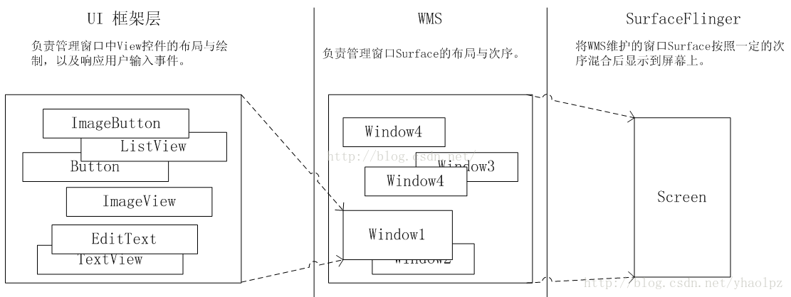
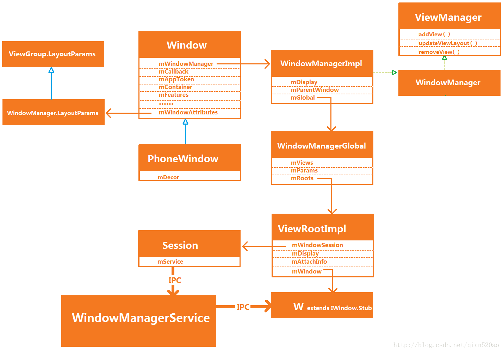

# WMS

## 相关文章

- [彻底理解 Window 和 WindowManager](https://blog.csdn.net/qq_24451593/article/details/80175371)

## 图示

- 
- 

## 相关类

### Window

- Window 表示一个窗口的概念，也是一个抽象的概念，Window 并不是实际存在的，它是以 View 的形式存在的,任何 View 都是附属在一个 Window 上面的

### PhoneWindow

- Window的实现类

### WindowManager

- WindowManager 是外界也就是我们访问 Window 的入口

### WindowManagerImpl

- WindowManager的实现类

### WindowManagerGlobal

- WindowManagerGlobal 在整个应用进程中是以单例存在的,内部维持了相关的view的信息
- 内部比较重要的是ViewRootImpl类

### WindowManagerService

- system_server进程中的服务

## Window的分类

- Window 是分层的，每个 Window 都有对应的 z-ordered，层级大的会覆盖在层级小的 Window 上面,window的层级也就是window的type这个值
- 应用window，1~99
- 子Window，1000~1999
- 系统window，2000~2999
