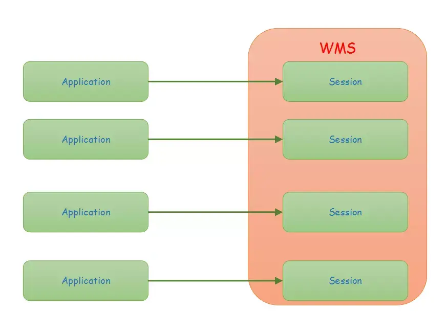

# WMS

## 相关文章

- [深入理解 WindowManagerService](https://www.jianshu.com/p/9e244d13b866)

## 基本概念

- WindowManagerService，是一个位于system_server进程的管理所有window的系统服务，应用进程通过IWindowManager.Stub.Proxy与之通信
- Session类继承自 IWindowSession.Stub，每一个应用进程都有一个唯一的 Session 对象,一个应用的所有的Activity的WindowSession对象都是同一个

- 

```java
// com/android/server/wm/WindowManagerService.java
public class WindowManagerService extends IWindowManager.Stub
        implements Watchdog.Monitor, WindowManagerPolicy.WindowManagerFuncs {
        /**
         * All currently active sessions with clients.
         */
        final ArraySet<Session> mSessions = new ArraySet<>();

        ......

        @Override
        public IWindowSession openSession(IWindowSessionCallback callback, IInputMethodClient client,
            IInputContext inputContext) {
            if (client == null) throw new IllegalArgumentException("null client");
            if (inputContext == null) throw new IllegalArgumentException("null inputContext");
            Session session = new Session(this, callback, client, inputContext);
            return session;
    }
}

    // android/view/ViewRootImpl.java
    public ViewRootImpl(Context context, Display display) {
        mContext = context;
        mWindowSession = WindowManagerGlobal.getWindowSession();
        ...
    }

    // android/view/WindowMangerGlobal.java
    public static IWindowManager getWindowManagerService() {
        synchronized (WindowManagerGlobal.class) {
            if (sWindowManagerService == null) {
                sWindowManagerService = IWindowManager.Stub.asInterface(
                        ServiceManager.getService("window"));
                try {
                    if (sWindowManagerService != null) {
                        ValueAnimator.setDurationScale(
                                sWindowManagerService.getCurrentAnimatorScale());
                    }
                } catch (RemoteException e) {
                    throw e.rethrowFromSystemServer();
                }
            }
            return sWindowManagerService;
        }
    }

    public static IWindowSession getWindowSession() {
        synchronized (WindowManagerGlobal.class) {
            if (sWindowSession == null) {
                try {
                    InputMethodManager imm = InputMethodManager.getInstance();
                    IWindowManager windowManager = getWindowManagerService();
                    sWindowSession = windowManager.openSession(
                            new IWindowSessionCallback.Stub() {
                                @Override
                                public void onAnimatorScaleChanged(float scale) {
                                    ValueAnimator.setDurationScale(scale);
                                }
                            },
                            imm.getClient(), imm.getInputContext());
                } catch (RemoteException e) {
                    throw e.rethrowFromSystemServer();
                }
            }
            return sWindowSession;
        }
    }
```

- WindowState 是 WMS 中一个重要的概念，在 WMS 中的一个 WindowState 对象就对应着一个应用进程中的 Window 对象
- 在调用WindowManagerGlobal.addView 方法时，经过一系列的方法调用，最后走到了 WindowManagerService.addWindow 方法中，在 WindowManagerService.addWindow 方法中，会创建一个与 Window 对象对应的 WindowState 对象并调用 WindowState.attach 方法，然后将该 WindowState 对象添加到 WMS 的 mWindowMap Map 中

- ![addToWindow]](./../../image-resources/sourcecode/wms/wms_addtowindow.webp)

- IWindow服务端在应用进程，实现类是ViewRootImpl中的W，客户端是Wms，在ViewRootImpl的setView方法中通过IWindowSession.Stub.Proxy传递给了Wms

```java
// android/view/ViewRootImpl.java
public void setView(View view, WindowManager.LayoutParams attrs, View panelParentView) {
        synchronized (this) {
            if (mView == null) {
                mView = view;

                ...
                try {
                    mOrigWindowType = mWindowAttributes.type;
                    mAttachInfo.mRecomputeGlobalAttributes = true;
                    collectViewAttributes();
                    // 调用Session的addToDisplay，调用wms服务中的功能
                    // mWindow即为W类对象，也就是IWindow的实现类
                    res = mWindowSession.addToDisplay(mWindow, mSeq, mWindowAttributes,
                            getHostVisibility(), mDisplay.getDisplayId(), mWinFrame,
                            mAttachInfo.mContentInsets, mAttachInfo.mStableInsets,
                            mAttachInfo.mOutsets, mAttachInfo.mDisplayCutout, mInputChannel);
                } catch (RemoteException e) {
                    mAdded = false;
                    mView = null;
                    mAttachInfo.mRootView = null;
                    mInputChannel = null;
                    mFallbackEventHandler.setView(null);
                    unscheduleTraversals();
                    setAccessibilityFocus(null, null);
                    throw new RuntimeException("Adding window failed", e);
                } finally {
                    if (restore) {
                        attrs.restore();
                    }
                }
                ...
            }
        }
    }

    // com/android/server/wm/Session.java
    @Override
    public int addToDisplay(IWindow window, int seq, WindowManager.LayoutParams attrs,
            int viewVisibility, int displayId, Rect outFrame, Rect outContentInsets,
            Rect outStableInsets, Rect outOutsets,
            DisplayCutout.ParcelableWrapper outDisplayCutout, InputChannel outInputChannel) {
        return mService.addWindow(this, window, seq, attrs, viewVisibility, displayId, outFrame,
                outContentInsets, outStableInsets, outOutsets, outDisplayCutout, outInputChannel);
    }

    // com/android/server/wm/WindowManagerService.java
    public class WindowManagerService extends IWindowManager.Stub
        implements Watchdog.Monitor, WindowManagerPolicy.WindowManagerFuncs {

    final WindowHashMap mWindowMap = new WindowHashMap();

    public int addWindow(Session session, IWindow client, int seq,
            WindowManager.LayoutParams attrs, int viewVisibility, int displayId,
            Rect outContentInsets, Rect outStableInsets, Rect outOutsets,
            InputChannel outInputChannel) {
            ...

            final WindowState win = new WindowState(this, session, client, token, parentWindow,
                    appOp[0], seq, attrs, viewVisibility, session.mUid,
                    session.mCanAddInternalSystemWindow);
            ...
            win.attach();
            mWindowMap.put(client.asBinder(), win);
            ...
            win.mToken.addWindow(win);
    }
}
```
