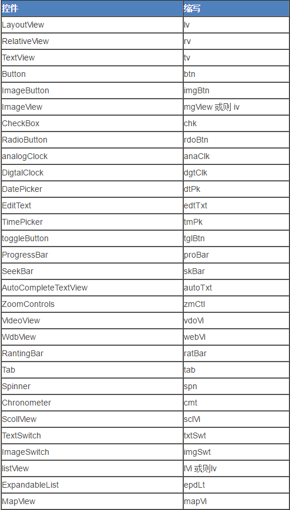

# java代码命名规范

Created by Rancune@126.com on 2016/10/21.

## 类名

- 采用大驼峰式命名法
- 类名应当尽可能只包含字母，不要包含特殊字符（比如下划线等）。如果不是必要，最好不要包含数字
- 尽量避免缩写，除非该缩写是众所周知的，比如HTML，URL
- 如果类名称包含单词缩写，则单词缩写的每个字母均应大写
- 具体类的命名规范

Header One        | Header Two    | Header Three
:---------------- | :------------ | :-----------------
activity 类        | Activity为后缀标识 | WelcomeActivity
fragment 类        | fragment为后缀标识 | WelcomeFragment
adapter 类         | adapter为后缀标识  | ContactListAdapter
service 类         | Service为后缀标识  | DownloadService
broadcastReceiver | Receiver为后缀标识 | RecordReceiver
database          | dbhelper为后缀标识 | ImHelper
base 类            | Base 开头       | BaseActivity

## 成员变量

- 类成员变量以m开头，比如mContext
- static变量以s开头，比如sInstance
- 变量小驼峰命名法 比如 mStudentName
- 局部变量，正常单词组合的小驼峰命名法
- 变量最好不要包含特殊字符（比如下划线等）。如果不是必要，最好不要包含数字
- 常量命名只能包含字母和_，单词之间用_ 隔开，字母全部大写 比如RESULT_SUCCESS, RESULT_CANCEL

## 方法名

- 动词或动名词，采用小驼峰命名法

- 如果方法有默认行为，最好方法注释说明，并且方法名也有提示，或在方法参数是提醒

- 常用方法的名字

方法          | 说明
:---------- | :---------------------------------------
initXX()    | 初始化相关方法,使用init为前缀标识，如初始化布局initView()
isXX()      | checkXX()方法返回值为boolean型的请使用is或check为前缀标识
getXX()     | 返回某个值的方法，使用get为前缀标识
release()   | 释放资源
getInstance | 单例

## 方法参数与方法返回可能为空

- 如果方法参数不能为空，需要用NonNull注解，方法中要检测是否为空

- 如果方法返回有可能为空，需要用Nullable注解，这样方便对函数返回检测，方便代码理解

- **尽可能的避免方法的返回为空**，比如集合可以用空集合，字符串可以用""返回

## 资源命名

- 全部小写，采用下划线命名法。其中{module_name}为业务模块或是功能模块等模块化的名称或简称。

- 如果是主module, 则前面的module_name可以不用

- activity layout： {module_name}_activity_{名称} 例如： activity_main.xml , crm_activity_shopping.xml

- fragment layout:{module_name}_fragment_{名称} 例如： fragment_main.xml , crm_fragment_shopping.xml

- Dialog layout: {module_name}_dialog_{名称} 例如： dialog_confirm.xml crm_dialog_loading.xml

- 列表项布局命名：{module_name}_listitem_{名称} 例如： listitem_customer.xml

- 包含项布局命名：include_{名称} 例如： include_head.xml

- widget layout： {module_name}_widget_{名称} 例如： crm_widget_shopping_detail.xml

## 资源id命名规范

- 命名模式为：{view缩写}_{module_name}_{view的逻辑名称}，如：ll_crm_content

## selector资源命令

- 正常 normal download_normal.png
- 按下 pressed download_pressed.png
- 不可用 disabled download_disabled.png
- selector download_selector

## 其它

- 尽可能的少的创建对象，比如对于activity,尽可能的在一个View.OnClickListener中处理所有的逻辑 再比如对于RecyclerView的每一个item的点击事件，尽可能统一处理

- strings.xml中使用%1$s实现字符串的通配

- 一般情况下不要在循环内部try catch 异常，除非必要

- 代码完成后最好format一下
